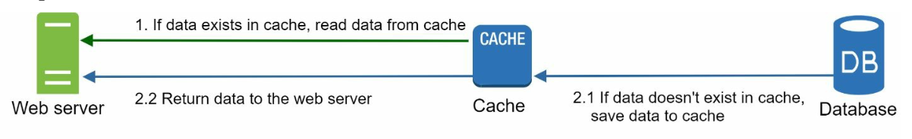

# 第 1 章：从零扩展到数百万用户

## 引言
扩展一个系统以支持数百万用户是一个复杂且迭代的过程，需要不断改进和优化。本章介绍如何从单服务器设置开始，逐步扩展架构以处理数百万用户。

---

## 第 1 节：单服务器设置
最初，所有组件（Web 应用、数据库、缓存）都运行在单台服务器上。 

   

### 请求流程
1. 用户通过域名（例如 `api.mysite.com`）访问应用，域名通过 DNS 解析为 IP 地址。
2. Web 服务器的 IP 地址被返回给浏览器或移动应用。
3. HTTP 请求被发送到 Web 服务器，服务器返回 HTML 或 JSON 响应。

### 流量来源
1. **Web 应用：**使用服务器端语言（例如 Python、Java）实现业务逻辑，并使用客户端语言（例如 JavaScript、HTML）进行展示。
2. **移动应用：**使用 HTTP 和 JSON 与 Web 服务器通信，以实现轻量级的数据交换。

---

## 第 2 节：数据库分离
随着用户群体增长，数据库被迁移到专用服务器，从而允许 Web 层和数据库层独立扩展。

   

### 数据库选择

1. **关系型数据库（SQL）：**存储在表中的结构化数据。示例：MySQL、PostgreSQL。
2. **非关系型数据库（NoSQL）：**适用于非结构化数据或低延迟需求。类别包括：
   - 键值存储
   - 图数据库
   - 列存储
   - 文档存储

- 在以下情况下，非关系型数据库可能是正确的选择：
   - 应用需要超低延迟。
   - 数据是非结构化的，或者不存在关系型数据。
   - 只需要序列化和反序列化数据（JSON、XML、YAML 等）。
   - 需要存储海量数据。

---

## 第 3 节：垂直扩展与水平扩展
### 垂直扩展
- 向现有服务器添加更多资源（CPU、RAM）。
- 受硬件限制，并且缺乏冗余。

### 水平扩展
- 向服务器池中添加更多服务器，更适合大规模系统。
- 使用负载均衡器处理服务器之间的请求路由。
---

## 第 4 节：负载均衡器

   

**负载均衡器**在多台服务器之间分配流量。好处包括：
1. 冗余：如果一台服务器离线，流量会被重新路由。
   -  如果服务器 1 离线，所有流量都会被路由到服务器 2。
2. 可扩展性：可以轻松添加服务器来处理流量峰值。
   -  如果网站流量快速增长，可以添加后续服务器来处理额外流量。

---

## 第 5 节：数据库复制

   

### 主从模型
- **主数据库：**处理写操作。
   - 所有修改数据的命令，如 insert、delete 或 update，都必须发送到主数据库。
- **从数据库：**处理读操作，从而提高性能和可靠性。
   - 由于在大多数应用中读写比更高；因此，一个系统中的从数据库数量
通常多于主数据库数量。

### 好处
1. 通过并行读操作提高性能。
2. 通过冗余提高可用性和数据可靠性。

### 故障处理
- 如果只有一个从数据库可用，而它离线了，读操作会暂时被定向
到主数据库。
- 如果有多个从数据库可用，读操作会
被重新定向到其他健康的从数据库，并且一台新服务器会替换旧服务器。 
-  如果主数据库离线，一个从数据库会被提升为新的
主数据库。
- 在生产系统中，选定的从数据库可能不是最新的，因此需要通过运行数据恢复脚本来更新数据
（多主和循环复制等方法可能有所帮助）。

---

## 第 6 节：缓存
**缓存**将经常访问的数据存储在内存中，以减少数据库负载。缓存层是一个临时数据存储层，比数据库快得多。 

   

### 缓存注意事项
1. **使用场景：**当数据读取频繁但修改不频繁时，可以考虑使用缓存。
2. **过期策略：**缓存数据过期后，会从缓存中移除。如果没有过期策略，缓存数据将
永久存储在内存中。
3. **一致性：**这意味着让数据存储和缓存保持同步。由于数据存储和缓存上的数据修改操作不在同一个事务中，因此
可能发生不一致。 
4. **缓解故障：**单个缓存服务器构成潜在的单点故障，建议在不同数据中心部署多个缓存服务器来避免
SPOF。
5. **驱逐策略：**缓存已满后，需要驱逐项目以释放内存。LRU 是最常用的缓存驱逐策略。

---

## 第 7 节：内容分发网络（CDN）
**CDN**通过在地理位置分散的服务器上缓存静态内容（图像、CSS、JavaScript）来改善加载时间。

   

### 工作流
1. 用户从距离最近的 CDN 服务器请求内容。
2. 如果内容不可用，则从源服务器获取内容并缓存。

### CDN 注意事项
1. **成本：**CDNs 由第三方提供商运营，这些提供商会对进出 CDN 的数据传输收费。
2. **缓存过期：**缓存过期时间不应过长或过短。
3. **CDN 回退：**如果 CDN 暂时中断，客户端应能够检测到问题
并从源服务器请求资源。
4. **使文件失效：**如果文件被更新，应使缓存失效，以指向更新后的文件。

---

## 第 8 节：无状态 Web 层
通过将会话数据移动到共享数据存储中，Web 服务器变为无状态。这允许：
1. 更容易地进行水平扩展。
2. 根据流量进行自动扩展。

   

---

## 第 9 节：多数据中心设置
跨多个数据中心部署可以提高可用性并减少延迟。策略包括：

   

1. **GeoDNS 路由：**将用户引导到最近的数据中心。
2. **数据复制：**在各中心之间同步数据，以防止不一致。

### 关键注意事项
- **流量重定向：**需要有效的工具来将流量定向到正确的数据中心。
- **数据同步：**一种常见策略是在多个数据中心之间复制数据。 
- **测试和部署：**自动化部署工具对于让所有数据中心的服务保持一致至关重要。

---

## 第 10 节：消息队列
**消息队列**是一个存储在内存中的持久化组件，支持异步
通信。它充当缓冲区并分发异步请求。

   

- 输入服务（称为生产者/发布者）创建消息，并将其发布到消息队列。
- 其他服务（称为消费者/订阅者）连接到队列，并执行消息定义的操作。

---

## 第 11 节：日志记录、指标和自动化

   

### 重要性
1. **日志记录：**跟踪错误和系统健康状况。
2. **指标：**提供对性能和用户活动的洞察。
3. **自动化：**简化测试、部署和扩展。

---

## 第 12 节：数据库扩展
### 垂直扩展
- 添加硬件资源，但受物理和成本限制。
- 存在多个缺点：
   -  单点故障的风险更高。
   -  垂直扩展的总体成本很高

### 水平扩展（分片）

   

- 使用键（例如 `user_id`）将数据划分到多个分片中。
   - 分片将大型数据库拆分成更小、更易管理的部分，称为分片。
   - 每个分片共享相同的架构，但每个分片上的实际数据对于该分片是唯一的。
-  分片键对于实现分片策略至关重要。选择分片键时，选择一个可以均匀分配数据的键很重要。

#### 挑战 
1. **数据重新分片：**在以下情况下需要重新分片数据：
   - 由于快速增长，单个分片无法再容纳更多数据。 
   - 由于数据分布不均，一些分片可能比其他分片更快耗尽容量。
   - 使用一致性哈希来克服这些问题

2. **名人问题：**对特定分片的访问过多可能导致服务器过载。
   - 要解决这个问题，我们可能需要为每个名人分配一个分片。

3. **连接和反规范化：**数据库跨多个服务器进行分片后，很难跨数据库分片执行连接操作。
   -  一种常见的解决方法是对数据库进行反规范化，使查询可以在单个表中执行。

---

## 结论
### 要点
1. 保持 Web 层无状态。
2. 在每个层构建冗余。
3. 使用缓存和 CDNs 优化性能。
4. 通过分片扩展数据层。
5. 解耦组件以提高灵活性。

本章为构建能够处理数百万用户的可扩展系统提供了坚实基础。
 
