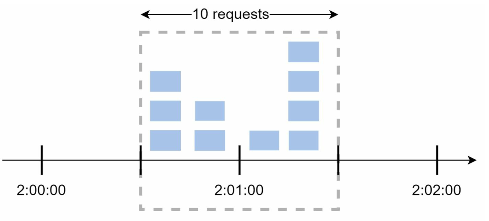

# 第 4 章：设计速率限制器

## 简介
本章探讨速率限制器的设计和实现——这是一种用于控制客户端或服务发送流量速率的系统组件。速率限制器对于防止滥用、降低成本以及确保服务器资源的稳定性至关重要。其使用示例包括限制发帖、创建账户和领取奖励。

## 速率限制的益处
- **防止 DoS 攻击：** 阻止过量调用，以避免资源耗尽。
- **降低成本：** 限制不必要的请求，以减少服务器开支。
- **防止过载：** 过滤过量请求，以稳定服务器性能。

## 步骤 1：理解问题
### 关键特性
- 服务端 API 速率限制器。
- 支持多种限流规则。
- 在分布式环境中处理大规模系统。
- 可选择独立服务或应用层代码。
- 在用户受到限流时通知用户。

### 要求
- 准确的请求限流。
- 最小延迟。
- 低内存使用量。
- 分布式能力。
- 清晰的异常处理。
- 高容错性。

## 步骤 2：高层设计
### 部署位置选项

    

1. **客户端实现：** 由于可能被滥用而不可靠。
2. **服务端实现：** 首选方案，便于控制且可靠。
3. **中间件（API 网关）：** 适用于集成速率限制的灵活选项。

### 部署位置指南
- 评估当前技术栈并选择高效的选项。
- 根据业务需求选择合适的算法。
- 如果采用微服务，则使用 API 网关。
- 如果资源有限，则选择商业解决方案。

## 步骤 3：速率限制算法
### 1. 令牌桶

  

- **描述：** 按固定速率向桶中添加令牌；每个请求消耗一个令牌。
- **参数：** 桶大小和填充速率。
- **优点：** 易于实现、节省内存、支持流量突发。
- **缺点：** 需要仔细调整参数。

### 2. 漏桶

  

- **描述：** 使用 FIFO 队列以固定速率处理请求。
- **优点：** 节省内存，输出速率稳定。
- **缺点：** 流量突发可能会延迟较新的请求。
  

  示例：https://github.com/uber-go/ratelimit

### 3. 固定窗口计数器

  

- **描述：** 将时间划分为固定区间，并使用计数器限制请求。
- **优点：** 简单，适用于特定用例且效率高。
- **缺点：** 窗口边缘的流量峰值可能超过限制。

- 时间窗口边缘的流量突然突发
可能导致超过允许配额的请求通过。

  

### 4. 滑动窗口日志

  

- **描述：** 跟踪时间戳，以实现滚动时间窗口。
- **优点：** 精确的速率限制。
- **缺点：** 内存消耗高。
  

### 5. 滑动窗口计数器

  

- **描述：** 结合固定窗口和滑动日志方法，以平滑流量峰值。
- **优点：** 节省内存，处理流量突发。
- **缺点：** 近似结果可能并不完全严格。
  

## 高层架构

  

- **数据存储：** 使用内存缓存（例如 Redis）进行快速计数器操作。
- **步骤：**
  1. 客户端向中间件发送请求。
  2. 中间件检查 Redis 中的计数器。
  3. 根据限制处理或拒绝请求。

## 高级考量
### 分布式环境
- **挑战：** 竞态条件、同步问题。
- **解决方案：** 在 Redis 中使用锁、Lua 脚本或有序集合。使用集中式数据存储进行同步。

### 性能优化
- 采用多数据中心设置以降低延迟。
- 使用最终一致性模型进行同步。

### 监控
- 定期进行分析，以确保算法有效，并根据需要调整规则。

