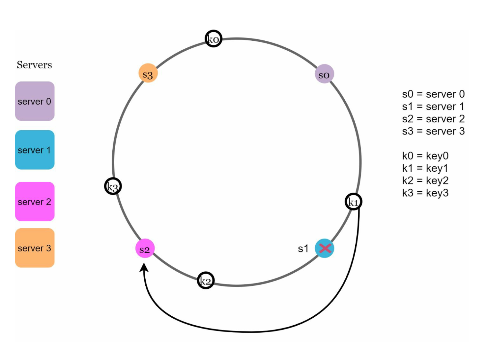

# 第 5 章：设计一致性哈希

## 引言
本章探讨一致性哈希，这是一种通过在服务器之间高效分配请求和数据来实现水平扩展的关键技术。它最大限度地减少服务器添加或移除时的数据重新分配，并确保数据均匀分布，从而缓解服务器热点等问题。

## 重新哈希问题
### 说明
在传统哈希方法中，例如 `serverIndex = hash(key) % N`，当服务器数量发生变化时，数据重新分配会变得棘手。例如：
- 移除服务器会导致大多数键被重新分配，从而造成缓存未命中。
- 添加服务器会导致不必要的键重新分配。

  

- 当服务器池大小固定时，这种方法效果很好。但是，当添加新服务器或移除现有服务器时，就会出现问题。

  

### 关键问题
服务器数量变化时大多数键被重新分配，会导致效率低下和过载。

## 一致性哈希
### 定义
一致性哈希确保在添加或移除服务器时，只有一小部分键会被重新映射。这会最大限度地减少中断并增强可扩展性。

### 关键概念
1. **哈希空间和环：** 哈希空间形成一个连续的环，哈希值从 `0` 分布到 `2^160-1`（例如使用类似 SHA-1 的哈希函数）。将两端连接起来即可得到一个环。
    

    
    

- 使用相同的哈希函数 f，根据服务器 IP 或名称将服务器映射到环上。  

    

    
    

1. **服务器查找**
- 通过沿环顺时针遍历，直到找到服务器，即可确定键对应的服务器。

  

  
  

2. **添加和移除服务器**
- 添加服务器只会重新分配附近的键。只有一小部分键会被重新分配到新服务器。
  
  

  
  

- 移除服务器只会影响其范围内的键。被移除服务器的键只会被重新分配给顺时针方向的下一台服务器。

  

  
  

## 挑战与解决方案
### 基本方法中的两个问题
1. **分区大小不均：** 服务器可能拥有大小不等的数据分区。
2. **键分布不均匀：** 某些服务器收到的键数量可能显著多于其他服务器。

### 解决方案：虚拟节点
- 每台服务器在环上由多个均匀分布在环上的虚拟节点表示。
- 虚拟节点改善键分布并平衡负载。随着虚拟节点数量增加，键的分布会变得更加均衡。这是因为虚拟节点越多，标准差越小，从而实现均衡的数据分布。   
   
  

  
  

## 受影响的键
当服务器被添加或移除时：
- **添加服务器：** 受影响的键位于新服务器及其前驱之间。
  在下面的示例中，服务器 4 被添加到环上。受影响的范围从 s4（新
  添加的节点）开始，沿环逆时针移动，直到找到服务器（s3）。因此，位于 s3 和 s4 之间的键
  需要重新分配给 s4。

  

  
  

- **移除服务器：** 受影响的键位于被移除服务器及其前驱之间。在以下示例中，当服务器（s1）被移除时，受影响的范围从 s1
（被移除的节点）开始，沿环逆时针移动，直到找到服务器（s0）。因此，位于 s0 和 s1 之间的键必须重新分配给 s2。
   
  

  
  

## 一致性哈希的优点
- **最大限度减少重新分配：** 只有一小部分键会被重新分配。
- **可扩展性：** 支持水平扩展。
- **缓解热点：** 平衡数据分布，避免服务器过载。

## 现实世界中的应用
- Amazon Dynamo DB
- Apache Cassandra
- Discord
- Akamai CDN
- Maglev Load Balancer

