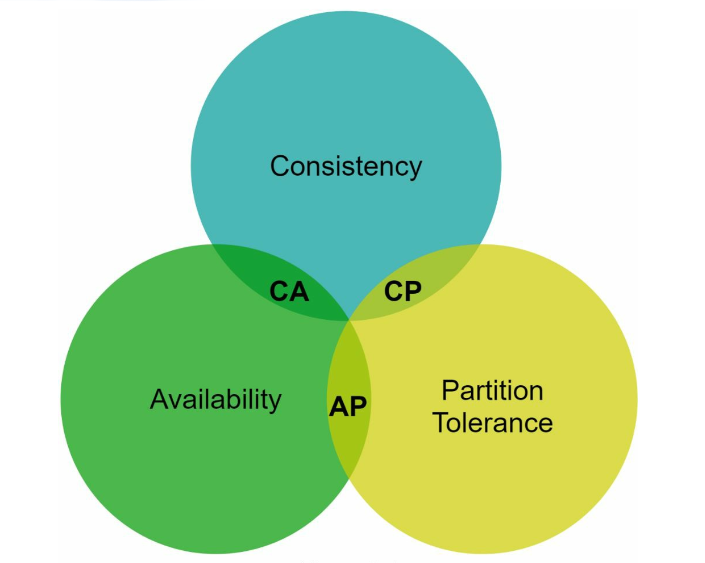
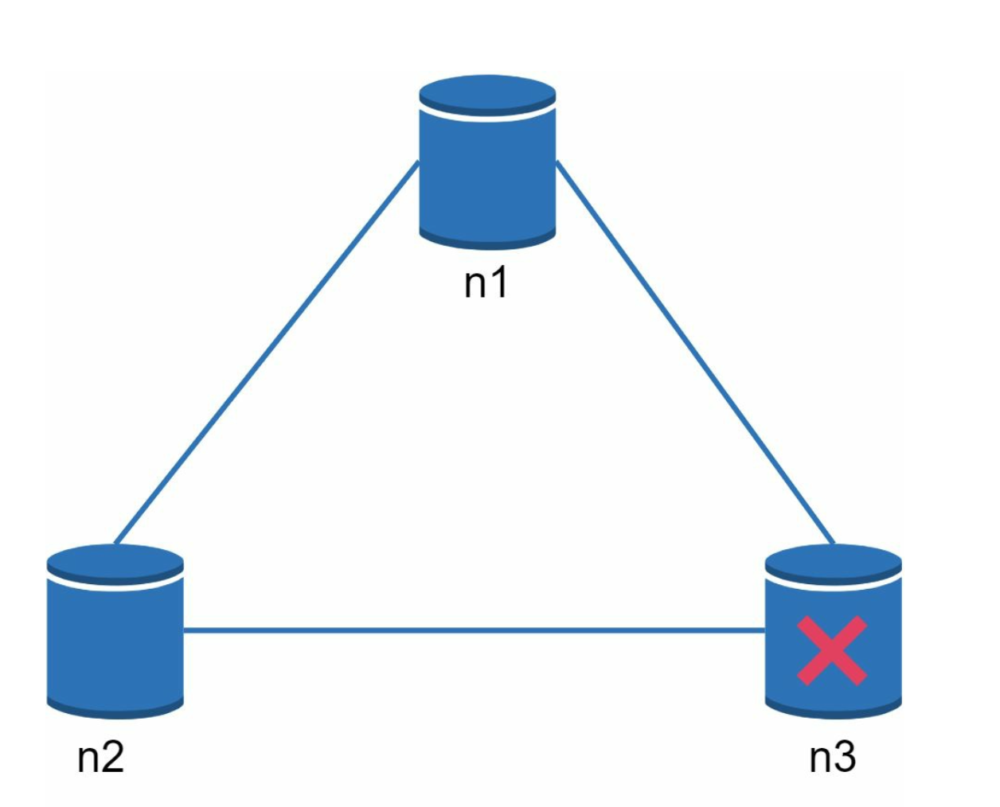
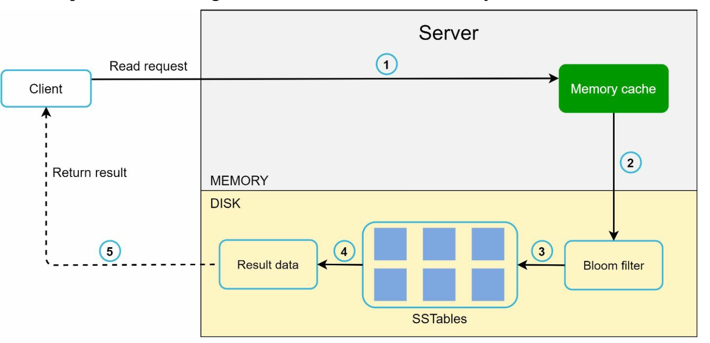

# 第 6 章：设计键值存储

## 简介
**键值存储**是一种非关系型数据库，其中数据以键值对的形式存储。每个键都是唯一的，并使用这些键访问值。本章详细介绍如何设计一个可扩展、高可用的分布式键值存储，支持以下操作：
- `put(key, value)` 用于插入数据。
- `get(key)` 用于检索数据。

### 设计特征
- 小型键值对（<10 KB）。
- 支持高可用性和可扩展性的大数据。
- 自动扩展和可调一致性。
- 低延迟。

---

## 单服务器键值存储
### 实现
- 使用**哈希表**在内存中存储键值对。
- 优化：
  - 数据压缩。
  - 将不常访问的数据存储在磁盘上。

### 局限
单个服务器的内存有限，因此需要采用**分布式方法**来实现可扩展性。

---

## 分布式键值存储
**分布式键值存储**将数据分区到多台服务器上，并且必须处理 **CAP 定理**中概述的权衡。

### CAP 定理
1. **一致性：**所有客户端同时看到相同的数据。
2. **可用性：**即使某些节点宕机，系统也会响应每个请求。
3. **分区容错性：**尽管存在网络分区，系统仍能继续运行。

**权衡：**根据 CAP 定理，三项保证中只能实现其中两项。

  

#### 系统类型：
- **CP 系统：**在牺牲可用性的同时保证一致性和分区容错性（例如银行系统）。
- **AP 系统：**在牺牲一致性的同时保证可用性和分区容错性（例如最终一致性）。
- **CA 系统：**在牺牲分区容错性的同时保证一致性和可用性。

    **由于网络故障不可避免，分布式系统必须容忍网络分区。因此，CA 系统无法存在于现实世界的应用中。**

    在分布式系统中，分区是不可避免的。当发生分区时，我们必须在一致性和可用性之间进行选择。例如，如果节点 n3 宕机，
    写入节点 n1 或 n2 的任何数据都无法传播到 n3。反过来，如果数据写入了 n3，但尚未传播到 n1 和 n2，节点 n1 和 n2 将拥有过时的数据。

    

    
    

    
- 如果选择 CP 系统，则必须阻止对 n1 和 n2 的所有写操作，以避免数据不一致。
- 如果选择 AP 系统，系统会继续接受读取，即使它可能返回过时的数据。
对于写操作，n1 和 n2 会继续接受写入，
网络分区解决后，数据将同步到 n3。

---

## 系统组件
### 1. 数据分区
- **技术：**使用一致性哈希在多台服务器之间均匀分配数据。
- **优势：**
  - 添加/移除服务器时自动扩展。
  - 通过虚拟节点实现异构性。服务器的虚拟节点数量与服务器容量成正比。

### 2. 数据复制
- 将数据复制到 `N` 台服务器，以实现高可用性。
- 通过从服务器位置开始顺时针遍历来选择 N 台服务器，并选择环上的前 N 台服务器来存储数据副本。在存在虚拟节点的情况下，将副本放置在不同的数据中心以提高可靠性。

    

    
    

### 3. 一致性
由于数据会在多个节点上复制，因此必须在副本之间进行同步。
- **法定人数共识：**
  - `N`：副本总数。
  - `W`：写法定人数大小。要使写操作被视为成功，必须收到 W 个副本的确认。
  - `R`：读法定人数大小。要使读操作被视为成功，必须等待至少 R 个副本的响应。
  - **规则：**`W + R > N` 可确保强一致性。
  - W、R 和 N 的配置是在延迟和一致性之间进行的典型权衡。

    

    
    

    
    - 如果 R = 1 且 W = N，系统针对快速读取进行了优化。
    - 如果 W = 1 且 R = N，系统针对快速写入进行了优化。
    - 如果 W + R > N，则保证强一致性（通常 N = 3，W = R = 2）。
    - 如果 W + R <= N，则不保证强一致性。

- **模型：**
  - **强一致性：**读操作返回与最新写入数据项的结果相对应的值。
  - **弱一致性：**后续读操作可能看不到最新的值。
  - **最终一致性：**经过足够的时间后，所有更新都会传播，所有副本都保持一致

### 4. 不一致性解决
复制带来了高可用性，但会导致副本之间出现不一致。版本控制和
向量锁用于解决不一致问题。
- **版本控制：**
    - 使用**向量时钟**跟踪数据版本并解决冲突。
    - 版本控制意味着将每次数据修改视为数据的一个新的不可变版本。
        

        
        
        

    
    - 服务器 1 更改了名称，服务器 2 也更改了名称。这两项更改是同时执行的。现在，我们有了冲突的值，称为版本 v1 和 v2。

- **向量时钟**
    1. **设置：**向量时钟是与数据项关联的[服务器，版本]对。它可用于检查
        一个版本是否先于、后于另一个版本，或与其他版本冲突。
        - 假设向量时钟表示为 D([S1, v1], [S2, v2], …, [Sn, vn])，如果数据项 D 被写入服务器
        Si，系统必须执行以下任务之一。
        - 其中：`D` 是数据项。`Si` 是服务器标识符。`vi` 是服务器 `Si` 上数据的版本计数器。

    2. **更新向量时钟：**当数据项在服务器上被修改时：
        - 如果服务器存在于向量时钟中，则其版本计数器递增。
        - 否则，将一个新条目添加到向量时钟中。

    3. **冲突检测：**
        - **无冲突：**如果 X 中的所有计数器都小于或等于 Y 中的计数器，则版本 X 是版本 Y 的祖先。
        - **存在冲突：**如果 Y 中至少有一个计数器小于其在 X 中对应的计数器，则两个版本是兄弟版本。

    4. **冲突解决：**检测到冲突（兄弟版本）时，系统依靠特定于应用程序的逻辑或客户端干预来协调数据。

        

        
        

- **挑战：**
  - 增加客户端的复杂性。
  - 经过多次更新后，向量时钟的大小可能增长，因此需要裁剪策略来限制其大小。

### 5. 故障处理

#### a. 故障检测
仅仅因为另一台服务器这样说，就认定一台服务器宕机是不够的。通常，至少需要两个独立的信息源才能将服务器标记为宕机。
- **Gossip 协议：**
    

        
    

    - 每个节点维护成员 ID 和心跳计数器。
    - 每个节点定期递增其心跳计数器。
    - 每个节点定期向一组随机节点发送心跳。
    - 如果心跳在超过预定义的时间段内没有增加，则认为该成员
    已离线

#### b. 临时故障
- **宽松法定人数：**暂时使用健康节点维持操作。
        

        
        

    - 检测到故障后，系统需要部署某些机制来确保可用性
    - 系统不强制执行法定人数要求，而是在哈希环上选择前 W 台健康服务器进行写入，并选择前 R 台
    健康服务器进行读取。
    - 离线服务器会被忽略。如果服务器不可用，另一台服务器将暂时处理请求

- **暗示移交：**离线服务器在恢复后追上更改。
    - 宕机服务器恢复后，更改将被推送回去，以实现数据一致性

#### c. 永久故障
- 使用**Merkle 树**在副本之间进行高效同步。
    **Merkle 树**（或哈希树）是一种数据结构，用于在永久故障期间高效检测和解决副本之间的不一致。

- 工作原理
    1. **结构：**
        - **叶节点**存储单个数据块的哈希。
        - **非叶节点**存储其子节点的哈希。
        - **根哈希**表示树中所有数据的组合状态。

    2. **构建 Merkle 树：**
        - **步骤 1：**将键空间划分为桶。
            
            

        - **步骤 2：**使用均匀哈希对桶中的每个键进行哈希。

            

        - **步骤 3：**为每个桶创建单个哈希。
        
            

        - **步骤 4：**组合桶的哈希以计算更高层级的哈希，最终得到根哈希。

            

    3. **同步：**
        - 要同步两个副本：
            - 比较它们的根哈希。
            - 如果根哈希匹配，则副本是一致的。
            - 如果根哈希不同，则递归比较子哈希，以识别不一致的桶。
        - 仅同步不一致的数据。

- 优势
    - **效率：**仅同步不一致的数据，减少数据传输。
    - **可扩展性：**以极少的同步开销有效处理大型数据集。
    - **可靠性：**确保副本之间的数据一致性。

### 6. 处理数据中心中断
- 跨多个数据中心复制数据，以确保中断期间的可用性。

---

## 写入和读取路径
### 1. 写入路径（基于 Cassandra 架构）

    

- 将写入持久化到**提交日志**。
- 将数据保存到**内存缓存**。
- 当缓存已满时，将数据刷新到磁盘上的**SSTable**（Sorted String Table）。

   

### 2. 读取路径

    
    

- 检查**内存缓存**中的数据。
- 如果不存在，则使用 **Bloom Filter** 在 SSTable 中定位数据。
- 检索并返回数据。

---

## 最终架构

-  客户端通过简单的 API：get(key) 和 put(key,
value) 与键值存储通信。
- 协调器是一个充当客户端与键值存储之间代理的节点。
- 使用一致性哈希将节点分布在环上。
- 系统完全去中心化，因此添加和移动节点可以自动完成。
- 数据会在多个节点上复制。
- 不存在单点故障，因为每个节点都承担相同的一组职责。

 
