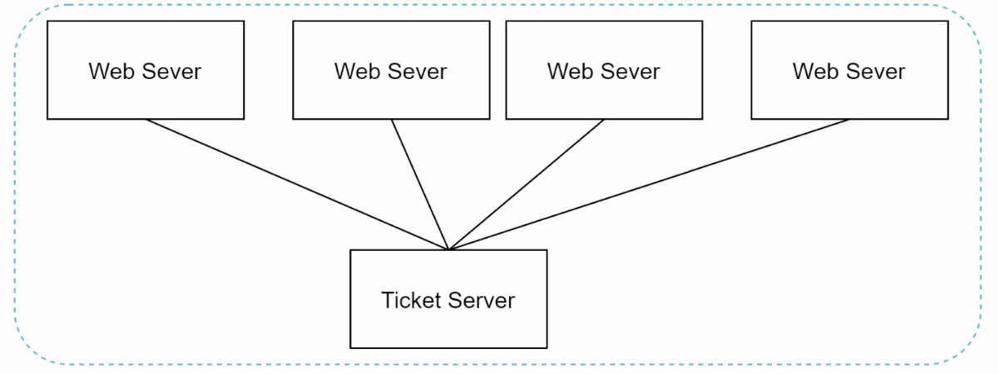

# 第 7 章：设计分布式系统中的唯一 ID 生成器

## 引言
本章讨论为分布式系统设计**唯一 ID 生成器**所面临的挑战。由于可扩展性和同步方面的挑战，传统的自动递增键不适用于分布式环境。重点是创建满足以下要求的唯一、可排序的 64 位数值 ID：
- ID 必须**唯一**且**按日期排序**。
- ID 必须适合 **64 位**。
- 系统应每秒生成**超过 10,000 个 ID**。

---

## 第 1 步：理解问题
### 基本要求
- ID 必须唯一且为数值型，并且应适合 64 位。
- ID 随时间递增，但不严格按 `+1` 递增。
- ID 应可按日期排序。
- 系统必须处理高吞吐量（10,000 个 ID/秒）。

---

## 第 2 步：高层设计选项
### 1. 多主复制
- **方法：** 使用数据库 `auto_increment`，并设置步长递增（例如，对于 k 台服务器使用 `+k`）。

    

    
    

- **缺点：**
  - 难以跨数据中心扩展。
  - ID 不总是随时间递增。
  - 添加/移除服务器时存在扩展问题。

### 2. UUID（通用唯一标识符）
- **方法：** 
    - 使用 UUID 在每台服务器上独立生成 128 位唯一标识符。
    - UUID 可以独立生成，无需服务器之间进行协调

        

        
        

- **优点：**
  - 无需服务器之间进行协调。
  - 可随 Web 服务器轻松扩展。
- **缺点：**
  - 超出 64 位要求。
  - ID 不可按时间排序，并且可能不是数值型。

### 3. 票据服务器
- **方法：** 使用一个集中式数据库服务器来递增并分配 ID。

    

    
    

- **优点：**
  - 对小规模系统来说，实现简单。
  - 生成数值型 ID。
- **缺点：**
  - 单点故障。
  - 多服务器设置中存在同步挑战。

### 4. Twitter Snowflake 方法
- **方法：** 

    

      
    

    

      
    

    - 将 ID 划分为多个部分，以确保唯一性和可扩展性。
    - **符号位（1 位）：** 始终为 `0`，可能用于区分有符号数和无符号数。
    - **时间戳（41 位）：** 自定义纪元以来的毫秒数（Twitter 的默认值为 `1288834974657`，相当于 Nov 04, 2010, 01:42:54 UTC）。确保 ID 按时间排序。
    - **数据中心 ID（5 位）：** 最多可标识 `2^5 = 32` 个数据中心。
    - **机器 ID（5 位）：** 可标识每个数据中心内最多 `2^5 = 32` 台机器。
    - **序列号（12 位）：** 跟踪同一毫秒内一台机器生成的 ID，每毫秒最多支持 `2^12 = 4096` 个 ID。序列号每毫秒重置为 `0`。

- **优点：**
    - **可扩展性：** 在多台服务器上每秒处理 10,000+ 个 ID。
    - **时间顺序：** 确保 ID 可按时间排序。
    - **去中心化：** 无单点故障。

## 第 4 步：其他注意事项
### 1. 时钟同步
- **挑战：** ID 生成假设各服务器之间的时钟已同步。
- **解决方案：** 使用**网络时间协议（NTP）**将漂移降至最低。

### 2. 部分长度调优
- 根据使用场景调整各部分的大小（例如，减少序列位数、增加时间戳位数）。

### 3. 高可用性
- ID 生成器属于任务关键型组件，必须具备容错能力。
- 考虑冗余和故障转移机制。

