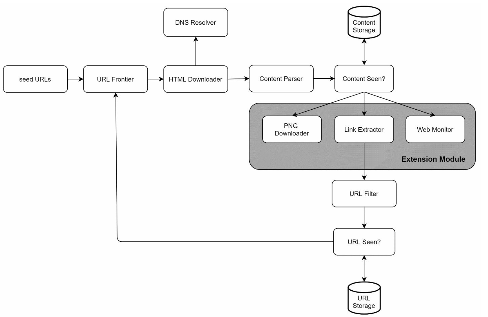

# 第 9 章：设计一个 Web 爬虫

## 引言
**Web 爬虫**，也称为蜘蛛程序或机器人，用于发现和收集 Web 内容，例如网页、图片和视频。本章重点讨论如何为**搜索引擎索引**设计可扩展的 Web 爬虫。

### Web 爬虫的应用
1. **搜索引擎索引：** 收集网页以创建可搜索的索引（例如 Googlebot）。
2. **Web 归档：** 保存 Web 数据以供将来使用（例如美国国会图书馆）。
3. **Web 挖掘：** 从 Web 数据中提取知识（例如对股东报告进行财务分析）。
4. **Web 监控：** 检测版权或商标侵权。

### 设计挑战
一个优秀的 Web 爬虫必须解决以下问题：
- **可伸缩性：** 使用并行化处理数十亿个页面。
- **健壮性：** 处理错误的 HTML、崩溃和恶意链接。
- **礼貌性：** 避免使用过多请求压垮服务器。
- **可扩展性：** 以最少的改动支持新的内容类型。

---

## 步骤 1：理解问题

### 需求
1. 每月抓取 **1 billion 个网页**（400 pages/second，峰值 800 QPS）。
2. 收集**仅 HTML 内容**。
3. 跟踪新的和已更新的页面。
4. 忽略重复内容。
5. 将抓取的数据存储 **5 years**，需要 **~30 PB** 的存储空间。

---

## 步骤 2：高层设计

### 组件

1. **种子 URL：** 爬虫的起点。
    - 需要选择一个良好的起点，以便爬虫能够遍历尽可能多的链接。
    - 可以根据不同热门网站的地域，或根据主题来确定。
    - 策略：按地域或主题分类（例如体育、医疗保健）。

2. **URL Frontier：** 存储待下载的 URL。
   - 使用 **FIFO 队列**实现。

3. **HTML 下载器：** 从 URL Frontier 提供的 URL 下载网页。

4. **DNS 解析器：** 将 URL 转换为 IP 地址。

5. **内容解析器：** 验证并解析网页。
   - 丢弃格式错误的页面。

6. **内容已存在？：** 使用哈希比较检查重复内容（比较两个网页的哈希值）。

7. **内容存储：** 将 HTML 页面存储在磁盘上（将热门内容存储在内存中以降低延迟）。

8. **URL 提取器：** 从已解析的页面中提取新链接。

9. **URL 过滤器：** 排除列入黑名单或错误的 URL。

10. **URL 已存在？** 跟踪已访问的 URL 以避免重复。

11. **URL 存储：** 存储已访问过的 URL。

---

### 工作流
1. 将**种子 URL**添加到 URL Frontier。
2. **HTML 下载器**获取 URL，并通过 DNS 解析器解析其 IP。
3. **内容解析器**验证内容，并将其传递给“内容已存在？”组件。
4. 如果内容是新的，则通过**URL 提取器**提取链接。
5. 过滤链接，并将不重复的链接添加到 URL Frontier。

---

## 步骤 3：深入了解关键组件
### DFS/BFS
-  可以将 Web 看作一个有向图，其中网页是节点，超链接（URL）是边。
-  通常使用 BFS 进行图遍历，因为深度可能非常深，因此 DFS 并不理想。
-  标准 BFS 不会考虑 URL 的优先级，并非每个页面都具有相同的质量和重要性。

### URL Frontier
- **礼貌性：** 
    - 确保同一时间每个主机只有一个请求。在两个下载任务之间增加延迟。
    - 使用从主机名到队列和工作（下载）线程的映射。
    - 每个下载器线程都有一个独立的 FIFO 队列，并且只从该队列下载 URL。

        

    - **队列路由器：** 确保每个队列（b1, b2, … bn）只包含来自同一主机的 URL。
    - **映射表：** 将每个主机映射到一个队列。
    - **队列选择器：** 每个工作线程都映射到一个 FIFO 队列，并且只从该队列下载 URL。队列选择逻辑由队列选择器完成。
    - **工作线程 1 到 N。** 工作线程从同一主机按顺序下载网页。可以在两个下载任务之间增加延迟。

- **优先级：** 
    - 为重要页面分配更高优先级（例如根据 PageRank 或更新频率）。

        
    
    - **优先级计算器：** 接收 URL 作为输入并计算优先级。
    - **队列 f1 到 fn：** 每个队列都有分配的优先级。高优先级队列会以更高的概率被选中。
    - **队列选择器：** 随机选择一个队列，但偏向于优先级更高的队列。
    - **前置队列：** 管理优先级
    - **后置队列：** 管理礼貌性

- **新鲜度：** 根据更新历史或重要性重新抓取。

### HTML 下载器
- **遵循 Robots.txt：** 遵守 robots.txt 文件中的规则。
- **性能优化：**
  1. 使用多台服务器进行分布式抓取。
  2. 使用 **DNS 缓存**避免重复解析。
  3. 在地理位置上分布抓取服务器，以加快下载速度。
  4. 使用较短的超时时间，避免慢速或无响应的服务器。

### 健壮性
1. **一致性哈希：** 有效地在服务器之间分配负载。
2. **错误处理：** 防止异常导致系统崩溃。
3. **数据验证：** 确保内容完整性。

### 可扩展性
- 为新的内容类型添加模块（例如 PNG 下载器、Web 监控器）。
- 示例：插入一个模块来监控 Web 内容中的版权侵权。

    
---

### 避免问题内容
1. **重复内容：** 使用哈希比较进行检测。
2. **蜘蛛陷阱：** 使用 URL 长度限制等技术避免无限循环。
3. **数据噪声：** 过滤广告或垃圾邮件等无关内容。

---

## 步骤 4：总结
### 关键要点
1. Web 爬虫必须在可伸缩性、健壮性、礼貌性和可扩展性之间取得平衡。
2. **礼貌性**防止服务器过载，而**优先级**确保重要页面优先被抓取。
3. 高效的存储和错误处理对于处理大规模抓取至关重要。

### 其他考虑
- **服务器端渲染：** 处理由 JavaScript 或 AJAX 生成的动态内容。
- **反垃圾邮件措施：** 排除低质量或无关页面。
- **数据库分片：** 使用复制和分片扩展数据层。
- **水平扩展：** 使用无状态服务器高效地扩展抓取任务。
- **分析：** 收集和分析数据以获取洞察。
 
