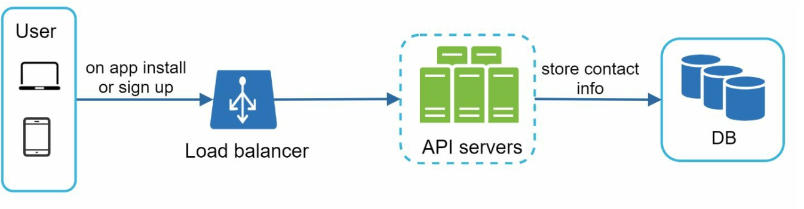

# 第 10 章：设计通知系统

## 简介
**通知系统**对现代应用程序至关重要，可提供产品通知、事件、优惠和警报等及时更新。通知可以通过以下方式发送：
1. **推送通知**（移动端或桌面端）、
2. **SMS 消息**，以及
3. **电子邮件**。

本章重点介绍设计一个能够每天发送数百万条通知的可扩展系统。

---

## 步骤 1：理解问题
### 要求
- **通知类型：**推送通知、SMS 和电子邮件。
- **投递：**软实时系统，延迟最小。
- **平台：**iOS、Android 和桌面端。
- **触发器：**通知可以由客户端应用程序触发，也可以在服务器上调度。
- **规模：**
  - **推送通知：**10 million/day，
  - **SMS：**1 million/day，
  - **电子邮件：**5 million/day。
- **选择退出支持：**用户可以禁用特定的通知类型。

---

## 步骤 2：高层设计

### 组件

1. **通知类型：**
   - **iOS 推送通知：**使用 **Apple Push Notification Service (APNS)**。
   - **Android 推送通知：**使用 **Firebase Cloud Messaging (FCM)**。
   - **SMS 消息：**使用 Twilio 或 Nexmo 等第三方服务。
   - **电子邮件：**使用 SendGrid 或 Mailchimp 等商业电子邮件服务。

2. **收集联系信息：**
   

      
   

   - 在应用安装或注册期间收集设备令牌、电话号码或电子邮件地址。
   - 将联系信息存储在数据库中：
     - **设备令牌表：**用于推送通知。
     - **用户表：**用于电子邮件和电话号码。

3. **通知发送流程：**

   

      
   

   - **触发服务：**
      - 生成事件以发起通知（例如账单提醒、发货更新）。
      - 服务可以是微服务、cron 作业或分布式系统，用于触发通知发送事件。
   - **通知服务器：** 
      - 为服务提供发送通知的 API。
      - 执行基本验证，以验证电子邮件和电话号码。
      - 查询数据库或缓存，以获取渲染通知所需的数据。
   - **第三方服务：**向用户投递通知。

     

### 初始设计中的挑战
- **单点故障（SPOF）：**一台通知服务器可能导致整个系统崩溃。
- **可扩展性问题：**难以独立扩展数据库、缓存和处理组件。
- **性能瓶颈：**发送通知需要大量资源。

### 改进设计

   

      
   

- 将数据库和缓存移出通知服务器。
- 引入带有多台通知服务器的**水平扩展**。
- 使用**消息队列**将系统组件解耦。
   -  当需要发送大量通知时，消息队列充当缓冲区。
- 添加从消息队列中拉取通知事件并将其发送到相应第三方服务的工作程序。

   

---

## 步骤 3：深入设计

### 可靠性
1. **防止数据丢失：** 
   

   
   

   - 将通知数据持久化到数据库中，并实现重试机制。
   - 通知日志数据库用于数据持久化。

2. **去重：** 
   - 检查事件 ID，以避免发送重复通知。
   - 当通知事件首次到达时，通过检查事件 ID 来确认之前是否见过该事件。
如果之前见过，则丢弃它；否则，发送通知。

### 其他组件
   

   
   

1. **通知模板：**预格式化模板，用于保持通知的一致性并提高效率。
2. **通知设置：**
   - 用户可以针对特定渠道（推送、SMS 或电子邮件）选择加入或退出。
   - 存储在专用的通知设置表中。
3. **速率限制：**限制向用户发送通知的频率。
4. **重试机制：**如果第三方服务失败，则重试发送通知。
5. **监控队列：**跟踪排队的通知，以动态扩展工作程序。
6. **事件跟踪：**收集打开率、点击率和参与度等指标。

### 安全性
- 使用 **AppKey** 和 **AppSecret** 对推送通知 API 进行身份验证和保护。

### 通知流程

   

   
   

1. 触发服务调用 API 发送通知。
2. 通知服务器验证请求，并从缓存或数据库中获取元数据。
3. 通知事件被发送到消息队列。
4. 工作程序处理事件，并与第三方服务交互。
5. 第三方服务将通知投递给用户。

---

## 关键优化
1. **水平扩展：**添加更多通知服务器以分配负载。
2. **消息队列：**解耦处理，以处理大量请求。
3. **缓存：**通过缓存频繁访问的数据来减少延迟。
4. **分布式抓取：**在地理位置上优化消息投递，以获得更好的性能。
 
