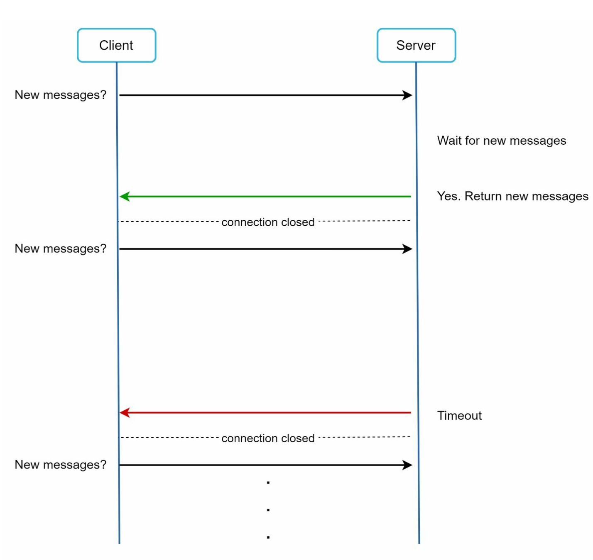

# 第 12 章：设计聊天系统

## 引言
**聊天系统**支持用户之间的实时消息传递。本章重点介绍设计一个包含以下功能的聊天应用：
- **一对一聊天**
- **群聊（最多 100 名用户）**
- **在线状态指示器**
- **多设备支持**
- **推送通知**

系统面向 50 million 个日活跃用户（DAU），并永久存储聊天历史。

---

## 步骤 1：理解问题

### 要求
1. **功能：**
   - 一对一聊天和群聊（最多 100 名成员）。
   - 基于文本的消息（最多 100,000 个字符）。
   - 在线/离线指示器。
   - 支持多设备。
   - 推送通知。
2. **规模：** 按 50 million DAU 进行设计。
3. **存储：** 永久聊天历史。

---

## 步骤 2：高层设计

### 通信协议
1. **发送方：** 使用 HTTP 发送消息，利用持久连接提高效率。

      

          
      

2. **接收方：**
   - **轮询：**
      - 客户端定期询问服务器是否有可用消息。
      - 由于频繁且重复的请求而效率低下。

             

   - **长轮询：** 
      - 保持连接打开，直到消息到达。 
      - 对不活跃用户而言效率低下。

         

   - **WebSocket：** 
      - 用于实时通信的双向持久连接，选择它来发送和接收消息。
      - 使用 WebSockets（ws）协议发送和接收消息。

             
   
---

### 组件

       
   

1. **无状态服务：**
   - 处理注册、登录和用户资料管理。
   - 与服务发现集成，以推荐最佳聊天服务器。
2. **有状态服务：**
   - 聊天服务器维护持久的 WebSocket 连接。
   - 负责消息传递和同步。
3. **第三方集成：**
   - 推送通知服务向用户通知新消息。
   - 关于通知实现，请参阅通知系统章节。

---
### 设计

客户端维护到聊天服务器的持久 WebSocket 连接，以进行实时消息传递。

       

- 聊天服务器负责消息的发送/接收。
- 在线状态服务器管理在线/离线状态。
- API 服务器处理所有事务，包括用户登录、注册、更改个人资料等。
- 通知服务器发送推送通知。
- 最后，键值存储用于存储聊天历史。由于以下原因，键值存储被用作聊天历史数据的数据库：
   - 它可以轻松实现水平扩展。
   - KV 存储提供非常低的数据访问延迟。
   - 关系数据库无法很好地处理长尾数据。当索引增长到
   很大时，随机访问代价高昂。
   - 其他经过验证且可靠的聊天应用也采用 KV 存储。例如，
   Facebook messenger 和 Discord 都采用了它。

以下是单聊和群聊的数据模型。
   - 主键是消息 ID，这有助于确定消息顺序。
   - 对于群聊，复合主键是 (channel_id, message_id)。 
      - ID 可以使用类似 Snowflake 的全局 64-bit 序列号生成器生成。
      - 更好的方法是使用本地序列号生成器。本地意味着 ID 仅在一个群组内唯一。
      - 本地 ID 可行的原因是，只要维护一对一频道或群组频道内的消息顺序即可。
      
         
         

## 步骤 3：深入设计

### 服务发现

      

- 服务发现的主要作用是根据地理位置、服务器容量等标准，为客户端推荐最佳
聊天服务器。
- 使用 **Apache Zookeeper** 根据地理位置和服务器容量等标准分配聊天服务器。
- 确保高效的负载分布并最大限度降低延迟。

### 消息流
#### 一对一聊天

1. 用户 A 向聊天服务器 1 发送消息。
2. 聊天服务器 1 分配唯一的消息 ID，并将消息存储在键值存储中。
3. 如果用户 B 在线，消息会被转发到聊天服务器 2，同时保持持久的 WebSocket 连接。
4. 如果用户 B 离线，则发送推送通知。

#### 群聊

     

- 消息会被复制到群组中每个收件人的独立收件箱。
- 简化同步，但对于更大的群组而言成本会变高。
- 在接收方一侧，收件人可能从多个用户处接收消息。每个收件人
拥有一个收件箱（消息同步队列），其中包含来自不同发送者的消息。

---

#### 消息同步

许多用户拥有多个设备。我们需要在设备之间同步消息。
每台设备都维护一个名为 cur_max_message_id 的变量，用于跟踪设备上最新的
消息 ID。满足以下两个条件的消息被视为
新消息：

     

- 收件人 ID 等于当前登录用户 ID。
- 键值存储中的消息 ID 大于 cur_max_message_id

---

### 在线状态
1. **心跳机制：** 
   

       
   

   
   - 客户端定期向在线状态服务器发送心跳，以表明自己在线。 
   - 如果在阈值内未收到心跳（例如 x = 30），则将用户标记为离线。

     

2. **扇出模型：** 

   

       
   

   - 使用发布-订阅模型向好友推送在线状态更新，其中每一对好友维护一个频道。
   - 当用户 A 的在线状态发生变化时，它会将事件发布到三个频道：channel A-B、A-C 和 A-D。 
   - 这三个频道分别由用户 B、C 和 D 订阅，他们会获得在线状态更新。 
   - 上述设计对于小型用户群组很有效。

---

## 其他注意事项
### 可扩展性
- **水平扩展：** 随着用户数量增加添加服务器。
- **负载均衡：** 在服务器之间均匀分配流量。
- **缓存：** 减少数据库负载并改善延迟。

### 错误处理
- **重试机制：** 通过重试和排队处理消息传递失败。
- **服务器故障：** 发生故障时使用服务发现分配新服务器。

### 未来扩展
1. **媒体支持：** 添加照片和视频处理，包括压缩和云存储。
2. **端到端加密：** 确保消息隐私。
3. **客户端缓存：** 减少数据传输以获得更好的性能。
4. **改进加载时间：** 使用地理分布式缓存网络。

