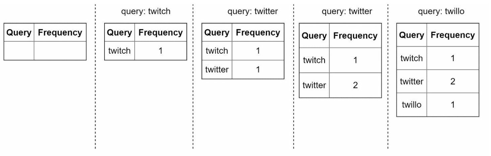

# 第 13 章：设计搜索自动补全系统

## 简介
自动补全也称为 typeahead 或增量搜索，会在用户于搜索框中输入时提供实时建议。系统必须根据历史查询数据，高效地提供相关且热门的前 k 个建议。

### 关键特性
- 建议最多 **5 个自动补全结果**。
- 基于**查询热度**（频率）。
- 仅支持**小写英文字母**。
- 快速响应时间（<100 ms）且可扩展。

---

## 步骤 1：理解问题

### 要求
1. **实时建议：** 在用户输入时显示相关匹配项。
2. **前 k 个结果：** 返回最多 5 个按热度排序的结果。
3. **可扩展性：** 处理 **10 million DAU**，峰值 QPS 为 **48,000**。
4. **高可用性：** 在不造成系统停机的情况下处理故障。
5. **数据增长：** 支持每天为新查询数据增长 **0.4 GB** 的存储。

---

## 步骤 2：高层设计
在高层设计中，系统被拆分为两个服务：
1. **数据收集服务：** 
    - 收集用户查询，并实时聚合这些查询以进行频率分析。
    - 对大型数据集而言，实时处理并不实际；不过，这是一个很好的起点

2. **查询服务：** 根据用户的输入提供前 k 个建议。

---

### 数据收集服务

    

- 从分析日志聚合查询数据，并更新频率表。
- 每周处理历史数据，以构建**字典树**（前缀树）。

### 查询服务

    
    

- 使用数据收集服务生成的频率表。
- 处理用户输入，并使用字典树从频率表中检索前 k 个建议。
- 使用缓存和高效的数据结构优化快速查找。
- 例如，当用户在搜索框中输入“tw”时，会显示以下搜索次数最多的前 5 个查询。

---

## 步骤 3：深入设计

### 字典树数据结构
**字典树**是一种树状数据结构，用于高效地存储和检索查询字符串。

#### 关键特性
1. **紧凑存储：** 以层次化方式表示前缀，从而最大限度地减少冗余。
2. **频率信息：** 在每个节点存储查询的热度。

4. **获取搜索次数最多的前 k 个查询的步骤**
   

      
   

    - 找到前缀
    - 从前缀节点遍历子树，以获取所有有效子节点
    - 对子节点排序并获取前 k 个

3. **优化：**
   - 在每个节点缓存前 k 个查询，以加快检索并避免遍历整个字典树。

        

   - 限制前缀长度，以缩小搜索空间，因为用户很少会输入很长的搜索查询（比如 50）。

#### 字典树操作
1. **创建：** 
    - 使用聚合的查询数据每周构建。
    - 数据源来自 Analytics Log/DB。
2. **更新：** 很少实时更新；每周更新会替换旧数据。
3. **删除：** 
      

         
      

    - 过滤器会移除不需要或有害的建议（例如仇恨言论）。
    - 设置过滤层使我们可以根据不同的过滤规则灵活地移除结果。
    - 不需要的建议会从数据库中异步物理删除。
    

---

### 查询处理流程
1. **前缀搜索：**
   - 识别与用户输入对应的前缀节点。
   - 遍历子树以收集有效建议。
2. **前 k 个排序：**
   - 在每个节点缓存前 k 个建议，以最大限度地减少排序开销。
3. **构造响应：**
   - 使用缓存数据构造结果，以实现快速响应时间。

---

### 优化
1. **在每个节点缓存：**
   - 存储前 k 个查询，以避免重复遍历。
2. **限制前缀长度：**
   - 将前缀长度限制为较小的值（例如 50 个字符），以便更快地查找。
3. **AJAX 请求：**
   - 使用轻量级异步请求实现实时响应。
4. **浏览器缓存：**
   - 将自动补全结果保存到浏览器缓存中，以用于经常搜索的词语。

---

### 数据收集流水线
在高层设计中，每当用户输入搜索查询时，数据都会实时更新。这种方式并不实际。
- 用户每天可能输入数十亿个查询。每次查询都更新字典树是不可行的。
- 字典树构建完成后，热门建议可能不会经常变化。

#### 更新后的设计

   

1. **分析日志：**
   - 将原始查询数据以日志形式存储，以便每周聚合。
   - 日志只追加且不建立索引
2. **聚合器：**
   - 将日志处理为频率表，以便构建字典树。
   - 对于 Twitter 等实时应用，在更短的时间间隔内聚合数据。
   - 对于其他情况，降低聚合频率，例如每周一次，就足够了。
3. **工作节点：**
   - 异步服务器重建字典树，并将其存储在持久化存储中。
4. **存储选项：**
    - **字典树缓存**：字典树缓存是一种分布式缓存系统，将字典树保存在内存中以便快速读取。
    - **字典树 DB** 
        1. **文档存储（例如 MongoDB）：** 由于每周构建一个新的字典树，我们可以定期对其进行快照，将其序列化，并把序列化后的数据存储在 MongoDB 之类的数据库中
        2. **键值存储：** 
            - 将前缀映射到节点数据，以便快速访问。
            - 字典树中的每个前缀都映射到哈希表中的一个键。
            - 每个字典树节点的数据都映射到哈希表中的一个值。

                
---

### 可扩展性
1. **分片：**
   - 根据前缀范围在服务器之间分配字典树节点（例如 `a-m`、`n-z`）。
   - 在前缀内部进一步分片，以平衡不均匀的分布（例如 `aa-ag`、`ah-an`）。
2. **负载均衡：**
   

      
   

   - 使用分片映射管理器将请求路由到适当的服务器。

---

## 步骤 4：高级特性

### 多语言支持
1. **Unicode 字符：** 使用 Unicode 支持非英语语言。
2. **特定国家的字典树：** 为不同国家或地区构建单独的字典树。

### 热门查询
- 通过动态更新字典树节点，或提高近期查询的权重，处理实时事件。

