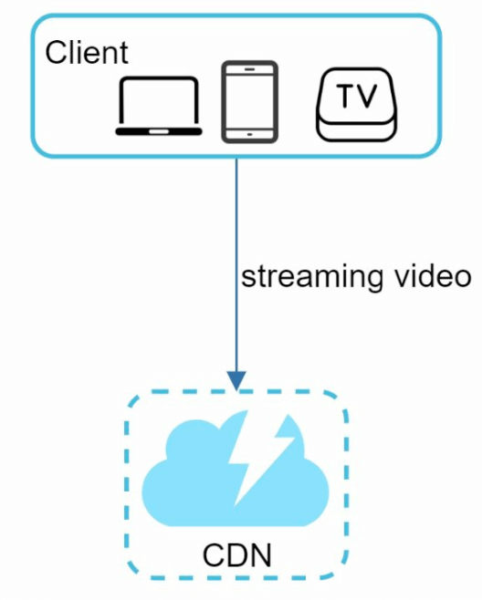
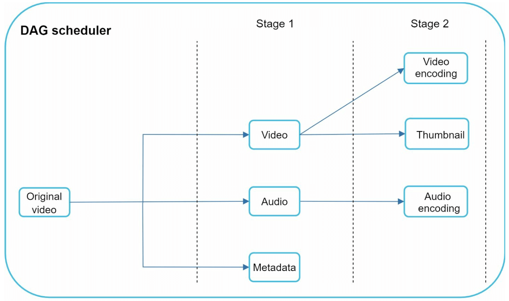
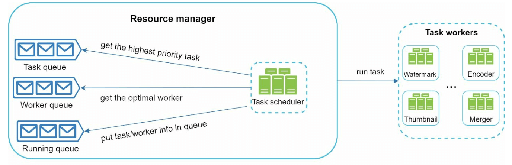
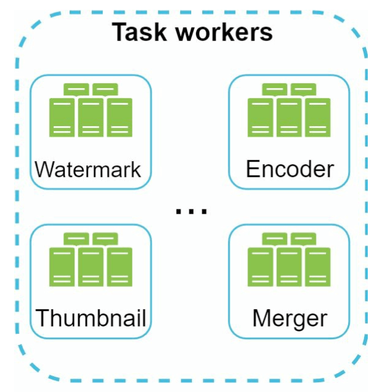

# 第 14 章：设计 YouTube

## 简介
YouTube 是一个庞大的视频流式传输平台，支持视频上传、播放和各种互动。本章重点介绍如何设计一个可扩展的视频流式传输系统，具备以下核心功能：
- **快速视频上传**
- **流畅的视频流式传输**
- **更改视频质量的能力**
- **低基础设施成本**
- **高可用性和可靠性**

### 关键统计数据 (2020)
- **2 billion 月活跃用户**
- **每天观看 5 billion 个视频**
- **移动互联网流量的 37% 来自 YouTube**
- 支持 **80 languages**
- **$15.1 billion 广告收入**，发生于 2019 年

---

## 第 1 步：理解问题和范围

### 核心功能
1. 上传视频
2. 观看视频

### 支持的平台
- 移动应用、Web 浏览器和智能电视

### 假设
- **日活跃用户 (DAU)：** 5 million
- **平均视频大小：** 300 MB
- **上传限制：** 每个视频最大 1 GB
- **每日存储需求：** 150 TB
- **CDN 成本：** 5 million * 5 videos * 0.3GB * $0.02 =  $150,000/day（使用 Amazon CloudFront）

---

## 第 2 步：高层设计

### 组件

    

1. **客户端：** 智能手机、计算机和电视等设备。
2. **CDN (内容分发网络)：** 存储并流式传输视频。
3. **API 服务器：** 处理除视频流式传输之外的所有用户交互（例如上传、元数据更新）。
4. **元数据数据库：** 存储视频元数据（例如标题、描述、大小）。
5. **原始存储：** 用于存储上传视频的 Blob 存储。
6. **转码服务器：** 将视频转换为多种分辨率和格式。
7. **转码后存储：** 用于存储转码后视频的 Blob 存储。

---

### 核心工作流
#### 1. 视频上传流程
- **并行进程：**
  1. 将视频上传到原始存储。
  2. 在数据库中更新视频元数据。

- **视频上传（步骤）：**

    

        
    

    - [1] 视频被上传到 Blob 存储。 
    - [2] 转码服务器将视频转换为多种格式。
    - [3] 一次转码完成后，以下两个步骤并行执行。
        - [3a] 转码后的视频被发送到转码后存储。
        - [3b] 转码完成事件被加入完成队列。 
    - [3a.1] 视频被分发到 CDN。 
    - [3b.1] 完成处理器更新元数据并通知用户。 

- **元数据上传（步骤）：**

    

        
    

    - 客户端并行发送请求以更新视频元数据。
    - 请求包含视频元数据，包括文件名、大小、格式等。
    
       

#### 2. 视频流式传输流程

  

- 视频直接从 CDN 通过边缘服务器进行流式传输，以最大限度地降低延迟。
- 一些流式传输协议是 MPEG_DASH、Apple HLS、Adobe HDS。
-  *不同的流式传输协议支持不同的视频编码和播放播放器。*

---

## 第 3 步：设计深入探讨

### 视频转码
#### 重要性
1. 原始视频会占用大量存储空间。它可以减少存储空间。
2. 确保跨设备和浏览器的兼容性。
3. 根据网络状况调整视频质量。

#### 组件
- **容器：** 封装视频、音频和元数据（例如 MP4、AVI）。
- **编解码器：** 压缩和解压缩算法（例如 H.264、VP9）。

#### 有向无环图 (DAG) 模型

    

- 视频转码在计算上成本高昂且耗时。
- DAG 模型定义编码、缩略图生成和水印等任务。
- 允许在视频处理中实现高度并行。

- 原始视频被拆分为视频、音频和元数据。 
    - 视频编码：转换视频以支持不同的分辨率、编解码器和比特率。
    - 缩略图：可以由用户上传，也可以由系统自动生成。
    - 水印：视频顶部的图像叠加层，其中包含视频的标识信息。

---

### 视频转码架构

1. **预处理器：** 将视频拆分为更小的块（GOP 对齐）。它有 4 项职责。

    

        
    

    - 视频拆分：视频流被拆分，或进一步拆分为更小的图像组（GOP）对齐块。
    - 它按 GOP 对齐拆分视频，以支持旧客户端。
    - 它根据客户端程序员编写的配置文件生成 DAG。 
    - 它将 GOP 和元数据存储在临时存储中，以防编码失败时系统可以使用持久化数据执行重试操作。

2. **DAG 调度器：** 将任务组织为串行或并行阶段。
    

        
    

    - 它将 DAG 图拆分为任务阶段，并将它们放入资源管理器中的任务队列。
    - 阶段 1：视频、音频和元数据。
    - 视频文件在阶段 2 中进一步拆分为两个任务：视频编码和缩略图。

3. **资源管理器：** 负责管理资源分配的效率。它
包含 3 个队列和一个任务调度器。
    

        
    

    - 任务队列：包含待执行任务的优先队列。
    - 工作器队列：包含工作器利用率信息的优先队列。
    - 运行队列：包含当前正在运行的任务以及运行这些任务的工作器。
    - 任务调度器：选择最优任务/工作器，并指示选定的任务工作器执行作业。

4. **任务工作器：** 执行转码和其他操作。
    

        
   

    - 不同的任务工作器可能运行不同的任务。

5. **临时存储：** 存储用于重试的中间数据。
    - 存储系统的选择取决于数据类型、数据大小、访问频率、数据生命周期等因素。 
6. **输出：** 准备好进行分发的转码后视频。

---

## 系统优化

### 速度优化
1. **并行视频上传：** 将视频拆分为更小的块，以实现更快且可恢复的上传。

    

2. **分布式上传中心：** 使用靠近用户的 CDN 作为上传枢纽。
3. **并行处理：** 使用消息队列解耦模块，以实现高度并行。

    
    

### 安全优化
1. **预签名 URL：** 将视频上传限制为授权用户。

    

2. **保护视频：**
   - **DRM 系统**（例如 Apple FairPlay、Google Widevine）。
   - **AES 加密。**
   - **水印。**

### 节省成本的优化
1. 仅通过 CDN 提供热门视频；通过高容量服务器提供不太热门的视频。
2. 对很少访问的视频按需编码。
3. 根据受欢迎程度进行视频分发区域化。
4. 构建自定义 CDN 并与 ISP 合作，以降低带宽成本。

---

## 错误处理
### 可恢复错误
- 重试失败的上传、转码或资源分配任务。

### 不可恢复错误
- 停止格式错误的视频处理并返回错误代码。
 
