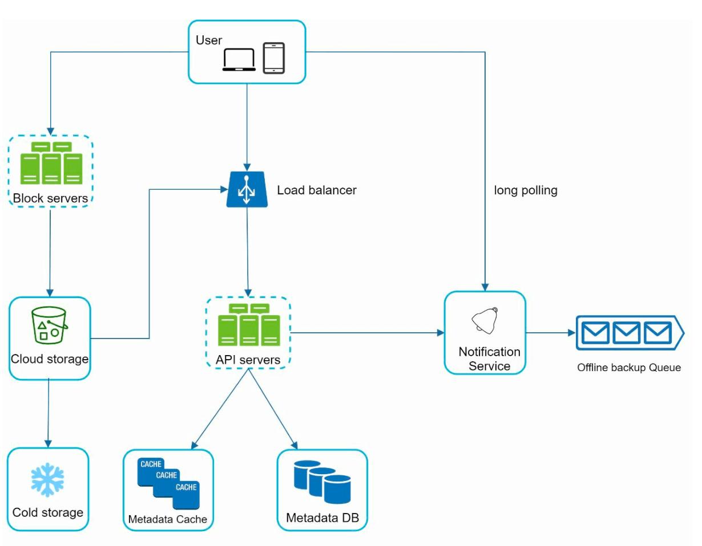

# 第 15 章：设计 Google Drive

## 引言
Google Drive 是一项基于云的文件存储和同步服务，允许用户通过各种设备存储、访问和共享文件。本章讨论设计一个具备以下功能的可扩展系统：
- **文件上传和下载**
- **跨设备文件同步**
- **文件共享**
- **文件修订历史**
- **编辑、删除和共享通知**

---

## 第 1 步：理解问题

### 关键要求
#### 功能性要求：
- 上传和下载文件。
- 跨多个设备同步文件。
- 维护文件修订版本。
- 启用带权限的文件共享。
- 在文件编辑、删除和共享时发送通知。

#### 非功能性要求：
- **可靠性：** 数据丢失不可接受。
- **快速同步速度：** 避免延迟同步导致用户失去耐心。
- **带宽效率：** 最大限度减少不必要的数据使用。
- **可扩展性：** 处理 10 million 日活跃用户（DAU）。
- **高可用性：** 在服务器故障或网络问题期间无缝运行。

### 约束和假设
- 用户获得 **10 GB 免费空间**。
- 最大文件大小：**10 GB**。
- 平均文件上传大小：**500 KB**。
- 上传频率：**每个用户每天 2 个文件**。
- 所需总存储空间：**500 PB**。

---

## 第 2 步：高层设计
### 单服务器设置
基本设置包括：
1. **Web 服务器：** 处理上传和下载。
2. **元数据数据库：**  用于跟踪用户数据、登录信息、文件信息/
3. **存储目录：** 保存按命名空间组织的文件。

    

- 设置一个 Web 服务器和一个名为 drive/ 的目录作为存储上传文件的根目录。 
- 在 drive/ 目录下，有一个名为 namespaces 的目录列表。 
- 每个命名空间包含该用户上传的所有文件。 
- 每个文件或文件夹都可以通过连接命名空间和相对路径来唯一标识。

该设计可作为起点，但不足以进行扩展。

#### APIs
1. **向 Google Drive 上传文件：** 支持两种上传类型
    - 简单上传：文件较小时使用。
    - 可恢复上传： 
        - 端点：https://api.example.com/files/upload?uploadType=resumable
        - 发送初始请求以获取可恢复 URL。
        - 上传数据并监控上传状态
        - 如果上传被中断，则恢复上传。
2. **从 Google Drive 下载文件：** 要下载文件
    -  端点：https://api.example.com/files/download
3. **获取文件修订版本：**
    - 端点：https://api.example.com/files/list_revisions

### 迁移到分布式系统

#### 改进：
1. **分片：** 根据 `user_id` 将存储拆分到不同服务器。
2. **Amazon S3：** 使用 S3 进行可扩展且冗余的文件存储，并进行跨区域复制。

    
     
3. **负载均衡器：** 在多个 Web 服务器之间分配流量。
4. **元数据数据库复制：** 通过数据库分片和复制确保可用性。

#### 同步冲突：
对于像 Google Drive 这样的大型存储系统，同步冲突会时有发生。
当两个用户同时修改同一个文件或文件夹时，就会发生冲突。

- 在示例中，用户 1 和用户 2 尝试同时更新同一文件，但用户 1 的文件先由我们的系统处理。
- 用户 1 的更新操作成功完成，但用户 2 遇到同步冲突。 
- 系统呈现同一文件的两个副本：用户 2 的本地副本和服务器上的最新版本。
- 用户 2 可以选择合并两个文件，或用一个版本覆盖另一个版本。

### 改进后的设计

1. **用户交互：**：用户通过浏览器或移动应用访问该应用程序。

2. **块服务器：**
   - 文件被拆分为 **4 MB 块**（最大大小），并分配唯一的哈希值。
   - 块独立存储在云存储中（例如 Amazon S3）。
   - 文件重建包括按特定顺序连接各个块。

3. **云存储：** 块存储在云存储中，以实现可扩展性和冗余。

4. **冷存储：** 将非活动文件移至冷存储以降低成本。

5. **负载均衡器：** 在 API 服务器之间均匀分配请求，以确保高效运行。

6. **API 服务器：**
   - 处理用户身份验证、个人资料管理和文件元数据更新。
   - 管理所有非上传工作流。

7. **元数据数据库和缓存：**
   - 存储用户、文件、块和版本的元数据。
   - 缓存经常访问的元数据，以加快检索速度。

8. **通知服务：**
   - 一个**发布者/订阅者系统**，通知客户端文件变更（添加、编辑、删除）。
   - 确保客户端可以拉取最新更新。

9. **离线备份队列：** 临时存储文件变更信息，以便离线客户端重新上线后进行同步。

---

## 第 3 步：深入设计

### 元数据数据库
下面展示了一个高度简化的版本，因为它只包含最重要的表和字段。
#### 模式设计：
- **用户表：** 存储用户资料和偏好设置。
- **文件表：** 维护文件元数据（例如大小、名称、路径）。
- **块表：** 跟踪用于重建文件的文件块。
- **文件版本表：** 存储文件修订历史。

---

### 文件上传流程

1. **文件上传：**
   - 文件由块服务器拆分为块、压缩并加密。
   - 块上传到块服务器并存储在 S3 中。
2. **元数据上传：**
   - 客户端向 API 服务器发送元数据。
   - 元数据以 `pending` 状态存储在数据库中。
3. **完成：**
   - S3 触发回调，将文件状态更新为 `uploaded`。
   - 通知服务通知相关用户。

---

### 文件同步
1. **增量同步：** 仅传输已修改的块，而不是整个文件。

    

    
    

2. **压缩：** 根据文件类型使用压缩算法对块进行压缩。 
3. **冲突解决：**
   - 首个处理的版本胜出。
   - 冲突版本会单独保存，以供用户解决。

---

### 文件下载流程
当文件在其他位置被添加或编辑时，会触发下载流程。客户端有两种获知方式：
- 如果客户端 A 在线时文件被另一个客户端更改，通知服务会通知客户端 A。
- 如果客户端 A 离线时文件被另一个客户端更改，数据会保存到缓存中。离线客户端重新上线后，会拉取最新更改。

客户端得知文件发生更改后，首先通过 API 服务器请求元数据，然后
下载块以构建文件。

1. **触发：** 通知服务向客户端通知文件更新。
2. **获取元数据：** 客户端通过 API 获取更新后的元数据。
3. **下载块：** 客户端从块服务器下载更新后的块，并重建文件。

---

### 通知服务
1. **目的：** 使客户端了解文件变更。
2. **机制：** 实现**长轮询**以进行异步通知。
3. **示例：** 添加、编辑或删除文件时，通知会推送给所有相关客户端。

---

### 存储优化
1. **去重：** 使用基于哈希的比较在帐户级别移除重复块。
2. **版本控制策略：**
   - 限制保存的修订版本数量。
   - 对频繁编辑的文件优先保留最近版本。
3. **冷存储：** 将很少访问的文件移至更廉价的存储解决方案（例如 Amazon S3 Glacier）。

---

### 故障处理
1. **负载均衡器故障：** 备用负载均衡器变为活动状态。
2. **块服务器故障：** 待处理任务会重新分配给其他服务器。
3. **元数据数据库故障：**
   - 将从节点提升为主节点。
   - 将流量重定向到剩余副本。
4. **云存储故障：** 使用跨区域复制获取不可用的文件。
5. **通知服务故障：** 客户端重新连接到备用服务器。

