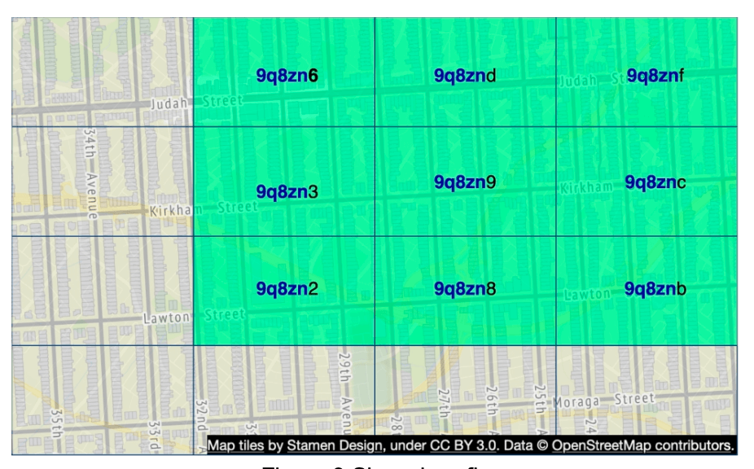
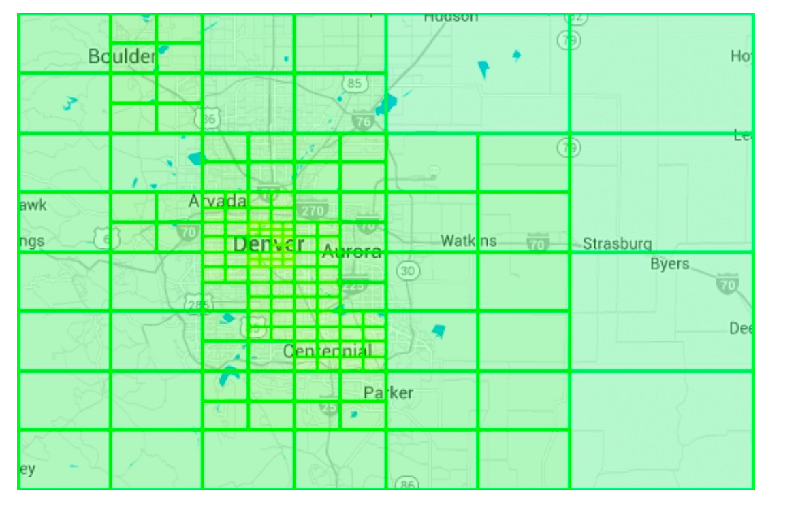
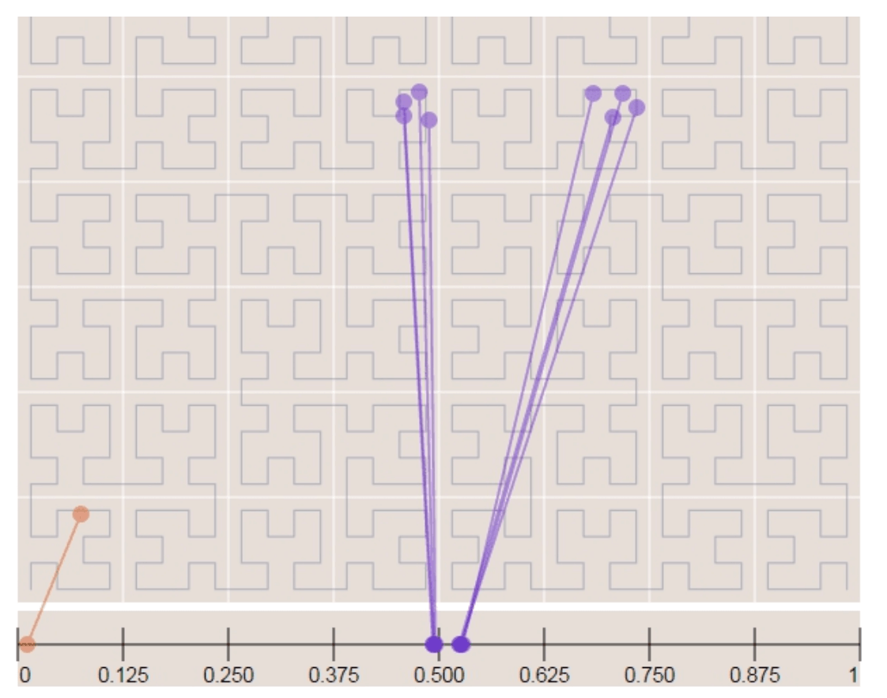

# 第 16 章：邻近服务

## 引言
**邻近服务**旨在查找附近的位置，例如餐厅、酒店、加油站和其他商家。这项功能用于 **Google Maps** 和 **Yelp** 等应用，帮助用户发现指定半径内的地点。


## 第 1 步：理解问题并确定范围

### **功能需求**
1. **搜索商家**，依据用户位置（纬度、经度）和搜索半径。
2. **允许商家所有者**添加、更新或删除商家（非实时）。
3. **提供详细的商家信息**（在请求时）。

### **非功能需求**
- **低延迟**：用户应该快速得到响应。
- **数据隐私**：遵守 GDPR 和 CCPA 法规。
- **高可用性**：处理繁忙地点高峰时段的流量峰值。

### **粗略估算**
- **每日活跃用户 100 百万。**
- **系统中有 200 百万家商户。**
- **搜索 QPS 计算：**
  - 用户**每天进行 5 次搜索**。
  - **Search QPS** = (100M × 5) / 86,400 ≈ **5,000 QPS**。

---

## 第 2 步：高层设计

### **API 设计**
#### **搜索附近商家**
GET /v1/search/nearby

- **请求参数**：
  - `latitude`：用户位置的纬度。
  - `longitude`：用户位置的经度。
  - `radius`：搜索半径（默认值：5000m）。

#### **商家 APIs**
| API 端点                         | 描述                                             |
|-----------------------------------|--------------------------------------------------|
| `GET /v1/businesses/{id}`         | 获取详细的商家信息                    |
| `POST /v1/businesses`             | 添加新商家                              |
| `PUT /v1/businesses/{id}`         | 更新商家详情                         |
| `DELETE /v1/businesses/{id}`      | 从系统中移除商家               |


### **数据模型**
- 由于两个功能被非常频繁地使用，读数据量很高，因此 MySQL 这样的关系型数据库很适合。
  - 搜索附近的商家
  - 查看商家的详细信息

### **数据架构**
- 关键数据库表是商家表和地理空间索引表
- 商家表包含商家的详细信息。

### **高层系统架构**
系统由两部分组成：基于位置的服务（LBS）和商家相关服务。

<div style="margin-left:3rem">
    
</div>

- **基于位置的服务（LBS）**： 
  - 处理基于位置的搜索查询。
  - 以读为主的服务，不接收写请求。
  - QPS 很高，尤其是在高密度区域的高峰时段，并且系统是无状态的。
- **商家服务**：处理两种类型的请求。
  - 商家所有者创建、更新或删除商家。
  - 客户查看商家的详细信息。
- **负载均衡器**：将流量路由到 LBS 和商家服务。
- **数据库集群**： 
  - 对读密集型工作负载使用**主副本架构**。
  - LBS 读取的数据与主数据库写入的数据之间可能存在一些差异。
  - 这种不一致不是问题，因为商家信息不是实时更新的。


---

## 第 3 步：获取附近商家的算法

### **选项 1：二维搜索（朴素方法）**

<div style="margin-left:3rem">
    
</div>

最直观的方法是绘制一个预定义半径的圆，并查找圆内的所有商家。

**SQL 查询：**
```
SELECT business_id, latitude, longitude
FROM business
WHERE (latitude BETWEEN :lat - radius AND :lat + radius)
AND (longitude BETWEEN :long - radius AND :long + radius);
```
**问题：**
- **效率低：**需要扫描整个数据库。
- **受一维索引限制**（纬度/经度）。

一种潜在的改进是在经度和纬度列上建立索引，虽然这会稍微好一些，但仍然非常慢。

### 更好的方法
- 上一种方法的问题在于，数据库索引只能在一个维度上提高搜索速度。
- 一种最优方法是使用地理空间索引，将二维数据表示为一维数据。
  - 哈希：均匀网格、Geo Hash
  - 树：四叉树、Google S2、RTree

  <div style="margin-left:3rem">
    
  </div>


### **选项 2：均匀划分网格**

  <div style="margin-left:3rem">
    
  </div>

- **将世界划分为固定大小的网格**。
- **问题**：商家分布不均（城市中密度高，农村地区稀疏）。

### **选项 3：Geohash**
- 沿本初子午线和赤道将地球划分为四个象限，然后将每个网格划分为四个更小的网格。 
- 可以通过交替使用经度和纬度的位来表示每个网格。
- 重复这种细分

  <div style="margin-left:3rem">
    
    
  </div>


- **将纬度和经度编码成单个字母数字字符串**。它有 12 个精度（级别）
- **分层网格结构**允许高效搜索。
- 根据表格，使用最小 geohash 长度选择正确的精度。
  <div style="margin-left:3rem">
    
  </div>
- Geohash 保证两个 geohash 之间共享的前缀越长，它们就越接近。

- **挑战**：
  <div style="margin-left:3rem">
    
  </div>

  - **边界问题**（靠近网格边缘的商家可能会被排除）。
    - 两个位置可能非常接近，却完全没有共享前缀（可能位于赤道的另一侧）
    - 两个位置可能共享很长的前缀，却属于不同的 geohash。
  - 解决方案：需要搜索相邻网格。


### **选项 4：四叉树**

  四叉树是一种树形数据结构，它递归地将二维空间划分为四个象限，每个内部节点恰好有四个子节点，分别表示空间的四个子区域。
  - 四叉树是一种内存数据结构，在每台 LBS 服务器上运行，并在服务器启动时构建。

  <div style="margin-left:3rem">
    
  </div>

  - 根节点被递归拆分为 4 个象限，直到没有节点包含超过 x 个商家（此处为 100 个）。

  <div style="margin-left:3rem">
    
  </div>

- 四叉树索引不占用太多内存（通常以 GBs 计），可以轻松放入一台服务器。
- 由于构建树的时间复杂度为 nlogn，构建树可能需要几分钟。
- **适用于高效的 k 近邻搜索查询**（例如，查找最近的加油站）。

  <div style="margin-left:3rem">
    
  </div>

#### 运行注意事项
 - 对于大约 200 百万家商户，在服务器启动时构建四叉树可能需要几分钟。
 - 四叉树构建期间无法提供流量服务，因此新版本应该增量发布到一部分服务器。
 - 更新商家或添加新商家时，最简单的方法是增量重建四叉树。（会导致大量缓存失效）
 - 也可以动态更新四叉树，但实现更复杂。（需要锁机制）

### **选项 5：Google S2**
它使用基于希尔伯特曲线的 !D 索引将球体映射到一维空间。希尔伯特曲线上彼此接近的两个点在 1D 空间中也彼此接近。


  <div style="margin-left:3rem">
    
    
  </div>

- **使用希尔伯特曲线将地球划分为小单元格**。
- 非常适合地理围栏，因为它可以用不同级别覆盖任意区域。
- 地理围栏还允许定义包围感兴趣区域的参数。
- 另一个优势是，我们不必使用固定的精度级别，而是可以在 S2 中指定最小、最大级别和最大单元格数。


## 权衡比较 

#### Geohash
- 易于使用和实现- 无需构建/重建树
- 支持固定半径结果
- 更新索引很容易。
- 无法根据人口密度动态调整网格大小。

#### 四叉树
- 实现稍微困难一些。
- 支持获取 k 近邻商家。
- 可以根据人口密度动态调整网格大小。
- 更新索引更复杂，因为可能需要重建整棵树。

---

## 第 4 步：扩展数据库和缓存策略

### **扩展商家表**
- **按商家 ID 分片**可确保数据均匀分布。
- 我们为表中的每个商家分别存储一行。

| Geohash | 商家 ID     |
|---------|------------|
| 9q9hvu  | 343        |
| 9q9hvu  | 347        |
| 9q9hvu  | 112        |

### **扩展地理空间索引**
- 这可能不适合 geohash 表。在这种情况下，所有内容都可以放在一台服务器上，因此没有技术上的分片理由。
- 更好的方法是使用读副本来帮助承担读取负载。


---

### **缓存策略**
最明显的缓存键选择是位置坐标，但它存在一些问题：
 - gps 的位置坐标并不准确。
 - 用户可能移动，导致位置坐标发生变化。
 - 更好的键是 geohash。

| 缓存键     | 缓存值       |
|------------|------------|
| `geohash`  | 该网格中的商家 IDs 列表 |
| `business_id` | 商家详情（名称、地址、评论等） |

---

## 第 5 步：部署策略和最终架构

### **区域和可用区**
- 在**多个区域**中部署 LBS 和商家服务。

### **处理实时更新**
- **商家更新每天进行批处理**。

### **最终系统架构**


  <div style="margin-left:3rem">
    
  </div>


最终算法如下：

## 检索附近商家的步骤
1. **用户请求：**  
   - 用户搜索 **500 米**范围内的餐厅。  
   - 客户端将**纬度 (37.776720)、经度 (-122.416730) 和半径 (500m)**发送到**负载均衡器**。

2. **请求转发：**  
   - **负载均衡器（LB）**将请求转发到**基于位置的服务（LBS）**。

3. **Geohash 计算：**  
   - LBS 确定与半径匹配的**geohash 长度**。  
   - 使用参考表，**500m 对应 geohash 长度 = 6**。

4. **获取相邻 Geohash：**  
   - LBS 计算**相邻 geohash**，以包含附近区域。  
   - 结果是一个列表：  
     ```
     [my_geohash, neighbor1_geohash, neighbor2_geohash, ..., neighbor8_geohash]
     ```

5. **从 Redis 获取商家 IDs：**  
   - 对于列表中的每个 geohash，LBS 查询**Geohash Redis 服务器**以获取**商家 IDs**。  
   - 使用并行查询来最小化延迟。

6. **检索和排序商家：**  
   - LBS 从**商家信息 Redis 服务器**获取**完整的商家详情**。  
   - 商家按与用户位置的**距离**排序。  
   - **排序后的结果**被发送回客户端。

## 关键优化
- **并行 Redis 调用**：减少响应时间。  
- **Geohash 索引**：确保高效的空间查询。  
- **缓存**：加快商家数据的查找和检索。  

该方法确保**低延迟、可扩展**地检索用户附近的商家。

---

### **选择最佳索引方法**
| 索引方法       | 优点 | 缺点 |
|----------------|------|------|
| **Geohash** | 易于实现，适合邻近搜索 | 边界问题，固定网格大小 |
| **四叉树** | 根据密度动态调整，支持 k 近邻查询 | 更复杂，需要重新平衡树 |
| **Google S2** | 高级地理围栏，用于 Google Maps | 更难实现 |

---

## 参考资料
1. [Geohash 算法](https://www.movable-type.co.uk/scripts/geohash.html)
2. [四叉树索引](https://en.wikipedia.org/wiki/Quadtree)
3. [Google S2 几何](https://s2geometry.io/)


