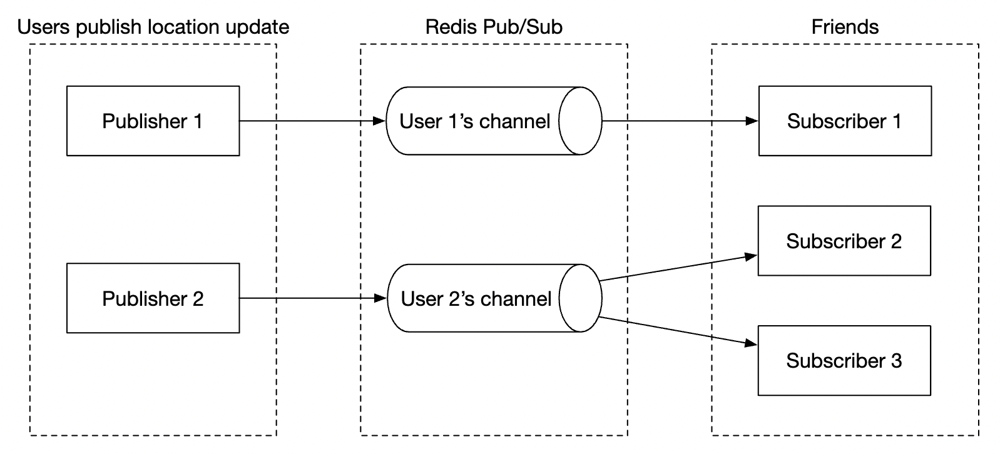

# 第 17 章：附近的朋友

## 引言

本章重点讨论如何为一种应用设计可扩展的后端，该应用允许用户分享自己的位置，并发现**附近**的朋友。

与邻近章节的主要区别在于，在本问题中，**位置会不断变化**，而在那个问题中，商业地址基本保持不变。

---

## 步骤 1：理解问题并确定设计范围

用于引导面试的一些问题：
 * C: 在地理位置上多近才算“附近”？
 * I: 5 miles，该数字应该可配置
 * C: 距离是按直线距离计算，还是会考虑朋友之间是否隔着河流等因素
 * I: 是的，这是一个合理的假设
 * C: 应用有多少用户？
 * I: 1bil 名用户，其中 10% 使用附近的朋友功能
 * C: 我们是否需要存储位置历史？
 * I: 是的，例如它对于机器学习可能很有价值
 * C: 我们是否可以假设不活跃的朋友会在 10min 后从该功能中消失
 * I: 是的
 * C: 我们是否需要担心 GDPR 等问题？
 * I: 不，为简单起见不需要

### **功能需求**

 * 用户应该能够在移动应用上看到附近的朋友。每个朋友都有距离和时间戳，用于指示位置更新时间
 * 附近的朋友列表应该每隔几秒更新一次

### **非功能需求**

- **低延迟**：重要的是在不过多延迟的情况下接收位置更新
- **可靠性**：偶尔丢失数据点是可以接受的，但系统总体上应该可用
- **最终一致性**：位置数据存储不需要强一致性。在不同副本中接收位置数据时延迟几秒是可以接受的

### **粗略估算**

用于确定潜在规模的一些估算：
 * 附近的朋友是半径 5mile 内的朋友
 * 位置刷新间隔为 30s。人的步行速度很慢，因此不需要过于频繁地更新位置。
 * 平均每天有 100mil 名用户使用该功能 \w 10% 并发用户，即 10mil
 * 平均每位用户有 400 个朋友，他们都使用附近的朋友功能
 * 应用每页显示 20 个附近的朋友
 * **位置更新 QPS** = 10mil / 30 == ~334k updates per second

---

## 步骤 2：提出高层设计并获得认同

在探索 API 和数据模型设计之前，我们将研究要使用的通信协议，因为它不像传统的请求-响应通信模型那样普遍。

### **高层设计**

在高层次上，我们希望在对等方之间建立有效的消息传递。这可以通过 peer-to-peer 协议实现，但对于连接不稳定且功耗限制严格的移动应用来说并不实际。

一种更实际的方法是使用共享后端，作为向目标朋友进行扇出的机制：

    

后端做什么？
 * 接收所有活跃用户的位置更新
 * 对于每次位置更新，找到所有应该接收它的活跃用户并将其转发给他们
 * 如果朋友之间的距离超过配置的阈值，则不转发位置数据

这听起来很简单，但挑战在于要为我们所处的规模设计系统。

我们一开始会先采用更简单的设计，并在深入设计中讨论更高级的方法：

    

- **负载均衡器**：在 rest API 服务器以及双向 web socket 服务器之间分发流量
- **rest API 服务器**：处理管理朋友、更新个人资料等辅助任务
- **Websocket 服务器**：有状态服务器，将位置更新请求转发给相应的客户端。它还负责在初始化时向移动客户端提供附近朋友的位置（稍后详细讨论）。
- **Redis 位置缓存**：用于存储每个活跃用户的最新位置数据。缓存中的每个条目都设置了 TTL。当 TTL 过期时，用户不再活跃，其数据会从缓存中删除。
- **用户数据库**：存储用户和好友关系数据。可以使用关系型数据库或 NoSQL 数据库。
- **位置历史数据库**：存储用户位置数据的历史记录，不一定直接用于附近的朋友功能，而是用于跟踪历史数据以进行分析
- **Redis pubsub**：用作轻量级消息总线，为位置更新启用每个用户频道的不同主题。

    

在上面的示例中，websocket 服务器订阅与其连接的用户对应的频道，并在收到位置更新时将其转发给适当的用户。

### **周期性位置更新**

以下是周期性位置更新的流程：

    

 * 移动客户端向负载均衡器发送位置更新
 * 负载均衡器将位置更新转发到该客户端对应的 websocket 服务器持久连接
 * Websocket 服务器将位置数据保存到位置历史数据库
 * 位置数据在位置缓存中更新。Websocket 服务器还会将位置数据保存在内存中，以便随后为该用户计算距离
 * Websocket 服务器通过 redis pub sub 在用户的频道中发布位置数据
 * Redis pubsub 将位置更新广播给该用户频道的所有订阅者，即负责该用户朋友的服务器
 * 已订阅的 web socket 服务器接收位置更新，计算应向哪些用户发送更新，并发送更新

以下是同一流程的更详细版本：

    

平均而言，将有 40 次位置更新需要转发，因为用户平均有 400 个朋友，其中 10% 的朋友同时在线。

### **API 设计**

我们需要支持以下 Websocket 例程：
 * 周期性位置更新 - 用户向 websocket 服务器发送位置数据
 * 客户端接收位置更新 - 服务器发送朋友的位置数据和时间戳
 * websocket 客户端初始化 - 客户端发送用户位置，服务器返回附近朋友的位置数据
 * 订阅新朋友 - websocket 服务器发送一个朋友 ID，移动客户端需要跟踪该朋友，例如该朋友首次上线时
 * 取消订阅朋友 - websocket 服务器发送一个朋友 ID，移动客户端需要取消订阅该朋友，例如该朋友下线时

HTTP API - 用于辅助职责的传统请求/响应负载。

### **数据模型**

 * 位置缓存将存储 `user_id` 与 `lat,long,timestamp` 之间的映射。Redis 是这个缓存的绝佳选择，因为我们只关心当前位置，并且它支持此用例所需的 TTL 淘汰。
 * 位置历史表存储相同的数据，但位于包含上述四列的关系型表中 \w。Cassandra 可用于此数据，因为它针对写入密集型负载进行了优化。

---

## 步骤 3：深入设计

让我们讨论如何扩展高层设计，使其能够在我们目标的规模下运行。

### **各组件的扩展能力如何？**

- **API 服务器**：可以通过自动扩展组和复制服务器实例轻松扩展
- **Websocket 服务器**：我们可以轻松扩展 ws 服务器，但在拆除服务器时需要确保已有连接能够优雅关闭。例如，我们可以在负载均衡器中将服务器标记为 "draining"，并停止向其发送连接，然后再将其最终从服务器池中移除
- **客户端初始化**：客户端首次连接到服务器时，会获取用户的朋友，订阅他们在 redis pubsub 上的频道，从缓存中获取他们的位置，最后转发给客户端
- **用户数据库**：我们可以基于 user_id 对数据库进行分片。通过专用服务和 API 暴露用户/朋友数据也可能是合理的，并由专门的团队管理
- **位置缓存**：我们可以通过启动多个 redis 节点轻松地对缓存进行分片。此外，TTL 限制了我们一次可以占用的最大内存。但我们仍然需要处理大量写入负载
- **Redis pub/sub 服务器**：我们利用了这样一个事实：已初始化但未使用的频道不会消耗内存。因此，我们可以为所有使用附近的朋友功能的用户预先分配频道，从而避免处理例如用户上线时创建新频道并通知活跃 websocket 服务器的问题

### **redis pub/sub 组件的扩展深入分析**

我们将需要约 200gb 内存来维护所有 pub/sub 频道。可以使用 2 台各有 100gb 的 redis 服务器来实现这一点。

鉴于我们需要每秒推送 ~14mil 次位置更新，我们至少需要 140 台 redis 服务器来处理这一负载，假设单台服务器可以处理每秒 ~100k 次推送。

因此，我们需要一个分布式 redis 服务器集群来处理密集的 CPU 负载。

为了支持分布式 redis 集群，我们需要利用服务发现组件（例如 zookeeper 或 etcd）来跟踪哪些服务器处于活动状态。

我们需要在服务发现组件中编码的数据如下：

    

Web socket 服务器使用从 zookeeper 获取的编码数据来确定特定频道所在的位置。为提高效率，可以在每个 websocket 服务器的内存中缓存哈希环数据。

关于向上或向下扩展服务器集群，我们可以根据历史流量数据设置每日任务来按需扩展集群。我们也可以对集群进行超额配置，以处理负载峰值。

Redis 集群可以被视为有状态存储服务器，因为频道会维护一些状态，并且需要与订阅者协调，使它们能够将连接交接给集群中新配置的节点。

我们必须注意扩展操作期间的一些潜在问题：
 * 由于频道被移动，会有大量来自 web socket 服务器的重新订阅请求
 * 操作期间可能会遗漏客户端发送的一些位置更新，这对于本问题是可以接受的，但我们仍应尽量减少这种情况。可以考虑在一天中流量最低的时段执行此类操作。
 * 在添加/删除服务器时，我们可以利用一致性哈希来尽量减少移动的频道数量

    

### **添加/删除朋友**

每当添加/删除朋友时，负责受影响用户的 websocket 服务器都需要从该朋友的频道订阅/取消订阅。

由于“附近的朋友”功能是更大应用的一部分，我们可以假设移动客户端一侧可以在任何事件发生时注册回调，并且客户端会向 websocket 服务器发送消息以执行相应操作。

### **拥有很多朋友的用户**

我们可以限制一个人能够拥有的朋友总数，例如 facebook 最多限制 5000 个朋友。

处理“whale”用户的 websocket 服务器一端的负载可能会更高，但只要我们有足够的 web socket 服务器，就应该没有问题。

### **附近的随机人员**

如果面试官希望更新设计，加入一个功能，让我们偶尔能在附近的朋友地图上看到一个随机人员，该怎么办？

一种处理方式是定义一个基于 geohash 的 pubsub 频道池：

    

geohash 内的任何人都会订阅适当的频道，以接收随机用户的位置更新：

    

我们还可以订阅多个 geohash，以处理某人距离很近但位于相邻 geohash 中的情况：

    

### **Redis pub/sub 的替代方案**

使用 Redis 进行 pub/sub 的一种替代方案是利用 Erlang——一种针对分布式计算应用优化的通用编程语言。

借助它，我们可以生成数百万个彼此通信的小型 erland 进程。我们可以在分布式 erlang 应用中同时处理 websocket 连接和 pub/sub 频道。

不过，使用 Erlang 的一个挑战是，它是一种小众编程语言，可能很难找到优秀的 erlang 开发人员。

---

## 步骤 4：总结

我们成功设计了一个支持附近的朋友功能的系统。

核心组件：
- **Web socket 服务器**：客户端与服务器之间的实时通信
- **Redis**：位置数据的快速读写 + pub/sub 频道

我们还探讨了如何扩展 restful api 服务器、websocket 服务器、数据层、redis pub/sub 服务器，也探讨了使用 Redis Pub/Sub 的替代方案。我们还探讨了“附近的随机人员”功能。
