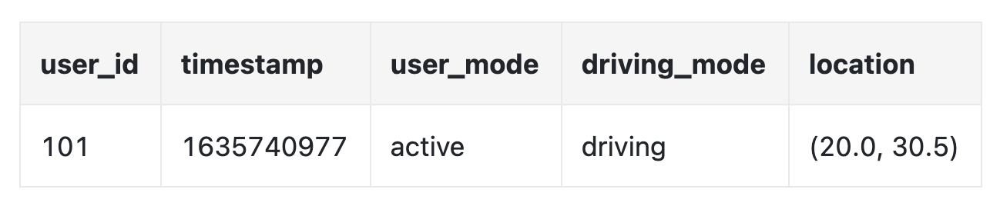

# 第 18 章：Google Maps

## 引言

我们将设计一个简单版本的 **Google Maps**。

关于 google maps 的一些事实：
 * 始于 2005 年
 * 提供各种服务 - 卫星影像、街道地图、实时交通状况、路线规划
 * 截至 2021 年，拥有 1bil 日活跃用户、覆盖全球 99% 的区域，每日更新 25mil 条实时位置信息

---

## 步骤 1：理解问题并确定设计范围

候选人与面试官之间的示例问答：
 * C: 我们要处理多少日活跃用户？
 * I: 1bil DAU
 * C: 我们应该重点关注哪些功能？
 * I: 位置更新、导航、ETA、地图渲染
 * C: 道路数据有多大？我们可以访问这些数据吗？
 * I: 我们从各种来源获得了道路数据，是 TBs 的原始数据
 * C: 我们是否应该将交通状况纳入考虑？
 * I: 是的，为了准确的时间估算，我们应该考虑
 * C: 不同的出行方式呢——步行、骑行、驾车？
 * I: 我们应该支持这些方式
 * C: 多站点导航呢？
 * I: 就面试范围而言，我们不关注这个
 * C: 商业地点和照片呢？
 * I: 问得好，但无需考虑这些

我们将重点关注三个关键功能——用户位置更新、包含 ETA 的导航服务、地图渲染。

### **非功能性要求**

- **准确性**: 用户不应得到错误的路线
- **流畅导航**: 用户应体验流畅的地图渲染
- **数据和电池用量**: 客户端应尽可能少地使用数据和电池。这对移动设备很重要。
- 一般可用性和可扩展性要求

### **地图 101**

在开始设计之前，有一些与地图相关的概念需要了解。

#### 定位系统

世界是一个球体，绕其轴旋转。位置由纬度（你向北/南有多远）和经度（你向东/西有多远）定义：

<div style="margin-left:3rem">
    
</div>

#### 从 3D 到 2D

将点从 3D 平面转换到 2D 平面的过程称为“地图投影”。

有不同的方法可以实现，每种方法都有其优点和缺点。几乎所有方法都会扭曲实际几何形状。

<div style="margin-left:3rem">
    
</div>

Google maps 选择了 Mercator 投影的一个修改版本，称为“Web Mercator”。

#### 地理编码

地理编码是将地址转换为地理坐标的过程。 

反向过程称为“反向地理编码”。

一种实现方式是使用插值——利用不同来源的数据（例如 GIS-es），其中街道网络被映射到地理坐标空间。

#### 地理哈希

地理哈希是一种编码系统，它将地理区域编码为由字母和数字组成的字符串。

它将世界表示为一个平面，并递归地将其细分为四个象限：

<div style="margin-left:3rem">
    
</div>

#### 地图渲染

地图渲染通过切片实现。世界不会被渲染成一张大的自定义图像，而是被拆分成更小的瓦片。

客户端只下载相关瓦片，并像拼接马赛克一样渲染它们。

不同缩放级别对应不同的瓦片。客户端根据客户端的缩放级别选择合适的瓦片。

例如，缩小视图时，整个世界只会下载一个 256x256 的瓦片，用来表示整个世界。

#### 导航算法的道路数据处理

在大多数路线算法中，交叉路口表示为节点，道路表示为边：

<div style="margin-left:3rem">
    
</div>

大多数导航算法使用 Djikstra 或 A* 算法的修改版本。

寻路性能对图的大小很敏感。为了在大规模场景下工作，我们不能将整个世界表示为一个图并在其上运行算法。

相反，我们使用类似切片的技术，将世界细分为越来越小的图。

路线瓦片保存对相邻瓦片的引用，算法在遍历相互连接的瓦片时，可以将它们拼接成更大的道路图：

<div style="margin-left:3rem">
    
</div>

这项技术使我们能够显著减少内存带宽，并且只加载给定源/目标对所需的瓦片。

但是，对于更长的路线，拼接小而详细的路线瓦片仍然会消耗时间/内存。相反，路线瓦片具有不同的详细程度，算法会根据我们要前往的目标使用详细程度合适的瓦片：

<div style="margin-left:3rem">
    
</div>

### **粗略估算**

对于存储，我们需要存储：
 * 世界地图 - 根据需要存储的所有瓦片估算为 ~70pb，但考虑到非常相似瓦片（例如大片沙漠）的压缩
 * 元数据 - 大小可以忽略不计，因此可以不纳入计算
 * 道路信息 - 存储为路线瓦片

导航请求的预估 QPS——1bil DAU 每周使用 35min -> 每天 5bil 分钟。 
假设 gps 更新请求经过批处理，我们得到 200k QPS，峰值负载下为 1mil QPS

---

## 步骤 2：提出高层设计并获得认可

<div style="margin-left:3rem">
    
</div>

### **位置服务**

<div style="margin-left:3rem">
    
</div>

它负责记录用户的位置更新：
 * 位置更新每隔 `t` 秒发送一次
 * 位置数据流可用于随着时间推移改进服务，例如提供更准确的 ETA、监控交通数据、检测封闭道路、分析用户行为等

我们不必一直将位置更新发送到服务器，而是可以在客户端批量处理更新，然后发送批次：

<div style="margin-left:3rem">
    
</div>

尽管进行了这种优化，但对于 Google Maps 规模的系统而言，负载仍然会很大。因此，我们可以利用针对大量写入进行优化的数据库，例如 Cassandra。

我们还可以利用 Kafka 高效地处理位置更新流，以便进一步分析。

位置更新请求负载示例：

```
POST /v1/locations
Parameters
  locs: JSON encoded array of (latitude, longitude, timestamp) tuples.
```

### **导航服务**

该组件负责在 A 和 B 之间快速找到路线，并在合理的时间内完成（可以有一点延迟）。路线不必是最快的，但准确性很重要。

请求负载示例：

```
GET /v1/nav?origin=1355+market+street,SF&destination=Disneyland
```

响应示例：

```json
{
  "distance": {"text":"0.2 mi", "value": 259},
  "duration": {"text": "1 min", "value": 83},
  "end_location": {"lat": 37.4038943, "Ing": -121.9410454},
  "html_instructions": "Head <b>northeast</b> on <b>Brandon St</b> toward <b>Lumin Way</b><div style=\"font-size:0.9em\">Restricted usage road</div>",
  "polyline": {"points": "_fhcFjbhgVuAwDsCal"},
  "start_location": {"lat": 37.4027165, "lng": -121.9435809},
  "geocoded_waypoints": [
    {
       "geocoder_status" : "OK",
       "partial_match" : true,
       "place_id" : "ChIJwZNMti1fawwRO2aVVVX2yKg",
       "types" : [ "locality", "political" ]
    },
    {
       "geocoder_status" : "OK",
       "partial_match" : true,
       "place_id" : "ChIJ3aPgQGtXawwRLYeiBMUi7bM",
       "types" : [ "locality", "political" ]
    }
  ],
  "travel_mode": "DRIVING"
}
```

目前还未考虑交通变化和重新规划路线，这些内容将在深入设计部分处理。

### **地图渲染**

在客户端保存完整的地图瓦片数据集是不可行的，因为其大小达到 petabytes。

这些数据需要根据客户端的位置和缩放级别，从服务器按需获取。

何时应该获取新瓦片——用户放大/缩小时以及导航过程中，即用户朝着新瓦片前进时。

地图瓦片应如何提供给客户端？
 * 它们可以动态构建，但这会给服务器带来巨大负载，也会使缓存变得困难
 * 地图瓦片根据其 geohash 静态提供，客户端可以计算出该 geohash。它们可以静态存储，并通过 CDN 提供服务

<div style="margin-left:3rem">
    
</div>

CDN 使用户能够从最接近用户的接入点服务器（POP）获取地图瓦片，以最大限度地降低延迟：

<div style="margin-left:3rem">
    
</div>

确定地图瓦片时需要考虑的选项：
 * 地图瓦片的 geohash 可以在客户端计算。如果是这样，我们应谨慎决定是否长期采用这种地图瓦片计算方式，因为强制客户端更新很困难
 * 或者，我们可以提供一个简单的 API，代表客户端计算地图瓦片 URL，但代价是额外的一次 API 调用

<div style="margin-left:3rem">
    
</div>

---

## 步骤 3：深入设计

### **数据模型**

让我们讨论如何存储所处理的不同类型的数据。

#### 路线瓦片

初始道路数据集来自不同来源。它会根据位置更新数据随着时间推移得到改进。

道路数据是非结构化的。我们有一个定期运行的离线处理流水线，将这些原始数据转换为应用所需的基于图的路线瓦片。

我们不需要数据库功能，因此不必将这些瓦片存储在数据库中。我们可以将它们存储在 S3 对象存储中，同时积极地进行缓存。

我们还可以利用库将邻接列表高效地压缩成二进制文件。

#### 用户位置数据

用户位置数据对于更新交通状况以及进行各种其他分析非常有用。

我们可以使用 Cassandra 存储此类数据，因为它的特性是写入密集型。

示例行：

<div style="margin-left:3rem">
    
</div>

#### 地理编码数据库

该数据库存储纬度/经度对和地点的键值对。

我们可以使用 Redis，因为它的读取访问速度很快，而我们的读取频繁且写入不频繁。

#### 世界地图的预计算图像

如前所述，我们将预先计算地图切片图像并将其存储在 CDN 中。

<div style="margin-left:3rem">
    
</div>

### **服务**

#### 位置服务

让我们重点讨论此服务的数据库设计以及用户位置的详细存储方式。

<div style="margin-left:3rem">
    
</div>

我们可以使用 NoSQL 数据库来承受位置更新带来的大量写入负载。我们优先考虑可用性而非一致性，因为用户位置数据经常变化，并且随着新更新到达而变得过时。

我们选择 Cassandra 作为数据库，因为它很好地满足了我们的所有要求。

我们将要存储的示例行：

<div style="margin-left:3rem">
    
</div>

 * `user_id` 是分区键，以便快速访问特定用户的所有位置更新
 * `timestamp` 是聚簇键，用于按照收到位置更新的时间对数据进行排序

我们还利用 Kafka 将位置更新流式传输到需要位置更新以执行各种用途的其他服务：

<div style="margin-left:3rem">
    
</div>

#### 渲染地图

地图瓦片存储在不同的缩放级别。在最低缩放级别，整个世界由一个 256x256 的瓦片表示。

随着缩放级别增加，地图瓦片的数量会变为四倍：

<div style="margin-left:3rem">
    
</div>

我们可以采用一种优化，不通过网络发送完整的图像信息，而是将瓦片表示为向量（路径和多边形），让客户端动态渲染瓦片。

这将显著节省带宽。

#### 导航服务

该服务负责寻找最快的路线：

<div style="margin-left:3rem">
    
</div>

让我们逐一了解这个子系统中的每个组件。

首先，我们有地理编码服务，它将地址解析为一个纬度/经度对的位置。

请求示例：

```
https://maps.googleapis.com/maps/api/geocode/json?address=1600+Amphitheatre+Parkway,+Mountain+View,+CA
```

响应示例：

```json
{
   "results" : [
      {
         "formatted_address" : "1600 Amphitheatre Parkway, Mountain View, CA 94043, USA",
         "geometry" : {
            "location" : {
               "lat" : 37.4224764,
               "lng" : -122.0842499
            },
            "location_type" : "ROOFTOP",
            "viewport" : {
               "northeast" : {
                  "lat" : 37.4238253802915,
                  "lng" : -122.0829009197085
               },
               "southwest" : {
                  "lat" : 37.4211274197085,
                  "lng" : -122.0855988802915
               }
            }
         },
         "place_id" : "ChIJ2eUgeAK6j4ARbn5u_wAGqWA",
         "plus_code": {
            "compound_code": "CWC8+W5 Mountain View, California, United States",
            "global_code": "849VCWC8+W5"
         },
         "types" : [ "street_address" ]
      }
   ],
   "status" : "OK"
}
```

路线规划服务根据当前交通状况计算建议路线，并针对出行时间进行优化。

最短路径服务针对对象存储中的路线瓦片运行 A* 算法的一个变体，以计算最优路径：
 * 它接收源/目标对，将它们转换为纬度/经度对，并从这些对中导出地理哈希，以确定路线瓦片
 * 算法从初始路线瓦片开始遍历，直到找到一条足够好的、通往目标瓦片的路径

<div style="margin-left:3rem">
    
</div>

路线规划器调用 ETA 服务，以获取基于机器学习算法的预计时间，该服务根据交通数据预测 ETA。

排序服务负责根据用户传入的筛选条件对不同的候选路径进行排序，例如避开收费道路或高速公路的标志。

更新器服务异步更新一些重要数据库，使其保持最新状态。

#### 改进——自适应 ETA 和重新规划路线

我们可以进行的一项改进，是根据新获得的交通数据自适应地更新行驶中的路线。

一种实现方式是，将当前正在沿路线导航的用户存储在数据库中，同时存储他们预计经过的所有瓦片。

数据可能如下所示：

```
user_1: r_1, r_2, r_3, …, r_k
user_2: r_4, r_6, r_9, …, r_n
user_3: r_2, r_8, r_9, …, r_m
...
user_n: r_2, r_10, r21, ..., r_l
```

如果某个瓦片上发生交通事故，我们可以识别出所有路径经过该瓦片的用户，并为他们重新规划路线。

为了减少存储在数据库中的瓦片数量，我们可以改为存储起始路线瓦片，以及不同分辨率级别的若干路线瓦片，直到目标瓦片也被包含在内：

```
user_1, r_1, super(r_1), super(super(r_1)), ...
```

<div style="margin-left:3rem">
    
</div>

这样，我们只需检查用户的最终瓦片是否包含发生交通事故的瓦片，即可判断该用户是否受到影响。

我们还可以跟踪导航用户的所有可能路线，并在有更快的重新规划路线可用时通知他们。

#### 传递协议

我们有多个选项，可以让我们从服务器主动向客户端推送数据：
 * 移动推送通知不起作用，因为负载大小受限，并且 Web 应用不可用
 * WebSocket 通常比长轮询更好，因为它在服务器上的计算开销更小
 * 我们也可以使用服务器发送事件（SSE），但倾向于使用 web sockets，因为它们支持双向通信，这对于例如最后一英里配送功能可能很有用

---

## 步骤 4：总结

这是我们的最终设计：

<div style="margin-left:3rem">
    
</div>

我们还可以提供的一项附加功能是多站点导航，该功能可以销售给 Uber 或 Lyft 等企业客户，以确定访问一组地点的最优路径。
