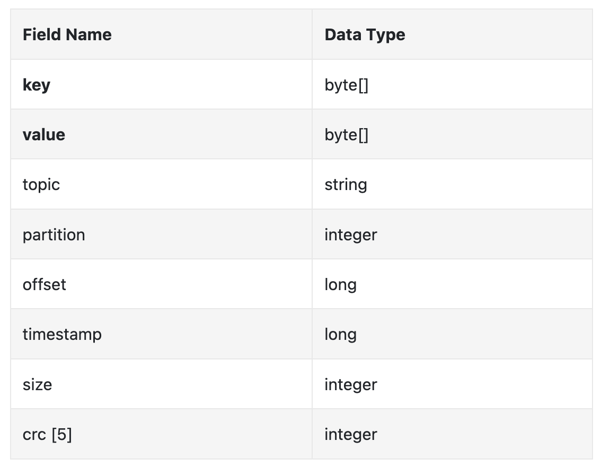
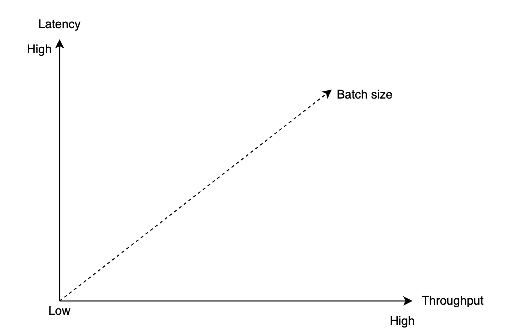
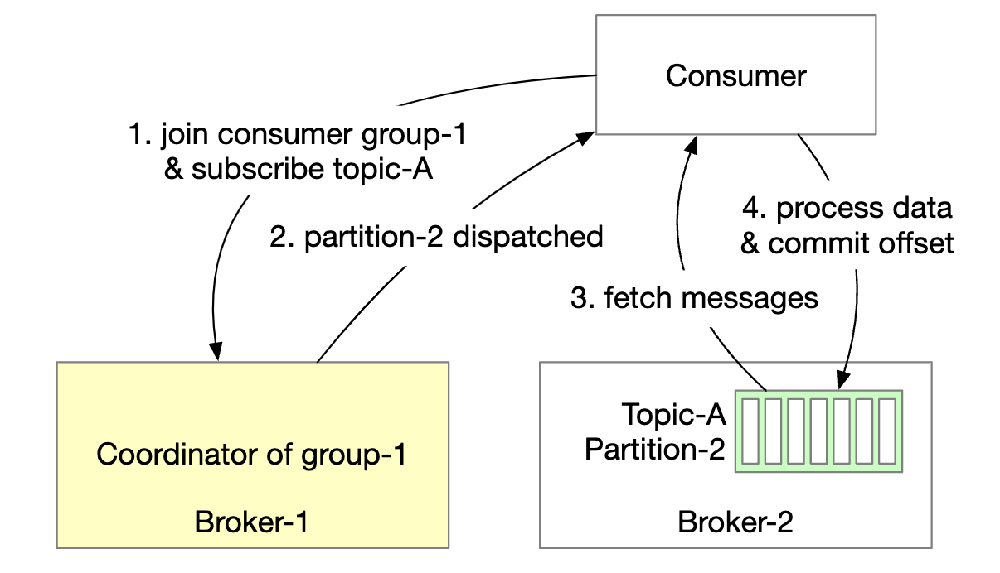
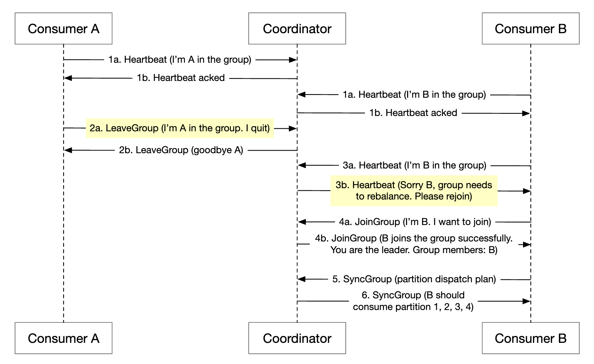
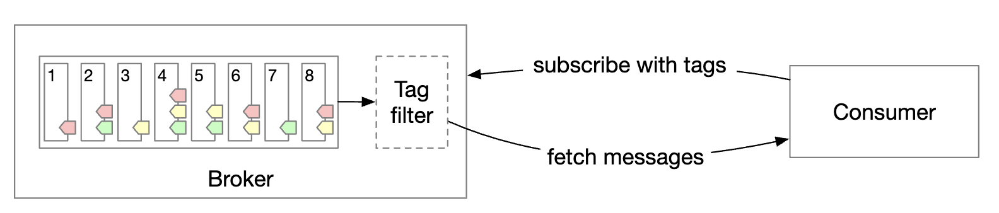
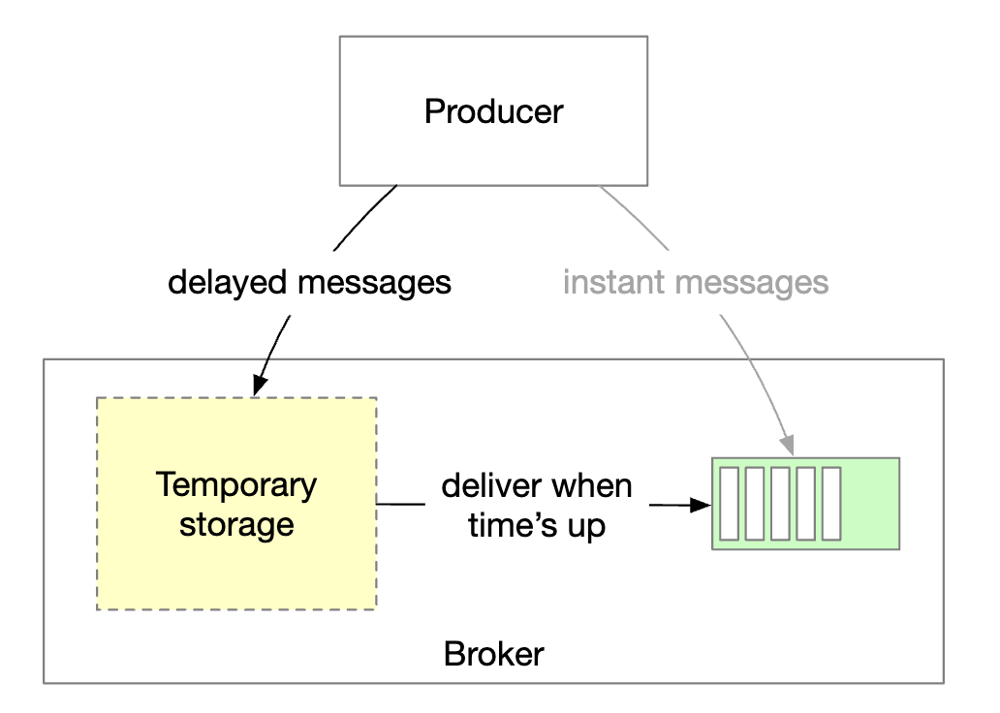

# 第 19 章：分布式消息队列

## 简介

本章将设计一个**分布式消息队列**。

消息队列的优势：
- **解耦**：消除组件之间的紧耦合。让它们分别更新。
- **提高可扩展性**：生产者和消费者可以根据流量独立扩展。
- **提高可用性**：如果系统的一部分宕机，其他部分仍可继续与队列交互。
- **改善性能**：生产者无需等待消费者确认即可生成消息。

一些流行的消息队列实现 - Kafka、RabbitMQ、RocketMQ、Apache Pulsar、ActiveMQ、ZeroMQ。

严格来说，Kafka 和 Pulsar 不是消息队列，而是事件流平台。
不过，功能正在逐渐趋同，使消息队列与事件流平台之间的区别变得模糊。

在本章中，我们将构建一个支持更高级功能的消息队列，例如较长的数据保留时间、重复消费消息等。

---

## 步骤 1：理解问题并确定设计范围

消息队列应该支持少数基本功能 - 生产者生成消息，消费者消费消息。
不过，还需要考虑性能、消息投递、数据保留等不同因素。

以下是候选人与面试官之间可能进行的一组问答：
 * C：格式和平均消息大小是什么？是否只有文本？
 * I：消息仅包含文本，通常为几 KB
 * C：消息可以被重复消费吗？
 * I：可以，消息可以被不同消费者重复消费。这是一项额外要求，传统消息队列不支持该功能。
 * C：消息是否按照生成时的顺序被消费？
 * I：是的，应保留顺序保证。这是一项额外要求，传统消息队列不支持该功能。
 * C：数据保留要求是什么？
 * I：消息需要保留两周。这是一项额外要求。
 * C：我们希望支持多少生产者和消费者？
 * I：越多越好。
 * C：我们希望支持什么数据投递语义？最多一次、至少一次，还是恰好一次？
 * I：我们肯定希望支持至少一次。理想情况下，我们可以全部支持，并让它们可配置。
 * C：端到端延迟的目标吞吐量是多少？
 * I：它应该支持日志聚合等场景的高吞吐量，也应该支持更传统场景的低吞吐量。

### **功能需求**

 * 生产者向消息队列发送消息
 * 消费者从队列中消费消息
 * 消息可以被消费一次或重复消费
 * 历史数据可以被截断
 * 消息大小在 KB 范围内
 * 必须保留消息顺序
 * 数据投递语义可配置 - 最多一次/至少一次/恰好一次。

### **非功能需求**

- **高吞吐量或低延迟**：可根据使用场景配置
- **可扩展**：系统应为分布式系统，并支持消息量突然激增
- **持久且耐用**：数据应持久化到磁盘并在节点之间复制

传统消息队列通常不支持数据保留，也不提供顺序保证。这大大简化了设计，我们将在后文讨论。

---

## 步骤 2：提出高层设计并获得认可

消息队列的关键组件：

    

 * 生产者向队列发送消息
 * 消费者订阅队列并消费已订阅的消息
 * 消息队列是位于中间的服务，用于将生产者与消费者解耦，使它们可以独立扩展。
 * 生产者和消费者都是客户端，而消息队列是服务器。

### **消息模型**

第一种消息模型是点对点模型，常见于传统消息队列：

    

 * 消息被发送到队列，并且恰好由一个消费者消费。
 * 可以有多个消费者，但一条消息只被消费一次。
 * 消息被确认已消费后，就会从队列中移除。
 * 点对点模型中没有数据保留，但我们的设计中存在数据保留。

另一方面，发布-订阅模型在事件流平台中更为常见：

    

 * 在此模型中，消息与一个主题相关联。
 * 消费者订阅主题，并接收发送到该主题的所有消息。

### **主题、分区和代理**

如果某个主题的数据量过大怎么办？一种扩展方式是将主题拆分为多个分区（即分片）：

    

 * 发送到主题的消息会均匀分布到各个分区
 * 承载分区的服务器称为代理
 * 每个主题都像一个使用 FIFO 进行消息处理的队列。分区内的消息顺序会被保留。
 * 消息在分区内的位置称为**偏移量**。
 * 生成的每条消息都会被发送到特定分区。分区键指定消息应该落入哪个分区。
   * 例如，可以使用 `user_id` 作为分区键，以保证同一用户的消息顺序。
 * 每个消费者订阅一个或多个分区。当多个消费者消费相同消息时，它们组成一个消费者组。

### **消费者组**

消费者组是一组协同工作的消费者，用于消费主题中的消息：

    

 * 消息按消费者组复制（而不是按消费者复制）。
 * 每个消费者组维护自己的偏移量。
 * 消费者组并行读取消息可以提高吞吐量，但会损害顺序保证。
 * 可以通过只允许一个组内消费者订阅一个分区来缓解这一问题。
 * 这意味着组内消费者数量不能多于分区数量。

### **高层架构**

    

- **客户端**：生产者和消费者。生产者将消息推送到指定主题。消费者组订阅主题中的消息。
- **代理**：承载多个分区。一个分区承载某个主题的部分消息。
- **数据存储**：在分区中存储消息。
- **状态存储**：保存消费者状态。
- **元数据存储**：存储配置和主题属性
- **协调服务**：负责服务发现（哪些代理处于存活状态）和领导者选举（哪个代理是领导者，负责分配分区）。

---

## 步骤 3：深入设计

为了实现高吞吐量并满足较高的数据保留要求，我们做出了一些重要的设计选择：
 * 我们选择了一种利用现代 HDD 特性和现代操作系统磁盘缓存策略的磁盘数据结构。
 * 消息数据结构是不可变的，以避免额外复制；在高容量/高流量系统中，我们希望避免这种复制。
 * 我们围绕批处理设计写入，因为小 I/O 是高吞吐量的敌人。

### **数据存储**

为了找到最适合消息的数据存储，我们必须检查消息的属性：
 * 写密集、读密集
 * 没有更新/删除操作。在传统消息队列中存在“删除”操作，因为消息不会被保留。
 * 主要是顺序读写访问模式。

我们的选项有哪些：
- **数据库**：不理想，因为典型数据库无法很好地同时支持写密集和读密集系统。
- **预写日志（WAL）**：只支持追加写入的纯文本文件，非常适合 HDD。
  * 我们将分区拆分为多个段，以避免维护一个非常大的文件。
  * 旧段是只读的。只有最新段接受写入。

    

WAL 文件用于传统 HDD 时非常高效。

人们误以为 HDD 访问速度很慢，但这很大程度上取决于访问模式。
当访问模式是顺序的（如我们的情况）时，HDD 可以达到每秒数 MB 的写入/读取速度，这足以满足我们的需求。
我们还利用了操作系统会积极地将磁盘数据缓存到内存中的事实。

### **消息数据结构**

消息模式在生产者、队列和消费者之间保持一致非常重要，以避免额外复制。这可以实现更加高效的处理。

消息结构示例：

    

消息的键指定消息属于哪个分区。一个示例映射是 `hash(key) % numPartitions`。
为了获得更大的灵活性，生产者可以覆盖默认键，以控制消息分布到哪些分区。

消息值是消息的负载。它可以是纯文本，也可以是压缩的二进制块。

**注意：**与传统 KV 存储不同，消息键不必唯一。允许存在重复键，甚至允许缺少键。

其他消息字段：
- **主题**：消息所属的主题
- **分区**：消息所属分区的 ID
- **偏移量**：消息在分区中的位置。可以通过`topic`、`partition`、`offset`定位消息。
- **时间戳**：消息存储的时间
- **大小**：此消息的大小
- **CRC**：确保消息完整性的校验和

通过添加其他字段，可以支持过滤等其他功能。

### **批处理**

批处理对系统性能至关重要。我们在生产者、消费者和消息队列中都应用批处理。

它之所以关键，是因为：
 * 它允许操作系统将消息组合在一起，从而分摊昂贵网络往返的成本
 * 消息按组顺序写入 WAL，这会产生大量顺序写入并利用磁盘缓存。

延迟和吞吐量之间存在权衡：
 * 批处理量大可以带来高吞吐量和更高延迟。
 * 批处理量小可以带来较低吞吐量和更低延迟。

如果系统作为传统消息队列部署，需要支持更低的延迟，则可以调小批大小来调整系统。

如果针对吞吐量进行调整，我们可能需要为每个主题配置更多分区，以补偿较慢的顺序磁盘写入吞吐量。

### **生产者流程**

如果生产者想要向某个分区发送消息，它应该连接到哪个代理？

一种选择是引入路由层，将消息路由到正确的代理。如果启用了复制，正确的代理就是领导者副本：

    

 * 路由层从元数据存储中读取复制计划，并将其缓存在本地。
 * 生产者向路由层发送消息。
 * 消息被转发到作为给定分区领导者的代理 1
 * 跟随者副本从领导者拉取新消息。收到足够的确认后，领导者提交数据并向生产者响应。

设置副本的原因是实现容错。

这种方法可行，但有一些缺点：
 * 由于增加了额外组件，网络跳数增加
 * 该设计无法实现消息批处理

为了缓解这些问题，我们可以将路由层嵌入生产者中：

    

 * 更少的网络跳数带来更低的延迟
 * 生产者可以控制消息被路由到哪个分区
 * 缓冲区允许我们在内存中批处理消息，并在单个请求中发送更大的批次，从而提高吞吐量。

批大小的选择是吞吐量和延迟之间的经典权衡。

    

 * 批大小越大，批次提交前的等待时间越长。
 * 批大小越小，请求发送得越早，延迟越低，但吞吐量也越低。

### **消费者流程**

消费者指定其在分区中的偏移量，并接收从该偏移量开始的一批消息：

    

设计消费者时一个重要的考虑因素是采用推送模型还是拉取模型：
- **推送模型**：由于代理在接收到消息时将消息推送给消费者，因此延迟较低。
  * 但是，如果消费速率落后于生产速率，消费者可能会不堪重负。
  * 处理处理能力不同的消费者很有挑战，因为代理控制着消费速率。
- **拉取模型**：允许消费者控制消费速率。
  * 如果消费速率较慢，消费者不会不堪重负，并且我们可以扩展它以追赶进度。
  * 拉取模型更适合批处理，因为使用推送模型时，代理无法知道消费者能处理多少消息。
  * 另一方面，使用拉取模型时，消费者可以积极获取大量消息批次。
  * 缺点是延迟较高，并且没有新消息时会产生额外的网络调用。后一个问题可以使用长轮询缓解。

因此，大多数消息队列（包括我们）选择拉取模型。

    

 * 新消费者订阅主题 A 并加入组 1。
 * 通过对组名称进行哈希找到正确的代理节点。这样，组内所有消费者都会连接到同一个代理。
 * 注意，该消费者组协调器不同于协调服务（ZooKeeper）。
 * 协调器确认消费者已加入组，并将分区 2 分配给该消费者。
 * 分区分配策略有多种 - 轮询、范围等。
 * 消费者从最后一个偏移量读取最新消息。状态存储保存消费者偏移量。
 * 消费者处理消息并向代理提交偏移量。这些操作的顺序会影响消息投递语义。

### **消费者再平衡**

消费者再平衡负责决定哪个消费者负责哪个分区。

当消费者加入/离开或分区添加/移除时，会发生这一过程。

代理充当协调器，在协调再平衡工作流方面发挥着重要作用。

    

 * 同一组中的所有消费者都连接到同一个协调器。通过对组名称进行哈希找到协调器。
 * 当消费者列表发生变化时，协调器会选择一个新的组领导者。
 * 组领导者计算新的分区分配计划，并将其报告给协调器，协调器再将其广播给其他消费者。

当协调器不再收到某个组中消费者的心跳时，会触发再平衡：

    

让我们了解一下消费者加入组时会发生什么：

    

 * 最初，组中只有消费者 A，它消费所有分区。
 * 消费者 B 发送请求加入组。
 * 协调器通知所有组成员被动地进行再平衡 - 作为对心跳的响应。
 * 所有消费者重新加入组后，协调器选择一个领导者，并将选举结果通知其余成员。
 * 领导者生成分区分配计划并将其发送给协调器。其他消费者等待分配计划。
 * 消费者开始从新分配的分区消费。

以下是消费者离开组时的情况：

    

 * 消费者 A 和 B 在同一个组中
 * 消费者 B 请求离开组
 * 当协调器收到 A 的心跳时，它会通知它们是时候进行再平衡了。
 * 其余步骤相同。

当消费者长时间不发送心跳时，过程类似：

    

### **状态存储**

状态存储保存分区与消费者之间的映射，以及分区最后被消费的偏移量。

    

组 1 的偏移量为 6，表示所有之前的消息都已被消费。如果消费者崩溃，新消费者将从该消息继续消费。
 
消费者状态的数据访问模式：
 * 频繁读写，但数据量较小
 * 数据经常更新，但很少删除
 * 随机读写
 * 数据一致性很重要

鉴于这些要求，像 Zookeeper 这样的快速 KV 存储是理想选择。

### **元数据存储**

元数据存储保存配置和主题属性 - 分区数量、保留期、副本分布。

元数据不经常变化，数据量也很小，但一致性要求很高。
Zookeeper 是这种存储的良好选择。

### **ZooKeeper**

Zookeeper 对构建分布式消息队列至关重要。

它是一个分层键值存储，通常用于分布式配置、同步服务和命名注册表（即服务发现）。

    

经过这一更改，代理只需要维护消息的数据。元数据和状态存储位于 Zookeeper 中。

Zookeeper 还帮助完成代理副本的领导者选举。

### **复制**

在分布式系统中，硬件问题不可避免。我们可以通过复制来实现高可用性，从而应对这些问题。

    

 * 每个分区都会跨多个代理复制，但只有一个领导者副本。
 * 生产者向领导者副本发送消息
 * 跟随者从领导者拉取复制的消息
 * 足够多的副本同步后，领导者向生产者返回确认
 * 每个分区的副本分布称为副本分布计划。
 * 给定分区的领导者创建副本分布计划并将其保存到 Zookeeper

### **同步副本**

我们需要解决的一个问题是保持给定分区的领导者和跟随者之间的消息同步。

同步副本（ISR）是与领导者保持同步的分区副本。

`replica.lag.max.messages` 定义了一个副本最多可以落后领导者多少条消息，才能被视为同步。

    

 * 已提交偏移量为 13
 * 两条新消息被写入领导者，但尚未提交。
 * 当 ISR 中的所有副本都同步了该消息后，消息才会提交
 * 副本 2 和 3 已完全追上领导者，因此它们位于 ISR 中
 * 副本 4 已落后，因此暂时从 ISR 中移除

ISR 体现了性能和持久性之间的权衡。
 * 为了让生产者不丢失消息，所有副本都应在发送确认之前保持同步
 * 但一个缓慢的副本会导致整个分区变得不可用

确认处理是可配置的。

`ACK=all` 表示 ISR 中的所有副本都必须同步一条消息。消息发送速度较慢，但消息持久性最高。

    

`ACK=1` 表示领导者收到消息后生产者就会收到确认。消息发送速度快，但消息持久性低。

    

`ACK=0` 表示生产者发送消息时无需等待领导者的任何确认。消息发送速度最快，消息持久性最低。

    

在消费者端，我们可以将所有消费者连接到某个分区的领导者，并让它们从领导者读取消息：
 * 这样设计最简单，操作也最容易
 * 分区中的消息只发送给组中的一个消费者，这限制了与领导者副本的连接数
 * 只要主题不是特别繁忙，与领导者副本的连接数通常不会很高
 * 我们可以通过增加分区和消费者的数量来扩展繁忙主题
 * 在某些场景下，让消费者从 ISR 读取可能更合理，例如消费者位于单独的 DC 中

ISR 列表由领导者维护，领导者会跟踪自身与每个副本之间的滞后。

### **可扩展性**

让我们评估如何扩展系统的不同部分。

#### 生产者

生产者比消费者小得多。通过添加/移除新的生产者实例，可以轻松实现其可扩展性。

#### 消费者

消费者组彼此隔离。可以随时轻松添加/移除消费者组。

再平衡有助于优雅地处理向组中添加/从组中移除消费者的情况。

消费者组再平衡帮助我们实现可扩展性和容错性。

#### 代理

代理如何处理故障？

    

 * 代理发生故障后，仍有足够的副本可以避免分区数据丢失
 * 选出新的领导者，代理协调器将故障代理上的分区重新分配给现有副本
 * 现有副本接管新的分区并充当跟随者，直到它们追上领导者并成为 ISR

要使代理具备容错能力，还需考虑以下事项：
 * ISR 的最小数量可以平衡延迟和安全性。你可以对其进行微调以满足需求。
 * 如果一个分区的所有副本都在同一个节点上，则会浪费资源。副本应分布在不同的代理上。
 * 如果一个分区的所有副本都崩溃，数据将永久丢失。将副本分散到多个数据中心可以提供帮助，但会增加大量延迟。一种选择是使用[数据镜像](https://cwiki.apache.org/confluence/pages/viewpage.action?pageId=27846330)作为解决方法。

添加新代理时，如何处理副本的重新分配？

    

 * 在新代理追上之前，可以暂时允许副本数量超过配置值
 * 新代理追上后，可以移除不再需要的分区副本

#### 分区

每当添加新分区时，生产者都会收到通知，并触发消费者再平衡。

在数据存储方面，我们只能将新消息存储到新分区，而不是尝试复制所有旧消息：

    

减少分区数量则更为复杂：

    

 * 分区退役后，新消息只会由剩余分区接收
 * 退役分区不会立即删除，因为仍然可以从中消费消息
 * 预配置的保留期过后，我们是否截断数据并释放存储空间
 * 在过渡期间，生产者只向活动分区发送消息，但消费者从所有分区读取消息
 * 保留期到期后，消费者会重新平衡

### **数据投递语义**

让我们讨论不同的投递语义。

#### 最多一次

在这种保证下，消息投递次数不会超过一次，也可能完全不投递。

    

 * 生产者异步地向主题发送消息。如果消息投递失败，则不会重试。
 * 消费者获取消息后立即提交偏移量。如果消费者在处理消息前崩溃，则消息不会被处理。

#### 至少一次

消息可以发送多次，并且不应有消息未被处理。

    

 * 生产者使用`ack=1`或`ack=all`发送消息。如果出现任何问题，它将不断重试。
 * 消费者获取消息，并且仅在处理完成后才消费偏移量。
 * 如果消费者在提交偏移量之前但在处理消息之后崩溃，则消息可能会被投递多次。
 * 因此，这适合数据重复可以接受或可以去重的使用场景。

#### 恰好一次

对于系统而言，实现成本极高，但这是对用户最友好的保证：

    

### **高级功能**

让我们讨论一些高级功能，这些功能可能会在面试中讨论。

#### 消息过滤

一些消费者可能只想消费分区中某种类型的消息。

可以为每个消息子集构建单独的主题来实现这一点，但如果系统有太多不同的使用场景，这可能代价高昂。
 * 在不同主题中存储相同消息会浪费资源
 * 生产者现在与消费者紧密耦合，因为每增加一种新的消费者需求，生产者就会发生变化

我们可以使用消息过滤来解决这个问题。
 * 一种简单方法是在消费者端进行过滤，但这会引入不必要的消费者流量
 * 另一种方式是给消息附加标签，消费者可以指定要订阅哪些标签
 * 也可以通过消息负载进行过滤，但对于加密/序列化消息来说，这可能具有挑战性且不安全
 * 对于更复杂的数学公式，代理可以实现语法解析器或脚本执行器，但这可能会让消息队列变得过于重量级

    

#### 延迟消息和定时消息

对于某些使用场景，我们可能希望延迟或调度消息投递。
例如，我们可能会提交一个从现在起 30m 后执行的支付验证检查，该检查会触发消费者查看支付是否成功。

可以通过将消息发送到代理中的临时存储，并在正确的时间将消息移动到分区来实现：

    

 * 临时存储可以是一个或多个特殊消息主题
 * 计时功能可以通过专用延迟队列或[分层时间轮](http://www.cs.columbia.edu/~nahum/w6998/papers/sosp87-timing-wheels.pdf)实现

---

## 步骤 4：总结

其他讨论要点：
- **通信协议**：重要考虑因素 - 支持所有使用场景和高数据量，并验证消息完整性。常用协议 - AMQP 和 Kafka protocol。
- **重试消费**：如果我们无法立即处理消息，可以将其发送到专用重试主题，以便稍后重试。
- **历史数据归档**：旧消息可以备份到 HDFS 或对象存储等高容量存储中（例如 S3）。
