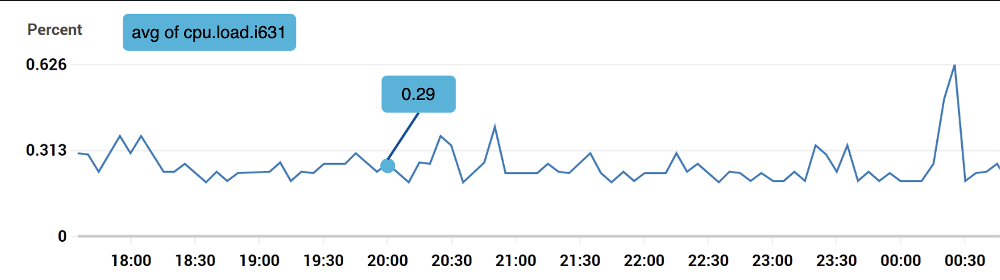
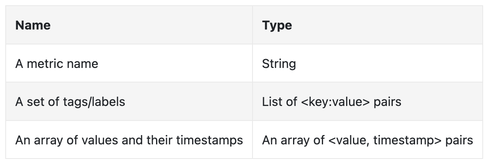
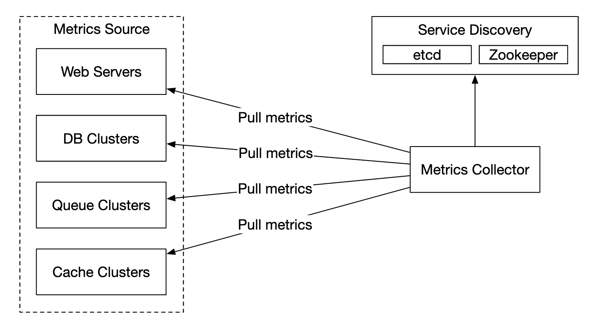
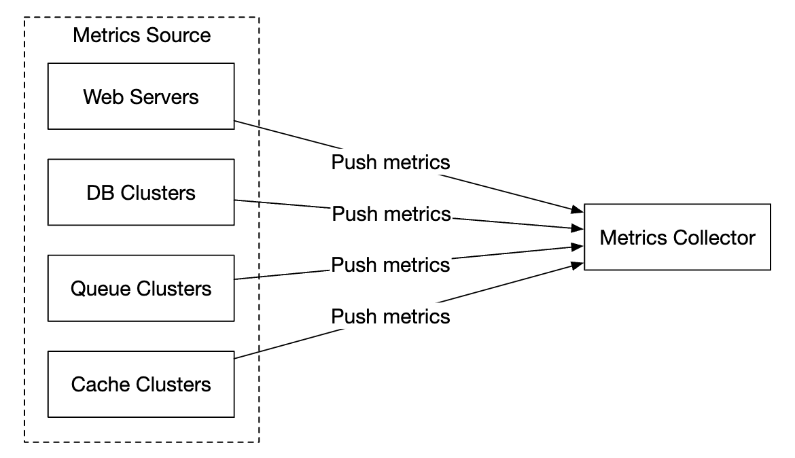

# 第 20 章：指标监控和告警系统

## 简介
本章重点介绍如何设计一个高度可扩展的 **指标监控和告警系统**，这对于确保高可用性和可靠性至关重要。

---

## 第 1 步：理解问题并确定设计范围
指标监控系统可能意味着很多不同的东西——例如，当面试官只关注基础设施指标时，你不希望设计一个日志聚合系统。

让我们先尝试理解问题：
 - C：我们是为谁构建这个系统？是为大型科技公司的内部监控系统，还是像 DataDog 这样的 SaaS？
 - I：我们只为内部使用而构建。
 - C：我们想收集哪些指标？
 - I：运营系统指标——CPU 负载、内存、数据磁盘空间。但也包括每秒请求数等高层指标。业务指标不在范围内。
 - C：我们正在监控的基础设施规模是多少？
 - I：100mil 日活跃用户，1000 个服务器池，每个池 100 台机器
 - C：我们应该保留数据多长时间？
 - I：假设保留 1y。
 - C：我们可以降低长期存储的指标数据分辨率吗？
 - I：保留新接收的指标 7 days。将其汇总为 1m 分辨率并保留接下来的 30 days。之后进一步将其汇总为 1h 分辨率（在 30 days 之后）。
 - C：支持哪些告警渠道？
 - I：Email、电话、PagerDuty 或 webhooks。
 - C：我们需要收集错误日志或访问日志等日志吗？
 - I：不需要
 - C：我们需要支持分布式系统追踪吗？
 - I：不需要

### **高层需求和假设**
被监控的基础设施规模很大：
 - 100mil DAU
 - 1000 个服务器池 * 100 台机器 * ~100 个指标/机器 -> ~10mil 个指标
 - 1-year 数据保留
 - 数据保留策略——原始数据保留 7d，1-minute 分辨率保留 30d，1h 分辨率保留 1y

可以监控各种指标：
 - CPU 负载
 - 请求数
 - 内存使用量
 - 消息队列中的消息数

### **非功能需求**
 - **可扩展性**：系统应该可扩展，以容纳更多指标和告警
 - **低延迟**：系统需要为仪表板和告警提供低查询延迟
 - **可靠性**：系统应该高度可靠，以避免遗漏关键告警
 - **灵活性**：系统应该能够在未来轻松集成新技术

哪些需求不在范围内？
 - **日志监控**：ELK stack 在这个用例中非常流行
 - **分布式系统追踪**：这是指收集请求在系统内流经多个服务时其生命周期的数据

---

## 第 2 步：提出高层设计并获得认同

### **基础知识**
指标监控和告警系统涉及五个核心组件：

<div style="margin-left:3rem">
    
</div>

 - **数据收集**：从不同来源收集指标数据
 - **数据传输**：将数据从来源传输到指标监控系统
 - **数据存储**：组织并存储传入的数据
 - **告警**：分析传入数据、检测异常并生成告警
 - **可视化**：以图形、图表等形式呈现数据

### **数据模型**
指标数据通常记录为时间序列，其中包含一组带时间戳的值。
该序列可以通过名称和一组可选标签来标识。

示例 1 - 生产服务器实例 i631 在 20:00 的 CPU 负载是多少？

<div style="margin-left:3rem">
    
</div>

数据可以通过以下表格标识：

<div style="margin-left:3rem">
    
</div>

时间序列由指标名称、标签以及特定时间的单个数据点标识。

示例 2 - 过去 10min 内 us-west 区域所有 Web 服务器的平均 CPU 负载是多少？

```
CPU.load host=webserver01,region=us-west 1613707265 50

CPU.load host=webserver01,region=us-west 1613707265 62

CPU.load host=webserver02,region=us-west 1613707265 43

CPU.load host=webserver02,region=us-west 1613707265 53

...

CPU.load host=webserver01,region=us-west 1613707265 76

CPU.load host=webserver01,region=us-west 1613707265 83
```

这是我们可能从存储中提取以回答该问题的示例数据。
可以通过对各行最后一列的值取平均来计算平均 CPU 负载。

上面展示的格式称为行协议，市场上的许多流行监控软件都使用它——例如 Prometheus、OpenTSDB。

每个时间序列包含的内容：

<div style="margin-left:3rem">
    
</div>

可视化数据外观的一种好方法：

<div style="margin-left:3rem">
    
</div>

 - x 轴是时间
 - y 轴是你查询的维度——例如指标名称、标签等。

数据访问模式是写入密集型且读取具有尖峰，因为我们收集了大量指标，但它们很少被访问，不过在例如正在发生事故时会以突发形式访问。

数据存储系统是该设计的核心。
 - 不建议为这个问题使用通用数据库，尽管通过专家级调优可以达到良好规模。
 - 使用 NoSQL 数据库理论上可行，但很难设计一个可扩展的模式，以有效存储和查询时间序列数据。

有许多专门用于存储时间序列数据的数据库。其中许多支持自定义查询接口，可以有效查询时间序列数据。
 - OpenTSDB 是一个分布式时间序列数据库，但它基于 Hadoop 和 HBase。如果没有预先配置这些基础设施，就很难使用这项技术。
 - Twitter 使用 MetricsDB，而 Amazon 提供 Timestream。
 - 最流行的两个时间序列数据库是 InfluxDB 和 Prometheus。
 - 它们被设计用于存储大量时间序列数据。两者都基于内存缓存 + 磁盘存储。

InfluxDB 的规模示例——每秒超过 250k 次写入，配置为 8 cores 和 32gb RAM：

<div style="margin-left:3rem">
    
</div>

不要求你理解指标数据库的内部原理，因为这是小众知识。只有在你简历中提到它时，面试官才可能询问。

对于面试而言，只需理解指标是时间序列数据，并了解 InfluxDB 这类流行的时间序列数据库即可。

时间序列数据库的一个优点是可以按标签高效聚合和分析大量时间序列数据。
例如，InfluxDB 为每个标签构建索引。

然而，保持标签的基数较低至关重要——也就是说，不要使用太多唯一标签。

### **高层设计**

<div style="margin-left:3rem">
    
</div>

 - **指标来源**：可以是应用服务器、SQL 数据库、消息队列等。
 - **指标收集器**：收集指标数据并写入时间序列数据库
 - **时间序列数据库**：将指标存储为时间序列。提供用于分析大量指标的自定义查询接口。
 - **查询服务**：便于查询和检索时间序列 DB。如果足够强大，也可以完全由 DB 的接口替代。
 - **告警系统**：向各种告警目的地发送告警通知。
 - **可视化系统**：以图形/图表的形式显示指标。

---

## 第 3 步：设计深入探讨
让我们深入探讨系统中几个更有趣的部分。

### **指标收集**
对于指标收集，偶尔的数据丢失并不关键。客户端可以发出请求后不等待结果，这是可以接受的。

<div style="margin-left:3rem">
    
</div>

实现指标收集有两种方式——拉取或推送。

下面是拉取模型可能的样子：

<div style="margin-left:3rem">
    
</div>

对于这个方案，指标收集器需要维护服务和指标端点的最新列表。
我们可以使用 Zookeeper 或 etcd 来实现这一目的——服务发现。

服务发现包含关于何时以及从何处收集指标的配置规则：

<div style="margin-left:3rem">
    
</div>

下面是指标收集流程的详细说明：

<div style="margin-left:3rem">
    
</div>

 - 指标收集器从服务发现中获取配置元数据。这包括拉取间隔、IP 地址、超时和重试参数。
 - 指标收集器通过预定义的 http 端点（例如 `/metrics`）拉取指标数据。这通常由客户端库完成。
 - 或者，指标收集器可以向服务发现注册变更事件通知，以便在服务端点发生变化时收到通知。
 - 另一种选择是指标收集器定期轮询指标端点配置变更。

在我们的规模下，单个指标收集器不够。必须有多个实例。
但是，它们之间也必须进行某种同步，以便两个收集器不会重复收集相同的指标。

一种解决方案是将收集器和服务器放置在一致性哈希环上，并且只将一组服务器与单个收集器关联：

<div style="margin-left:3rem">
    
</div>

另一方面，在推送模型中，服务主动将其指标推送到指标收集器：

<div style="margin-left:3rem">
    
</div>

在这种方法中，通常会在服务实例旁安装一个收集代理。
该代理从服务器收集指标并将其推送到指标收集器。

<div style="margin-left:3rem">
    
</div>

使用此模型，我们可以在将指标发送到收集器之前聚合它们，这可能减少收集器处理的数据量。

另一方面，指标收集器可能拒绝推送请求，因为它无法处理负载。
因此，将收集器添加到负载均衡器后面的自动扩展组中非常重要。

那么哪一个更好？两种方法都有权衡，不同系统使用不同的方法：
 - Prometheus 使用拉取架构
 - Amazon Cloud Watch 和 Graphite 使用推送架构

以下是推送和拉取之间的一些主要区别：
|                                        | 拉取                                                                                                                                                                                                    | 推送                                                                                                                                                                                                                                    |
|----------------------------------------|---------------------------------------------------------------------------------------------------------------------------------------------------------------------------------------------------------|-----------------------------------------------------------------------------------------------------------------------------------------------------------------------------------------------------------------------------------------|
| 易于调试                               | 应用服务器上用于拉取指标的 /metrics 端点可用于随时查看指标。甚至可以在你的笔记本电脑上执行此操作。拉取胜出。                                                                                              | 如果指标收集器没有收到指标，问题可能由网络问题引起。                                                                                                                                        |
| 健康检查                               | 如果应用服务器没有响应拉取请求，你可以快速判断应用服务器是否宕机。拉取胜出。                                                                                                                           | 如果指标收集器没有收到指标，问题可能由网络问题引起。                                                                                                                                        |
| 短生命周期作业                         |                                                                                                                                                                                                         | 某些批处理作业可能生命周期很短，持续时间不足以被拉取。推送胜出。可以通过为拉取模型引入推送网关来解决这一问题 [22]。                                                                 |
| 防火墙或复杂网络设置                  | 让服务器拉取指标要求所有指标端点都可访问。在多数据中心设置中，这可能存在问题。可能需要更复杂的网络基础设施。                                                                                             | 如果指标收集器配置了负载均衡器和自动扩展组，就可以从任何地方接收数据。推送胜出。                                                                                             |
| 性能                                   | 拉取方法通常使用 TCP。                                                                                                                                                                         | 推送方法通常使用 UDP。这意味着推送方法提供更低延迟的指标传输。反驳观点是，与发送指标载荷相比，建立 TCP 连接的开销很小。 |
| 数据真实性                             | 要从中收集指标的应用服务器已在配置文件中预先定义。从这些服务器收集的指标保证是真实的。                                                                                                                 | 任何类型的客户端都可以向指标收集器推送指标。可以通过将接受指标的服务器列入白名单，或要求身份验证来解决这一问题。                                                                   |

没有明确的赢家。大型组织可能需要同时支持两种方式。一开始可能根本无法安装推送代理。

### **扩展指标传输管道**

<div style="margin-left:3rem">
    
</div>

无论使用推送还是拉取模型，指标收集器都配置在自动扩展组中。

然而，如果时间序列 DB 宕机，就有数据丢失的可能。为缓解这一问题，我们将配置一个排队机制：

<div style="margin-left:3rem">
    
</div>

 - 指标收集器将指标数据推送到 kafka
 - 消费者或 Apache Storm、Flink 或 Spark 等流处理服务处理数据，并将其推送到时间序列 DB

这种方法有几个优点：
 - Kafka 被用作高度可靠且可扩展的分布式消息平台
 - 它将数据收集和数据处理彼此解耦
 - 它可以通过在 Kafka 中保留数据来防止数据丢失

Kafka 可以配置为每个指标名称一个分区，以便消费者可以按指标名称聚合数据。
为了扩展这一点，我们可以进一步按标签/标记进行分区，并对待收集的指标进行分类/确定优先级。

<div style="margin-left:3rem">
    
</div>

在这个问题中使用 Kafka 的主要缺点是维护/运营开销。
一种替代方案是使用像 [Gorilla](https://www.vldb.org/pvldb/vol8/p1816-teller.pdf) 这样的大规模摄取系统。
可以认为，使用它进行排队的可扩展性与使用 Kafka 相当。

### **聚合可以发生在哪里**
指标可以在多个位置进行聚合。不同选择之间存在权衡：
 - **收集代理**：客户端收集代理只支持简单的聚合逻辑。例如收集 1m 的计数器并将其发送到指标收集器。
 - **摄取管道**：为了在写入 DB 前聚合数据，我们需要像 Flink 这样的流处理引擎。这会减少写入量，但由于不存储原始数据，我们会失去数据精度。
 - **查询端**：我们可以在通过可视化系统运行查询时聚合数据。不会丢失数据，但由于需要处理大量数据，查询可能很慢。

### **查询服务**
将查询服务与时间序列 DB 分开，可以将可视化和告警系统与数据库解耦，从而使我们能够将 DB 与客户端解耦，并随意更换它。

我们可以在这里添加缓存层，以减少时间序列数据库的负载：

<div style="margin-left:3rem">
    
</div>

我们也可以完全避免添加查询服务，因为大多数可视化和告警系统都有强大的插件，可以与大多数时间序列数据库集成。
如果选择了合适的时间序列 DB，我们也可能不需要引入自己的缓存层。

大多数时间序列 DB 不支持 SQL，因为 SQL 对查询时间序列数据无效。下面是一个计算指数移动平均值的 SQL 查询示例：

```
select id,
       temp,
       avg(temp) over (partition by group_nr order by time_read) as rolling_avg
from (
  select id,
         temp,
         time_read,
         interval_group,
         id - row_number() over (partition by interval_group order by time_read) as group_nr
  from (
    select id,
    time_read,
    "epoch"::timestamp + "900 seconds"::interval * (extract(epoch from time_read)::int4 / 900) as interval_group,
    temp
    from readings
  ) t1
) t2
order by time_read;
```

下面是 Flux 中的相同查询——InfluxDB 使用的查询语言：

```
from(db:"telegraf")
  |> range(start:-1h)
  |> filter(fn: (r) => r._measurement == "foo")
  |> exponentialMovingAverage(size:-10s)
```

### **存储层**
谨慎选择时间序列数据库非常重要。

根据 Facebook 发布的研究，运营存储的查询中约有 ~85% 针对过去 26h 的数据。

如果我们选择一个利用这一特性的数据库，它可能会对系统性能产生重大影响。InfluxDB 就是这样一个选项。

无论选择哪种数据库，我们都可以采用一些优化。

数据编码和压缩可以显著减少数据大小。这些功能通常内置于优秀的时间序列数据库中。

<div style="margin-left:3rem">
    
</div>

在上面的示例中，我们可以存储时间戳增量，而不是存储完整的时间戳。

我们可以采用的另一种技术是降采样——将高分辨率数据转换为低分辨率，以减少磁盘使用量。

我们可以对旧数据使用该技术，并由数据科学家配置规则，例如：
 - 7d - 不降采样
 - 30d - 降采样为 1min
 - 1y - 降采样为 1h

例如，下面是一张 10-second 分辨率的指标表：
| metric | timestamp            | hostname | Metric_value |
|--------|----------------------|----------|--------------|
| cpu    | 2021-10-24T19:00:00Z | host-a   | 10           |
| cpu    | 2021-10-24T19:00:10Z | host-a   | 16           |
| cpu    | 2021-10-24T19:00:20Z | host-a   | 20           |
| cpu    | 2021-10-24T19:00:30Z | host-a   | 30           |
| cpu    | 2021-10-24T19:00:40Z | host-a   | 20           |
| cpu    | 2021-10-24T19:00:50Z | host-a   | 30           |

降采样为 30-second 分辨率：
| metric | timestamp            | hostname | Metric_value (avg) |
|--------|----------------------|----------|--------------------|
| cpu    | 2021-10-24T19:00:00Z | host-a   | 19                 |
| cpu    | 2021-10-24T19:00:30Z | host-a   | 25                 |

最后，我们还可以使用冷存储来存放不再使用的旧数据。冷存储的财务成本低得多。

### **告警系统**

<div style="margin-left:3rem">
    
</div>

配置被加载到缓存服务器中。规则通常以 YAML 格式定义。下面是一个示例：

```
- name: instance_down
  rules:

  # Alert for any instance that is unreachable for >5 minutes.
  - alert: instance_down
    expr: up == 0
    for: 5m
    labels:
      severity: page
```

告警管理器从缓存中获取告警配置。它还会根据配置规则，以预定义的间隔调用查询服务。
如果满足某条规则，就会创建一个告警事件。

告警管理器的其他职责包括：
 - 过滤、合并和去重告警。例如，如果某个实例的告警被多次触发，则只生成一个告警事件。
 - 访问控制——将告警管理操作限制为特定人员非常重要
 - 重试——管理器确保告警至少传播一次。

告警存储是一个键值数据库，例如 Cassandra，用于保存所有告警的状态。它确保通知至少发送一次。
告警触发后，会将其发布到 Kafka。

最后，告警消费者从 Kafka 拉取告警数据，并通过不同渠道发送通知——Email、短信、PagerDuty、webhooks。

在现实世界中，有许多现成的告警系统解决方案。很难证明在内部构建自己的系统是合理的。

### **可视化系统**
可视化系统展示一段时间内的指标和告警。下面是一个使用 Grafana 构建的仪表板：

<div style="margin-left:3rem">
    
</div>

高质量的可视化系统很难构建。很难证明不使用 Grafana 这类现成解决方案是合理的。

---

## 第 4 步：收尾
下面是我们的最终设计：

<div style="margin-left:3rem">
    
</div>
