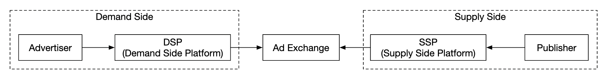
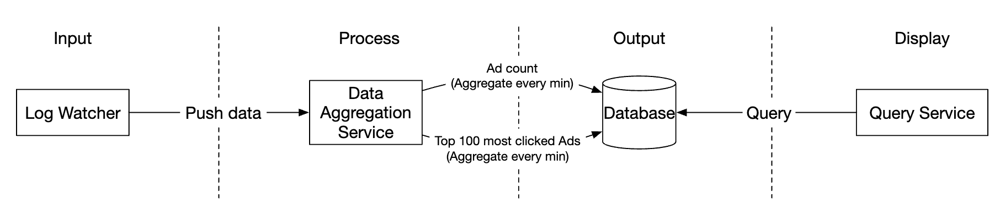
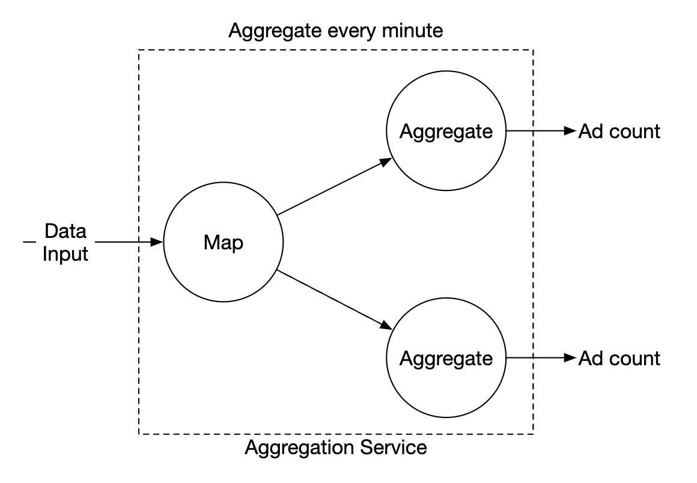
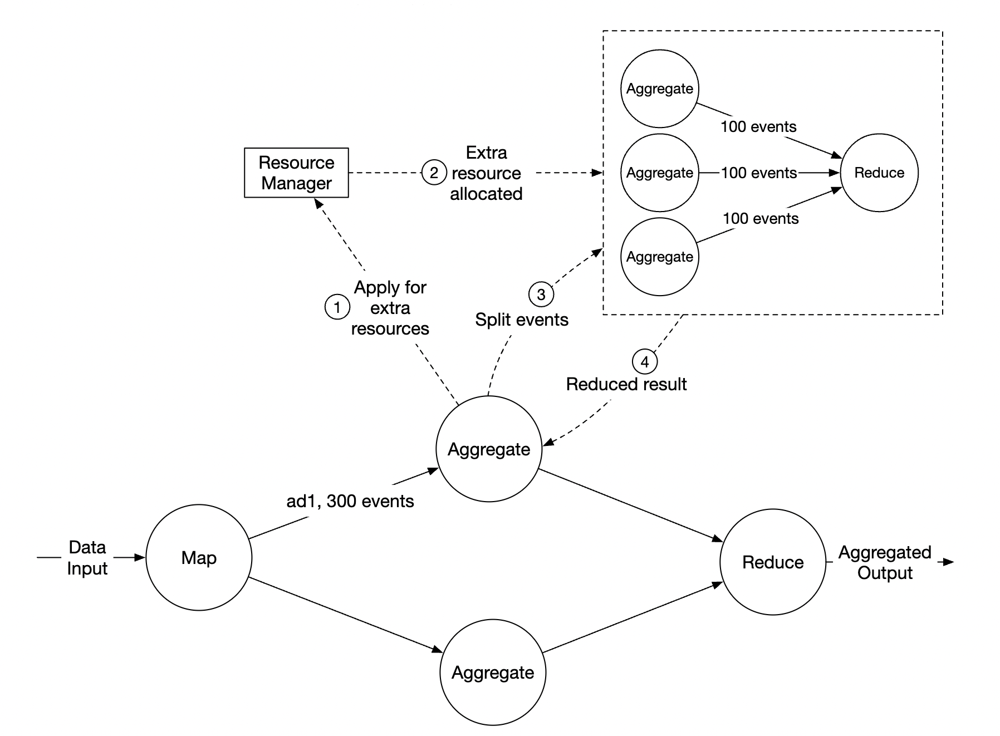

# 第 21 章：广告点击事件聚合

## 引言
**数字广告**是一个随着 Facebook、YouTube、TikTok 等兴起而发展的巨大行业。

因此，跟踪广告点击事件非常重要。本章探讨如何在 Facebook/Google 的规模下设计一个**广告点击事件聚合**系统。

数字广告有一个称为**实时竞价（RTB）**的流程，在该流程中，数字广告库存被买卖：

<div style="margin-left:3rem">
    
</div>

RTB 的速度很重要，因为它通常在一秒内完成。
数据准确性也非常重要，因为它会影响广告主需要支付的金额。

基于广告点击事件聚合，广告主可以做出调整目标受众和关键词等决策。

---

## 步骤 1：理解问题并确定设计范围
 - C: 输入数据的格式是什么？
 - I: 每天 1bil 次广告点击，总共有 2mil 个广告。广告点击事件的数量每年增长 30%。
 - C: 我们的系统需要支持哪些最重要的查询？
 - I: 需要考虑的主要查询：
   - 返回广告 X 在最近 Y minutes 内的点击事件数量
   - 返回点击次数最多的 100 个广告（统计过去 1min）。两个参数都应该可配置。聚合每分钟进行一次。
   - 支持根据 `ip`、`user_id`、`country` 对上述查询进行数据过滤
 - C: 我们需要担心边界情况吗？我能想到的有：
   - 某些事件可能比预期更晚到达
   - 可能存在重复事件
   - 系统的不同部分可能会宕机，因此需要考虑系统恢复
 - I: 这是一个很好的列表，请将这些情况考虑在内
 - C: 延迟要求是什么？
 - I: 广告点击聚合的 e2e 延迟为几分钟。对于 RTB，延迟小于一秒。广告点击聚合可以有这样的延迟，因为它们通常用于计费和报告。

### **功能需求**
 - 聚合最近 Y minutes 内 `ad_id` 的点击次数
 - 每分钟返回点击次数最多的 100 个 `ad_id`
 - 支持按不同属性过滤聚合
 - 数据集规模达到 Facebook 或 Google 的规模

### **非功能需求**
 - 聚合结果的正确性很重要，因为它用于 RTB 和广告计费
 - 正确处理延迟或重复事件
 - 健壮性 - 系统应该能够抵御部分故障
 - 延迟 - e2e 延迟最多为几分钟

### **粗略估算**
 - 1bil DAU
 - 假设用户每天点击 1 个广告 -> 每天 1bil 次广告点击
 - 广告点击 QPS = 10,000
 - 峰值 QPS 是该数量的 5 倍 = 50,000
 - 单次广告点击占用 0.1KB 的存储空间。每日存储需求为 100gb
 - 每月存储 = 3tb

---

## 步骤 2：提出高层设计并获得认同
本节讨论查询 API 设计、数据模型和高层设计。

### **查询 API 设计**
API 是客户端和服务器之间的契约。在我们的案例中，客户端是仪表盘用户——数据科学家/分析师、广告主等。

以下是我们的功能需求：
 - 聚合最近 Y minutes 内 `ad_id` 的点击次数
 - 返回最近 M minutes 内点击次数最多的 N 个 `ad_id`
 - 支持按不同属性过滤聚合

我们需要两个端点来实现这些需求。可以通过其中一个端点的查询参数进行过滤。

**聚合最近 M minutes 内 ad_id 的点击次数**：

```
GET /v1/ads/{:ad_id}/aggregated_count
```

查询参数：
 - from - 开始分钟。默认为 now - 1 min
 - to - 结束分钟。默认为 now
 - filter - 不同过滤策略的标识符。例如 001 表示“非美国点击”。

响应：
 - ad_id - 广告标识符
 - count - 开始分钟到结束分钟之间的聚合计数

**返回最近 M minutes 内点击次数最多的 N 个 ad_ids**

```
GET /v1/ads/popular_ads
```

查询参数：
 - count - 点击次数最多的前 N 个广告
 - window - 以分钟为单位的聚合窗口大小
 - filter - 不同过滤策略的标识符

响应：
 - ad_ids 列表

### **数据模型**
在我们的系统中，有原始数据和聚合数据。

原始数据如下所示：

```
[AdClickEvent] ad001, 2021-01-01 00:00:01, user 1, 207.148.22.22, USA
```

以下是结构化格式的示例：
| ad_id | click_timestamp     | user  | ip            | country |
|-------|---------------------|-------|---------------|---------|
| ad001 | 2021-01-01 00:00:01 | user1 | 207.148.22.22 | USA     |
| ad001 | 2021-01-01 00:00:02 | user1 | 207.148.22.22 | USA     |
| ad002 | 2021-01-01 00:00:02 | user2 | 209.153.56.11 | USA     |

以下是聚合后的版本：
| ad_id | click_minute | filter_id | count |
|-------|--------------|-----------|-------|
| ad001 | 202101010000 | 0012      | 2     |
| ad001 | 202101010000 | 0023      | 3     |
| ad001 | 202101010001 | 0012      | 1     |
| ad001 | 202101010001 | 0023      | 6     |

`filter_id` 帮助我们实现过滤需求。
| filter_id | region | IP        | user_id |
|-----------|--------|-----------|---------|
| 0012      | US     | *         | *       |
| 0013      | *      | 123.1.2.3 | *       |

为了快速返回最近 M minutes 内点击次数最多的 N 个广告，我们还会维护以下结构：
| most_clicked_ads   |           |                                                  |
|--------------------|-----------|--------------------------------------------------|
| window_size        | integer   | 聚合窗口大小（M），以分钟为单位                   |
| update_time_minute | timestamp | 最近更新时间戳（以 1 分钟为粒度）                 |
| most_clicked_ads   | array     | JSON 格式的广告 ID 列表                           |

存储原始数据和存储聚合数据各有什么优缺点？
 - 原始数据支持使用完整数据集，并支持数据过滤和重新计算
 - 另一方面，聚合数据让我们拥有更小的数据集和更快的查询
 - 原始数据意味着更大的数据存储和更慢的查询
 - 但是，聚合数据是派生数据，因此会有一些数据丢失。

在我们的设计中，将结合使用这两种方法：
 - 保留原始数据用于调试是个好主意。如果聚合中存在错误，我们可以发现错误并进行回填。
 - 也应该存储聚合数据，以获得更快的查询性能。
 - 原始数据可以存储在冷存储中，以避免额外的存储成本。

在选择数据库时，需要考虑几个因素：
 - 数据是什么样的？它是关系型、文档型还是 blob？
 - 工作负载是读密集型、写密集型还是两者兼有？
 - 是否需要事务？
 - 查询是否依赖 SUM 和 COUNT 等 OLAP 函数？

对于原始数据，我们可以看到平均 QPS 为 10k，峰值 QPS 为 50k，因此系统是写密集型的。
另一方面，读取流量很低，因为原始数据主要在出现问题时用作备份。

关系型数据库可以完成这项工作，但扩展写入可能具有挑战性。 
或者，我们可以使用 Cassandra 或 InfluxDB，它们对繁重的写入负载具有更好的原生支持。

另一个选项是使用 Amazon S3，并采用 ORC、Parquet 或 AVRO 等列式数据格式。由于我们对这种配置不熟悉，因此会坚持使用 Cassandra。

对于聚合数据，由于聚合数据会不断被仪表盘和告警查询，工作负载同时具有读密集和写密集的特点。
它也属于写密集型，因为聚合服务每分钟都会聚合并写入数据。 
因此，这里也将使用相同的数据存储（Cassandra）。

### **高层设计**
以下是我们的系统：

<div style="margin-left:3rem">
    
</div>

数据在输入和输出两端都以无界数据流的形式流动。

为了避免使用同步接收端（消费者崩溃可能导致整个系统停滞），
我们将利用消息队列（Kafka）进行异步处理，以解耦消费者和生产者。

<div style="margin-left:3rem">
    
</div>

第一个消息队列存储广告点击事件数据：
| ad_id | click_timestamp | user_id | ip | country |
|-------|-----------------|---------|----|---------|

第二个消息队列包含按分钟聚合的广告点击次数：
| ad_id | click_minute | count |
|-------|--------------|-------|

以及按分钟聚合的点击次数最多的 N 个广告：
| update_time_minute | most_clicked_ads |
|--------------------|------------------|

设置第二个消息队列是为了实现端到端恰好一次的原子提交语义：

<div style="margin-left:3rem">
    
</div>

对于聚合服务，使用 MapReduce 框架是一个不错的选择：

<div style="margin-left:3rem">
    
</div>

<div style="margin-left:3rem">
    
</div>

每个节点负责一个单独的任务，并将处理结果发送到下游节点。

map 节点负责从数据源读取数据，然后对数据进行过滤和转换。

例如，map 节点可以根据 `ad_id` 将数据分配到不同的聚合节点：

<div style="margin-left:3rem">
    
</div>

或者，我们可以将广告分布到 Kafka 分区中，并让聚合节点在一个消费者组中直接订阅。
但是，mapping 节点使我们能够在后续处理之前清理或转换数据。

另一个原因可能是我们无法控制数据的生成方式，
因此与同一个 `ad_id` 相关的事件可能会进入不同的分区。

aggregate 节点每分钟在内存中按 `ad_id` 统计广告点击事件。

reduce 节点收集 aggregate 节点的聚合结果并生成最终结果：

<div style="margin-left:3rem">
    
</div>

这种 DAG 模型使用 MapReduce 范式。它接收大数据，并利用并行分布式计算将其转换为常规大小的数据。

在 DAG 模型中，中间数据存储在内存中，不同节点使用 TCP 或共享内存相互通信。

让我们探索这种模型如何帮助我们实现各种用例。

**用例 1 - 聚合点击次数**：

<div style="margin-left:3rem">
    
</div>

 - 使用 `ad_id % 3` 对广告进行分区

**用例 2 - 返回点击次数最多的 N 个广告**：

<div style="margin-left:3rem">
    
</div>

 - 在本例中，我们聚合点击次数最多的前 3 个广告，但可以轻松扩展到前 N 个广告
 - 每个节点维护一个堆数据结构，以便快速获取点击次数最多的前 N 个广告

**用例 3 - 数据过滤**：
为了支持快速数据过滤，我们可以预先定义过滤条件，并基于这些条件进行预聚合：
| ad_id | click_minute | country | count |
|-------|--------------|---------|-------|
| ad001 | 202101010001 | USA     | 100   |
| ad001 | 202101010001 | GPB     | 200   |
| ad001 | 202101010001 | others  | 3000  |
| ad002 | 202101010001 | USA     | 10    |
| ad002 | 202101010001 | GPB     | 25    |
| ad002 | 202101010001 | others  | 12    |

这种技术称为**星型模式**，广泛用于数据仓库。
过滤字段称为**维度**。

这种方法具有以下优点：
 - 简单易懂且易于构建
 - 可以复用当前聚合服务来创建星型模式中的更多维度。
 - 基于过滤条件访问数据速度很快，因为结果已经预先计算

这种方法的一个限制是会创建更多的桶和记录，尤其是在过滤条件很多时。

---

## 步骤 3：深入设计
让我们深入探讨一些更有趣的话题。

### **流处理与批处理**
我们提出的高层架构是一种流处理系统。 
以下是三种系统的比较：
|                         | 服务（在线系统）              | 批处理系统（离线系统）                                  | 流处理系统（近实时系统）                       |
|-------------------------|-------------------------------|--------------------------------------------------------|----------------------------------------------|
| 响应性                  | 快速响应客户端                | 无需响应客户端                                         | 无需响应客户端                               |
| 输入                    | 用户请求                      | 有限大小的有界输入。大量数据                            | 输入没有边界（无限流）                        |
| 输出                    | 对客户端的响应                | 物化视图、聚合指标等                                   | 物化视图、聚合指标等                         |
| 性能衡量                | 可用性、延迟                  | 吞吐量                                                 | 吞吐量、延迟                                 |
| 示例                    | 在线购物                      | MapReduce                                              | Flink [13]                                   |

在我们的设计中，结合使用了批处理和流处理。 

我们使用流处理来处理到达的数据，并近乎实时地生成聚合结果。
另一方面，我们使用批处理来备份历史数据。

一个同时包含两条处理路径（批处理和流处理）的系统，这种架构称为 lambda。
缺点是需要维护两条具有不同代码库的处理路径。

Kappa 是一种替代架构，它将批处理和流处理合并到一条处理路径中。
其核心思想是使用单一的流处理引擎。

Lambda 架构：

<div style="margin-left:3rem">
    
</div>

Kappa 架构：

<div style="margin-left:3rem">
    
</div>

我们的高层设计使用 Kappa 架构，因为历史数据的重新处理也会经过聚合服务。

每当我们需要因为聚合逻辑中的重大错误等原因重新计算聚合数据时，都可以根据所存储的原始数据重新计算聚合。
 - 重新计算服务从原始存储中获取数据。这是一个批处理任务。
 - 获取的数据被发送到专用聚合服务，因此不会影响实时处理聚合服务。
 - 聚合结果被发送到第二个消息队列，之后我们在聚合数据库中更新结果。

<div style="margin-left:3rem">
    
</div>

### **时间**
我们需要时间戳来执行聚合。它可以在两个地方生成：
 - 事件时间 - 广告点击发生的时间
 - 处理时间 - 服务器处理事件时的系统时间

由于使用了异步处理（消息队列）和网络延迟，事件时间和处理时间之间可能存在显著差异。
 - 如果使用处理时间，聚合结果可能不准确
 - 如果使用事件时间，就必须处理延迟事件

没有完美的解决方案，我们需要考虑权衡：
|                 | 优点                                  | 缺点                                                                                 |
|-----------------|---------------------------------------|--------------------------------------------------------------------------------------|
| 事件时间        | 聚合结果更准确                         | 客户端可能使用错误的时间，或者时间戳可能由恶意用户生成                               |
| 处理时间        | 服务器时间戳更可靠                     | 如果事件延迟，时间戳就不准确                                                         |

由于数据准确性很重要，我们将使用事件时间进行聚合。

为了缓解延迟事件问题，可以采用一种称为“watermark”的技术。

在下面的示例中，事件 2 错过了需要进行聚合的窗口：

<div style="margin-left:3rem">
    
</div>

但是，如果有意延长聚合窗口，就可以降低事件遗漏的可能性。
窗口中延长的部分称为“watermark”：

<div style="margin-left:3rem">
    
</div>

 - 较短的 watermark 会增加事件遗漏的可能性，但会降低延迟
 - 较长的 watermark 会降低事件遗漏的可能性，但会增加延迟

无论 watermark 的大小如何，事件都有可能被遗漏。但没有必要针对这种低概率事件进行优化。

我们可以改为通过日终对账来解决这类不一致。

### **聚合窗口**
窗口函数有四种类型：
 - 滚动（固定）窗口
 - 跳跃窗口
 - 滑动窗口
 - 会话窗口

在我们的设计中，广告点击聚合使用滚动窗口：

<div style="margin-left:3rem">
    
</div>

对于 M minutes 内点击次数最多的 N 个广告聚合，还使用滑动窗口：

<div style="margin-left:3rem">
    
</div>

### **传递保证**
由于我们聚合的数据将用于计费，因此数据准确性是优先事项。

因此，我们需要讨论：
 - 如何避免处理重复事件
 - 如何确保所有事件都得到处理

我们可以使用三种传递保证——至多一次、至少一次和恰好一次。

在大多数情况下，当少量重复是可以接受的时候，至少一次就足够了。
不过，我们的系统并非如此，因为相差很小的百分比也可能导致数百万美元的差异。
因此，我们需要使用恰好一次的传递语义。

### **数据去重**
最常见的数据质量问题之一是数据重复。

它可能来自各种来源：
 - 客户端 - 客户端可能多次重新发送同一事件。出于恶意目的发送的重复事件最好由风险引擎处理。
 - 服务器宕机 - 聚合服务节点在聚合过程中途宕机，上游服务没有收到确认，因此事件被重新发送。

以下是由于最后一跳未能确认事件而产生数据重复的示例：

<div style="margin-left:3rem">
    
</div>

在本例中，偏移量 100 将被多次处理并发送到下游。

一种尝试缓解这一问题的方法是将最后看到的偏移量存储在 HDFS/S3 中，但这样可能导致结果永远无法到达下游：

<div style="margin-left:3rem">
    
</div>

最后，我们可以在与下游交互时以原子方式存储偏移量。为此，需要实现分布式事务：

<div style="margin-left:3rem">
    
</div>

**个人补充说明**：或者，如果下游系统以幂等方式处理聚合结果，就不需要分布式事务。

### **扩展系统**
让我们讨论如何随着系统增长进行扩展。

我们有三个独立的组件——消息队列、聚合服务和数据库。
由于它们彼此解耦，因此可以独立扩展。

如何扩展消息队列：
 - 我们不限制生产者，因此可以轻松扩展生产者
 - 可以通过将消费者分配到消费者组并增加消费者数量来扩展消费者。
 - 要实现这一点，还需要确保预先创建了足够的分区
 - 此外，当有数千个消费者时，消费者再平衡可能需要一段时间，因此建议在非高峰时段进行
 - 我们还可以考虑按地理位置对主题进行分区，例如 `topic_na`、`topic_eu` 等。

<div style="margin-left:3rem">
    
</div>

如何扩展聚合服务：

<div style="margin-left:3rem">
    
</div>

 - map-reduce 节点可以通过添加更多节点轻松扩展
 - 聚合服务的吞吐量可以通过利用多线程来扩展
 - 或者，我们可以利用 Apache YARN 等资源提供者来使用多进程
 - 选项 1 更容易，但选项 2 在实践中使用更广泛，因为它更具可扩展性
 - 以下是多线程示例：

<div style="margin-left:3rem">
    
</div>

如何扩展数据库：
 - 如果使用 Cassandra，它原生支持利用一致性哈希进行水平扩展
 - 如果向集群添加新节点，数据会自动在所有（虚拟）节点之间重新平衡
 - 采用这种方法不需要手动进行（重新）分片

<div style="margin-left:3rem">
    
</div>

另一个需要考虑的可扩展性问题是热点问题——如果某个广告比其他广告更受欢迎、获得更多关注，该怎么办？

<div style="margin-left:3rem">
    
</div>

 - 在上面的示例中，聚合服务节点可以通过资源管理器申请额外资源
 - 资源管理器分配更多资源，因此原始节点不会过载
 - 原始节点将事件拆分为 3 组，每个聚合节点处理 100 个事件
 - 结果被写回原始聚合节点

处理热点问题的其他更复杂方法：
 - Global-Local Aggregation
 - Split Distinct Aggregation

### **容错**
在聚合节点中，我们在内存中处理数据。如果节点宕机，已处理的数据就会丢失。

我们可以利用 kafka 中的消费者偏移量，在另一个节点接替工作后从上次停止的位置继续处理。
但是，由于我们要聚合 M minutes 内点击次数最多的 N 个广告，因此还需要维护额外的中间状态。

我们可以针对正在进行的聚合，在某一分钟制作快照：

<div style="margin-left:3rem">
    
</div>

如果一个节点宕机，新节点可以读取最近提交的消费者偏移量以及最近的快照，以继续执行任务：

<div style="margin-left:3rem">
    
</div>

### **数据监控和正确性**
由于我们聚合的数据非常关键，因为它用于计费，因此必须进行严格的监控，以确保正确性。

我们可能希望监控的一些指标：
 - **延迟**：可以跟踪不同事件的时间戳，以了解系统的 e2e 延迟
 - **消息队列大小**：如果队列大小突然增加，我们需要添加更多聚合节点。由于 Kafka 通过分布式提交日志实现，因此需要改为跟踪 records-lag 指标。
 - **聚合节点上的系统资源**：CPU、磁盘、JVM 等。

我们还需要实现一个对账流程，它是一个在日终运行的批处理任务。 
它根据原始数据计算聚合结果，并将其与聚合数据库中实际存储的数据进行比较：

<div style="margin-left:3rem">
    
</div>

### **替代设计**
在通用系统设计面试中，不要求你了解大数据处理中所用专业软件的内部原理。

解释思考过程并讨论权衡比了解具体工具更重要，这也是本章介绍通用解决方案的原因。

一种利用现成工具的替代设计，是将广告点击数据存储在 Hive 中，并在其上构建 ElasticSearch 层以实现更快的查询。

聚合通常在 ClickHouse 或 Druid 等 OLAP 数据库中完成。

<div style="margin-left:3rem">
    
</div>

---

## 步骤 4：总结
我们涵盖了以下内容：
 - 数据模型和 API 设计
 - 使用 MapReduce 聚合广告点击事件
 - 扩展消息队列、聚合服务和数据库
 - 缓解热点问题
 - 持续监控系统
 - 使用对账确保正确性
 - 容错

广告点击事件聚合是典型的大数据处理系统。

如果事先了解相关技术，理解和设计它会更容易：
 - Apache Kafka
 - Apache Spark
 - Apache Flink
