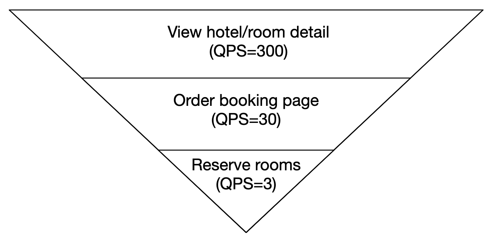
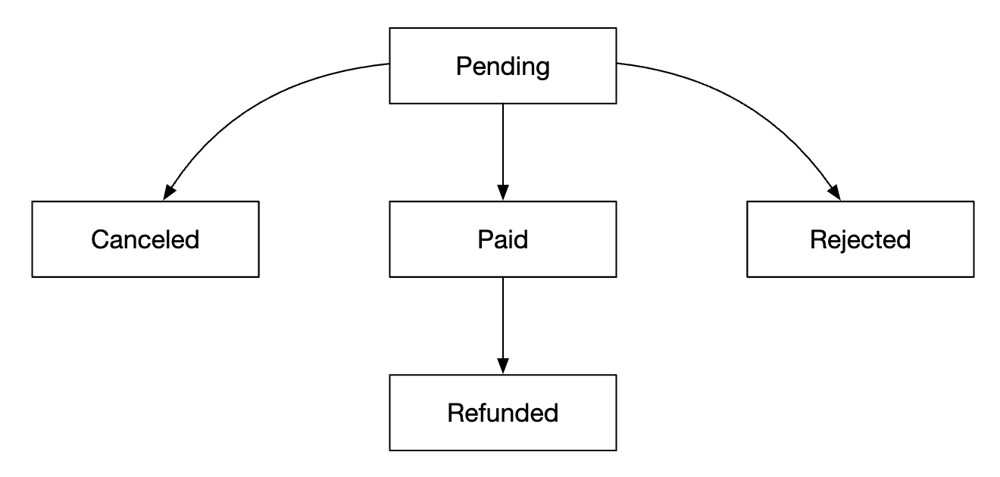
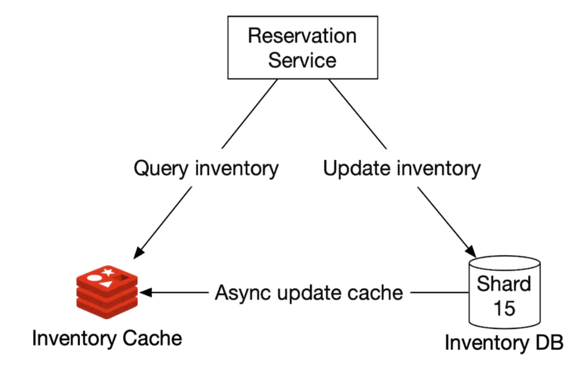
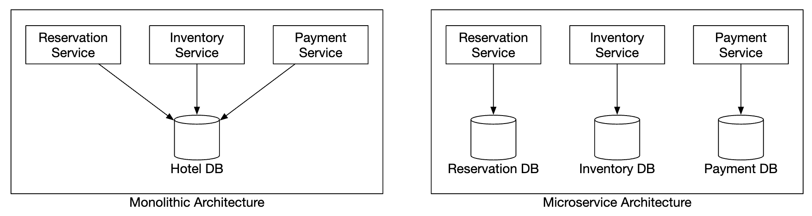

# 第 22 章：酒店预订系统

## 引言
在本章中，我们将设计一个类似 Marriott International 的**酒店预订系统**。

这也适用于其他类型的系统——Airbnb、航班预订、电影票预订。

---

## 步骤 1：理解问题并确定设计范围
在开始设计系统之前，我们应该向面试官提问，以明确范围：
 - C: 系统的规模是多少？
 - I: 我们正在为一个酒店连锁构建网站，\w 5000 家酒店和 1mil 间客房
 - C: 客户是在预订时付款，还是到达酒店时付款？
 - I: 他们在预订时全额付款。
 - C: 客户只能通过网站预订酒店房间吗？我们是否需要支持电话等其他预订方式？
 - I: 他们只能通过网站或应用进行预订。
 - C: 客户可以取消预订吗？
 - I: 可以
 - C: 还有其他需要考虑的事项吗？
 - I: 有，我们允许 10% 的超额预订。酒店会卖出比实际拥有数量更多的房间。酒店这样做是预期客户会取消预订。
 - C: 由于时间不多，我们将重点关注——展示酒店相关页面、酒店房间详情页面、预订房间、管理面板、支持超额预订。
 - I: 听起来不错。
 - I: 还有一件事——酒店价格一直在变化。假设酒店房间的价格每天变化。
 - C: 好的。

### **非功能性要求**
 - 支持高并发——旺季期间可能有大量客户尝试预订同一家酒店。
 - 中等延迟——用户进行预订时，低延迟是理想情况，但如果系统需要几秒钟处理，也是可以接受的。

### **粗略估算**
 - 总共有 5000 家酒店和 1mil 间客房
 - 假设 70% 的房间已被占用，平均入住时长为 3 天
 - 预计每日预订量——1mil * 0.7 / 3 = ~240k 次预订/天
 - 每秒预订量——240k / 10^5 秒/天 = ~3。平均预订 TPS 较低。

让我们估算 QPS。假设到达预订页面需要三个步骤，并且每个页面的转化率为 10%，
我们可以估算，如果有 3 次预订，那么预订页面必须有 30 次浏览，酒店房间详情页面必须有 300 次浏览。

<div style="margin-left:3rem">
    
</div>

---

## 步骤 2：提出高层设计并获得认可
我们将探讨——API 设计、数据模型、高层设计。

### **API 设计**
此 API 设计关注支持酒店预订系统所需的核心端点（使用 RESTful 实践）。

一个完整的系统需要更广泛的 API，以支持根据大量条件搜索房间，但本节不讨论这些内容。
原因是这些内容在技术上并不具有挑战性，因此不在范围内。

**酒店相关 API**
 - `GET /v1/hotels/{id}` - 获取酒店的详细信息
 - `POST /v1/hotels` - 添加新酒店。仅对 ops 可用
 - `PUT /v1/hotels/{id}` - 更新酒店信息。仅对 ops 可用
 - `DELETE /v1/hotels/{id}` - 删除酒店。API 仅对 ops 可用

**房间相关 API**
 - `GET /v1/hotels/{id}/rooms/{id}` - 获取房间的详细信息
 - `POST /v1/hotels/{id}/rooms` - 添加房间。仅对 ops 可用
 - `PUT /v1/hotels/{id}/rooms/{id}` - 更新房间信息。仅对 ops 可用
 - `DELETE /v1/hotels/{id}/rooms/{id}` - 删除房间。仅对 ops 可用

**预订相关 API**
 - `GET /v1/reservations` - 获取当前用户的预订历史
 - `GET /v1/reservations/{id}` - 获取预订的详细信息
 - `POST /v1/reservations` - 创建新预订
 - `DELETE /v1/reservations/{id}` - 取消预订

下面是一个创建预订的请求示例：

```
{
  "startDate":"2021-04-28",
  "endDate":"2021-04-30",
  "hotelID":"245",
  "roomID":"U12354673389",
  "reservationID":"13422445"
}
```

请注意，`reservationID` 是用于避免重复预订的幂等键。详情请参阅[并发部分](#concurrency-issues)

### **数据模型**
在选择使用哪种数据库之前，让我们先考虑访问模式。

我们需要支持以下查询：
 - 查看酒店的详细信息
 - 根据日期范围查找可用的房间类型
 - 记录预订
 - 查找预订或过去的预订历史

根据我们的估算，我们知道系统规模并不大，但需要为流量激增做好准备。

基于这些信息，我们将选择关系数据库，因为：
 - 关系数据库适合读密集型且写入较少的系统。
 - NoSQL 数据库通常针对写入进行了优化，但我们知道预订数量不会很多，因为只有访问网站的用户中的一小部分会进行预订。
 - 关系数据库提供 ACID 保证。对于此类系统，这些保证很重要，因为没有它们，我们将无法防止负余额、重复扣款等问题。
 - 关系数据库可以轻松地对数据建模，因为其结构非常清晰。

以下是我们的模式设计：

<div style="margin-left:3rem">
    
</div>

大多数字段都不言自明。唯一值得一提的字段是 `status` 字段，它表示给定房间的状态机：

<div style="margin-left:3rem">
    
</div>

此数据模型适用于 Airbnb 这样的系统，但不适用于酒店，因为用户预订的不是特定房间，而是房间类型。
他们预订一种房间类型，并在预订时选择房间号。

这一缺点将在[改进的数据模型](#improved-data-model)部分解决。

### **高层设计**
我们为此设计选择了微服务架构。近年来它越来越受欢迎：

<div style="margin-left:3rem">
    
</div>

 - **用户**：通过手机或电脑预订酒店房间
 - **管理员**：执行退款/取消付款等管理功能
 - **CDN**：缓存 JS 包、图像、视频等静态资源
 - **公共 API 网关**：支持速率限制、身份验证等的全托管服务。
 - **内部 API**：仅对授权人员可见。通常由 VPN 保护。
 - **酒店服务**：提供酒店和房间的详细信息。酒店和房间数据是静态的，因此可以积极地缓存。
 - **费率服务**：提供不同未来日期的房间费率。这个领域的一个有趣之处是，价格取决于某天酒店的入住程度。
 - **预订服务**：接收预订请求并预订酒店房间。还会跟踪预订创建/取消时的房间库存。
 - **支付服务**：处理支付，并在成功时更新预订状态。
 - **酒店管理服务**：仅对授权人员可用。允许执行管理和查看预订、酒店等特定功能。

服务间通信可以通过 RPC 框架（例如 gRPC）实现。

---

## 步骤 3：深入设计
让我们深入探讨：
 - 改进的数据模型
 - 并发问题
 - 可扩展性
 - 解决微服务中的数据不一致

### **改进的数据模型**
如前一节所述，我们需要修改 API 和模式，以支持预订房间类型而不是特定房间。

对于预订 API，我们不再预订 `roomID`，而是预订 `roomTypeID`：

```
POST /v1/reservations
{
  "startDate":"2021-04-28",
  "endDate":"2021-04-30",
  "hotelID":"245",
  "roomTypeID":"12354673389",
  "roomCount":"3",
  "reservationID":"13422445"
}
```

下面是更新后的模式：

<div style="margin-left:3rem">
    
</div>

 - **room**：包含房间信息
 - **room_type_rate**：包含给定房间类型的价格信息
 - **reservation**：记录客人的预订数据
 - **room_type_inventory**：存储酒店房间的库存数据。 

让我们看看 `room_type_inventory` 列，因为该表更有趣：
 - **hotel_id**：酒店的 id
 - **room_type_id**：房间类型的 id
 - **date**：单个日期
 - **total_inventory**：房间总数减去暂时从库存中移除的房间数。
 - **total_reserved**：给定 (hotel_id, room_type_id, date) 的预订房间总数

设计此表还有其他方式，但每个 (hotel_id, room_type_id, date) 对应一间房，可以实现轻松的
预订管理和更简单的查询。

表中的行通过每日 CRON 作业预先填充。

示例数据：
| hotel_id | room_type_id | date       | total_inventory | total_reserved |
|----------|--------------|------------|-----------------|----------------|
| 211      | 1001         | 2021-06-01 | 100             | 80             |
| 211      | 1001         | 2021-06-02 | 100             | 82             |
| 211      | 1001         | 2021-06-03 | 100             | 86             |
| 211      | 1001         | ...        | ...             |                |
| 211      | 1001         | 2023-05-31 | 100             | 0              |
| 211      | 1002         | 2021-06-01 | 200             | 16             |
| 2210     | 101          | 2021-06-01 | 30              | 23             |
| 2210     | 101          | 2021-06-02 | 30              | 25             |

检查某种房间可用性的示例 SQL 查询：

```
SELECT date, total_inventory, total_reserved
FROM room_type_inventory
WHERE room_type_id = ${roomTypeId} AND hotel_id = ${hotelId}
AND date between ${startDate} and ${endDate}
```

使用这些数据检查指定数量房间的可用性（注意，我们支持超额预订）：

```
if (total_reserved + ${numberOfRoomsToReserve}) <= 110% * total_inventory
```

现在让我们估算一下存储量。
 - 我们有 5000 家酒店。
 - 每家酒店有 20 种房间类型。
 - 5000 * 20 * 2 (years) * 365 (days) = 73mil 行

73 million 行数据并不多，单个数据库服务器就可以处理。
不过，设置读取副本（可能跨越不同区域）以实现高可用是有意义的。

后续问题——如果预订数据对于单个数据库来说太大，你会怎么做？
 - 只存储当前和未来的预订数据。预订历史可以移至冷存储。
 - 数据库分片——我们可以按 `hash(hotel_id) % servers_cnt` 对数据分片，因为查询中始终会选择 `hotel_id`。

### **并发问题**
另一个需要解决的重要问题是重复预订。

需要解决两个问题：
 - 同一用户点击两次“预订”
 - 多个用户同时尝试预订房间

以下是第一个问题的可视化：

<div style="margin-left:3rem">
    
</div>

解决这个问题有两种方法：
 - 客户端处理——点击后前端可以禁用预订按钮。但是，如果用户禁用了 javascript，他们不会看到按钮变灰。
 - 幂等 API——向 API 添加幂等键，使用户无论端点被调用多少次，都只能执行一次操作：

<div style="margin-left:3rem">
    
</div>

下面是该流程的工作方式：
 - 当你开始填写详细信息并进行预订时，会生成一个预订订单。预订订单使用全局唯一标识符生成。
 - 使用上一步生成的 `reservation_id` 提交预订 1。
 - 如果第二次点击“完成预订”，会发送相同的 `reservation_id`，后端会检测到这是重复预订。
 - 通过使 `reservation_id` 列具有唯一约束，可以避免重复，从而阻止将具有该 id 的多条记录存储在 DB 中。

<div style="margin-left:3rem">
    
</div>

如果有多个用户进行相同的预订呢？

<div style="margin-left:3rem">
    
</div>

 - 假设事务隔离级别不是可串行化
 - 用户 1 和 2 同时尝试预订同一个房间。
 - 事务 1 检查是否有足够的房间——有
 - 事务 2 检查是否有足够的房间——有
 - 事务 2 预订房间并更新库存
 - 事务 1 也预订房间，因为它仍然看到有 99 个 `total_reserved` 房间（总数为 100）。
 - 两个事务都成功提交更改

可以使用某种锁定机制解决此问题：
 - 悲观锁
 - 乐观锁
 - 数据库约束

以下是我们用来预订房间的 SQL：

```sql
# step 1: check room inventory
SELECT date, total_inventory, total_reserved
FROM room_type_inventory
WHERE room_type_id = ${roomTypeId} AND hotel_id = ${hotelId}
AND date between ${startDate} and ${endDate}

# For every entry returned from step 1
if((total_reserved + ${numberOfRoomsToReserve}) > 110% * total_inventory) {
  Rollback
}

# step 2: reserve rooms
UPDATE room_type_inventory
SET total_reserved = total_reserved + ${numberOfRoomsToReserve}
WHERE room_type_id = ${roomTypeId}
AND date between ${startDate} and ${endDate}

Commit
```

#### 选项 1：悲观锁
悲观锁通过在记录更新期间对其加锁，防止同时更新。

在 MySQL 中，可以使用 `SELECT... FOR UPDATE` 查询实现这一点，该查询会锁定查询选中的行，直到事务提交。

<div style="margin-left:3rem">
    
</div>

优点：
 - 防止应用程序更新正在更改的数据
 - 易于实现，并通过串行化更新避免冲突。当数据争用严重时很有用。

缺点：
 - 多个资源被锁定时可能发生死锁。
 - 这种方法不可扩展——如果事务锁定时间过长，会影响所有尝试访问该资源的其他事务。
 - 当查询选择大量资源且事务长期存在时，影响会很严重。

作者不推荐这种方法，因为它存在可扩展性问题。

#### 选项 2：乐观锁
乐观锁允许多个用户同时尝试更新一条记录。

有两种常见的实现方式——版本号和时间戳。建议使用版本号，因为服务器时钟可能不准确。

<div style="margin-left:3rem">
    
</div>

 - 向数据库表添加新的 `version` 列
 - 用户修改数据库行之前，读取版本号
 - 用户更新行时，版本号增加 1 并写回数据库
 - 数据库验证会阻止插入，除非新版本号大于之前的版本号

乐观锁通常比悲观锁更快，因为我们不会锁定数据库。
不过，当并发较高时，其性能往往会下降，因为这会导致大量回滚。

优点：
 - 它可以防止应用程序编辑过时的数据
 - 我们不需要在数据库中获取锁
 - 当数据争用较低时是首选方案，即更新冲突很少

缺点：
 - 数据争用较高时性能较差

乐观锁是我们系统的一个不错的选择，因为预订 QPS 并不是特别高。

#### 选项 3：数据库约束
这种方法与乐观锁非常相似，但通过数据库约束实现保护措施：

```
CONSTRAINT `check_room_count` CHECK((`total_inventory - total_reserved` >= 0))
```

<div style="margin-left:3rem">
    
</div>

优点：
 - 易于实现
 - 数据争用较小时效果良好

缺点：
 - 与乐观锁类似，数据争用较高时性能较差
 - 数据库约束不像应用程序代码那样容易进行版本控制
 - 并非所有数据库都支持约束

由于易于实现，这也是酒店预订系统的另一个好选择。

### **可扩展性**
通常，酒店预订系统的负载并不高。 

但是，面试官可能会问你，如果系统被 booking.com 这样的更大、更受欢迎的旅游网站采用，你会如何处理。
在这种情况下，QPS 可能会大 1000 倍。

出现这种情况时，了解瓶颈所在非常重要。所有服务都是无状态的，因此可以通过复制轻松扩展。

然而，数据库是有状态的，如何扩展它就没有那么明显了。

一种扩展方式是实现数据库分片——我们可以将数据拆分到多个数据库中，每个数据库包含一部分数据。

我们可以根据 `hotel_id` 进行分片，因为所有查询都会基于它进行过滤。 
假设 QPS 为 30,000，将数据库分成 16 个分片后，每个分片处理 1875 QPS，这在单个 MySQL 集群的负载能力范围内。

<div style="margin-left:3rem">
    
</div>

我们还可以通过 Redis 对房间库存和预订进行缓存。我们可以设置 TTL，使旧数据在已经过去的日期后过期。

<div style="margin-left:3rem">
    
</div>

我们根据 `hotel_id`、`room_type_id` 和 `date` 存储库存：

```
key: hotelID_roomTypeID_{date}
value: the number of available rooms for the given hotel ID, room type ID and date.
```

数据一致性是异步发生的，并通过使用 CDC 流机制进行管理——数据库更改会被读取并应用到单独的系统。
Debezium 是将数据库更改与 Redis 同步的常用选项。

使用这种机制，缓存和数据库可能会在一段时间内不一致。
在我们的场景中这没有问题，因为数据库会阻止我们进行无效预订。

这会在 UI 上造成一些问题，因为用户必须刷新页面才能看到“没有更多房间了”，
但无论是否存在这个问题，都可能发生这种情况，例如某人在预订前犹豫了很久。

缓存优点：
 - 减少数据库负载
 - 高性能，因为 Redis 在内存中管理数据

缓存缺点：
 - 维护缓存与 DB 之间的数据一致性很困难。我们需要考虑不一致会如何影响用户体验。

### **服务间的数据一致性**
单体应用使我们能够使用共享的关系数据库来确保数据一致性。

在我们的微服务设计中，我们选择了一种混合方案，其中一些服务是分开的，
但预订和库存 API 由同一个服务处理预订和库存 API。

这样做是因为我们希望利用关系数据库的 ACID 保证来确保一致性。

但是，面试官可能会质疑这种方法，因为它不是纯粹的微服务架构，在纯粹的微服务架构中，每个服务都有专用数据库：

<div style="margin-left:3rem">
    
</div>

这可能导致一致性问题。在单体服务器中，我们可以利用关系数据库的事务能力来实现原子操作：

<div style="margin-left:3rem">
    
</div>

然而，当操作跨越多个服务时，保证这种原子性就更具挑战性：

<div style="margin-left:3rem">
    
</div>

有一些众所周知的技术可以处理这些数据不一致问题：
 - **两阶段提交**：一种数据库协议，保证跨多个节点的原子事务提交。 
   但它的性能不佳，因为单个节点延迟会导致所有节点阻塞操作。
 - **Saga**：一系列本地事务，如果工作流中的任何步骤失败，就会触发补偿事务。这是一种最终一致性方法。

值得注意的是，处理跨微服务的数据不一致是一个具有挑战性的问题，会增加系统复杂性。
考虑到我们更务实地将相关操作封装在同一个关系数据库中，最好评估这样做的成本是否值得。

---

## 步骤 4：总结
我们介绍了酒店预订系统的设计。

以下是我们经历的步骤：
 - 收集需求并进行粗略计算，以了解系统规模
 - 在高层设计中介绍 API 设计、数据模型和系统架构
 - 在深入设计中，随着需求变化，探索了替代的数据库模式设计
 - 讨论竞态条件并提出解决方案——悲观/乐观锁、数据库约束
 - 通过数据库分片和缓存扩展系统的方法
 - 最后，我们讨论了如何处理多个微服务之间的数据一致性问题
