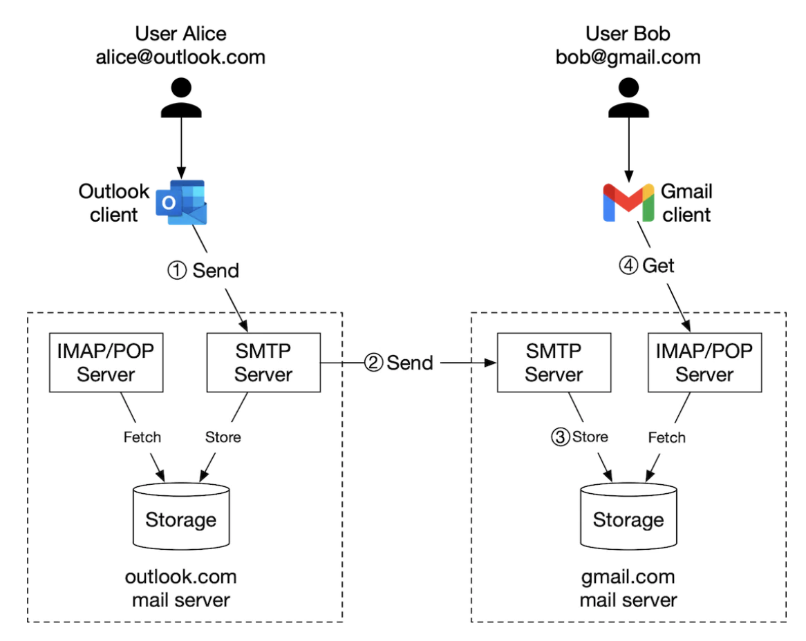
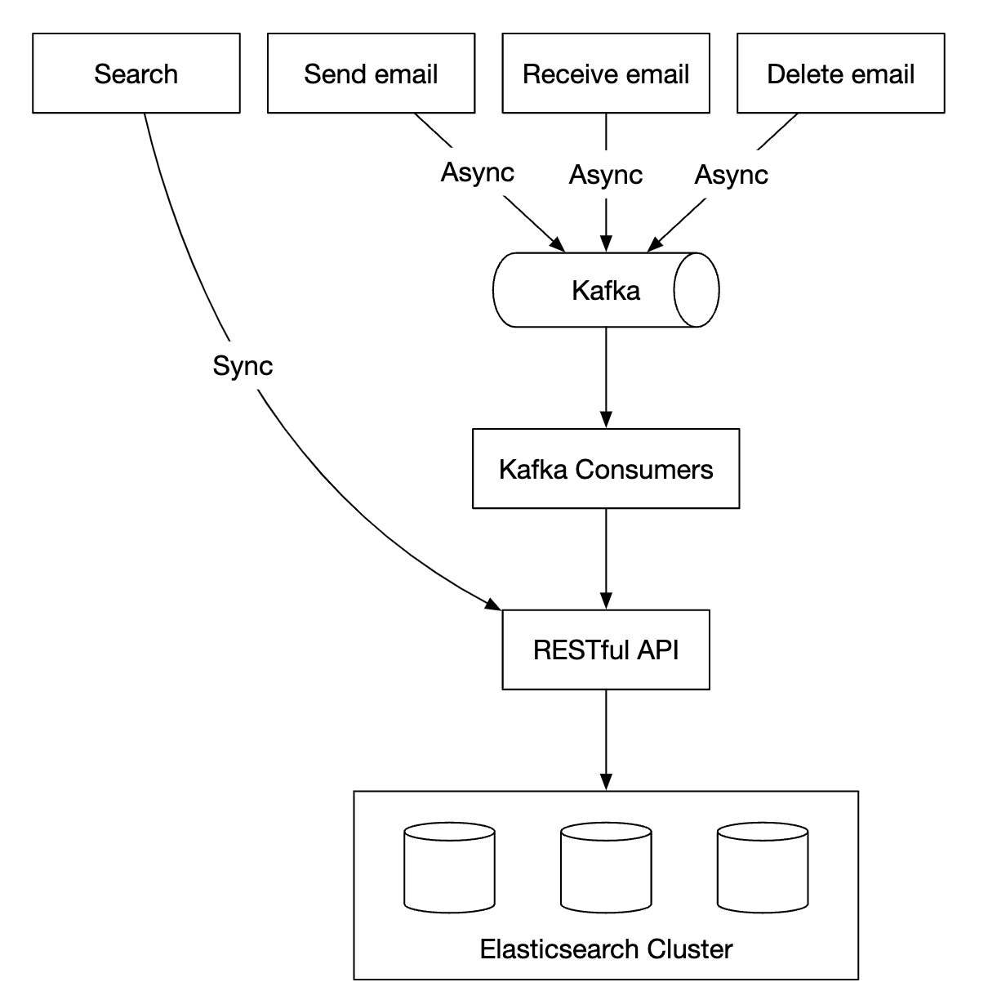

# 第 23 章：分布式电子邮件服务

## 简介

本章我们将设计一个类似 **Gmail** 的**分布式电子邮件服务**。

2020 年，**Gmail** 拥有 1.8bil 活跃用户，而 **Outlook** 在全球拥有 400mil 用户。

---

## 第 1 步：理解问题并确定设计范围

- C：有多少用户使用该系统？
- I：1bil 用户
- C：我认为以下功能很重要——身份验证、发送/接收电子邮件、获取电子邮件、过滤电子邮件、搜索电子邮件、防垃圾邮件保护。
- I：列表不错。现在不用担心身份验证。
- C：用户如何连接到电子邮件服务器？
- I：通常，电子邮件客户端通过 SMTP、POP、IMAP 连接，但在这个问题中我们将使用 HTTP。
- C：电子邮件可以有附件吗？
- I：可以

### **非功能需求**

- **可靠性**——我们不应该丢失数据
- **可用性**——我们应该使用复制来防止单点故障。我们还应该容忍部分系统故障。
- **可扩展性**——随着用户群增长，我们的系统应该能够处理这些用户。
- **灵活性和可扩展性**——系统应该灵活且易于通过新功能扩展。这是我们选择 HTTP 而不是 SMTP/其他邮件协议的原因之一。

### **粗略估算**

- **1bil 用户**
- 假设一个人每天发送 10 emails -> **100k emails per second**。
- 假设一个人每天接收 40 emails，并且每封电子邮件平均有 50kb 元数据 -> **730pb storage per year**。
- 假设 20% 的电子邮件包含存储附件，平均大小为 500kb -> **1,460pb per year**。

---

## 第 2 步：提出高层设计并获得认同

### **电子邮件知识 101**

有多种协议用于发送和接收电子邮件：
- **SMTP**——用于将电子邮件从一台服务器发送到另一台服务器的标准协议。
- **POP**——用于从远程邮件服务器接收电子邮件并将其下载到本地客户端的标准协议。检索后，电子邮件会从远程服务器删除。
- **IMAP**——与 POP 类似，用于从远程服务器接收并下载电子邮件，但它会将电子邮件保留在服务器端。
- **HTTPS**——严格来说不是电子邮件协议，但可以用于基于 Web 的电子邮件客户端。

除了邮件协议外，我们还需要为电子邮件服务器配置一些 DNS 记录——MX 记录：

<div style="margin-left:3rem">
    
</div>

电子邮件附件以 base64 编码发送，并且大多数邮件服务通常有 25mb 的大小限制。
这是可配置的，并且因个人账户和企业账户而异。

### **传统邮件服务器**

当用户数量有限并连接到单个服务器时，传统邮件服务器运行良好。

<div style="margin-left:3rem">
    
</div>

- Alice 登录她的 Outlook 电子邮件并按下“发送”。电子邮件被发送到 Outlook 邮件服务器。通信通过 SMTP 进行。
- Outlook 服务器查询 DNS 以查找 gmail.com 的 MX 记录，并将电子邮件传输到它们的服务器。通信通过 SMTP 进行。
- Bob 通过 IMAP/POP 从他的 gmail 服务器获取电子邮件。

在传统邮件服务器中，电子邮件存储在本地文件系统中。每封电子邮件都是一个单独的文件。

<div style="margin-left:3rem">
    
</div>

随着规模增长，磁盘 I/O 成为瓶颈。此外，它无法满足我们的高可用性和可靠性要求。
磁盘可能损坏，服务器可能宕机。

### **分布式邮件服务器**

分布式邮件服务器旨在支持现代用例并解决现代可扩展性问题。

这些服务器仍然可以为原生电子邮件客户端支持 IMAP/POP，并为跨服务器邮件交换支持 SMTP。

但是，对于功能丰富的基于 Web 的邮件客户端，通常使用基于 HTTP 的 RESTful API。

示例 API：
- `POST /v1/messages`——向 To、Cc、Bcc 标头中的收件人发送消息。
- `GET /v1/folders`——返回电子邮件账户的所有文件夹

示例响应：

```
[{id: string        Unique folder identifier.
  name: string      Name of the folder.
                    According to RFC6154 [9], the default folders can be one of
                    the following: All, Archive, Drafts, Flagged, Junk, Sent,
                    and Trash.
  user_id: string   Reference to the account owner
}]
```

- `GET /v1/folders/{:folder_id}/messages`——返回文件夹下的所有消息，支持分页
- `GET /v1/messages/{:message_id}`——获取特定消息的所有信息

示例响应：

```
{
  user_id: string                      // Reference to the account owner.
  from: {name: string, email: string}  // <name, email> pair of the sender.
  to: [{name: string, email: string}]  // A list of <name, email> paris
  subject: string                      // Subject of an email
  body: string                         //  Message body
  is_read: boolean                     //  Indicate if a message is read or not.
}
```

下面是分布式邮件服务器的高层设计：

<div style="margin-left:3rem">
    
</div>

- **Webmail**——用户使用 Web 浏览器发送/接收电子邮件
- **Web 服务器**——用于管理登录、注册、用户资料等的面向公众的请求/响应服务。
- **实时服务器**——用于实时向客户端推送新电子邮件更新。我们使用 websockets 进行实时通信，但对于不支持它们的旧浏览器，则回退到 long-polling。
- **元数据 db**——存储电子邮件元数据，例如主题、正文、发件人、收件人等。
- **附件存储**——对象存储（例如 Amazon S3），适合存储大文件。
- **分布式缓存**——我们可以在 Redis 中缓存最近的电子邮件，以改善用户体验。
- **搜索存储**——分布式文档存储，用于支持全文搜索。

下面是电子邮件发送流程：

<div style="margin-left:3rem">
    
</div>

- 用户撰写电子邮件并按下“发送”。电子邮件被发送到负载均衡器。
- 负载均衡器限制过多的邮件发送速率，并将请求路由到其中一台 Web 服务器。
- Web 服务器执行基本电子邮件验证（例如电子邮件大小），并在域名与发件人相同时短路出站流程。但会先执行垃圾邮件检查。
- 如果基本验证通过，电子邮件会被发送到消息队列（附件从对象存储中引用）
- 如果基本验证失败，电子邮件会被发送到错误队列
- SMTP 出站工作器从出站队列拉取消息，执行垃圾邮件/病毒检查，并将消息路由到目标邮件服务器。
- 电子邮件存储在“已发送电子邮件”文件夹中

我们还需要监控出站消息队列的大小。增长过大可能表示存在问题：
- 收件人的邮件服务器不可用。我们可以使用指数退避在稍后的时间重试发送电子邮件。
- 消费者不足以处理负载，我们可能需要扩展消费者。

下面是电子邮件接收流程：

<div style="margin-left:3rem">
    
</div>

- 传入电子邮件到达 SMTP 负载均衡器。邮件被分发到 SMTP 服务器，在那里执行邮件接受策略（例如，直接丢弃无效电子邮件）。
- 如果电子邮件附件太大，我们可以将其放入对象存储（s3）。
- 邮件处理工作器执行初步检查，之后邮件被转发到存储、缓存、对象存储和实时服务器。
- 离线用户重新上线后，会通过 HTTP API 获取新电子邮件。

---

## 第 3 步：设计深入探讨

现在让我们深入了解一些组件。

### **元数据数据库**

下面是电子邮件元数据的一些特征：
- 标头通常很小且访问频繁
- 正文大小从小到大不等，但通常只读取一次
- 大多数邮件操作都局限于单个用户——例如获取电子邮件、标记为已读、搜索。
- 数据新近程度会影响数据使用。用户通常只阅读最近的电子邮件
- 数据有高可靠性要求。数据丢失不可接受。

在 gmail/outlook 规模下，数据库通常是定制的，以减少每秒输入/输出操作数（IOPS）。

让我们考虑有哪些数据库选项：
- **关系数据库**——我们可以为标头和正文构建索引，但这些 DB 通常针对小数据块进行了优化。
- **分布式对象存储**——这可以是备份存储的好选择，但无法有效支持搜索/标记为已读等操作。
- **NoSQL**——Google BigTable 被 gmail 使用，但它不是开源的。

基于上述分析，很少有现有解决方案能够完美满足我们的需求。
在面试场景中，设计一个新的分布式数据库解决方案是不现实的，但提到以下特征很重要：
- 单列可以是 single-digit MB
- 强数据一致性
- 旨在减少磁盘 I/O
- 高可用且容错
- 应该易于创建增量备份

为了对数据进行分区，我们可以使用 `user_id` 作为分区键，这样一个用户的数据就存储在单个分片上。
这会阻止我们与多个用户共享一封电子邮件，但这不是本次面试的要求。

让我们定义表：
- 主键由分区键（数据分布）和聚类键（数据排序）组成
- 我们需要支持的查询——获取用户的所有文件夹、显示文件夹的所有电子邮件、创建/获取/删除电子邮件、获取已读/未读电子邮件、获取会话线程（加分项）

后续表格所用图例：

<div style="margin-left:3rem">
    
</div>

下面是文件夹表：

<div style="margin-left:3rem">
    
</div>

电子邮件表：

<div style="margin-left:3rem">
    
</div>

- email_id 是 timeuuid，它允许根据电子邮件创建时的时间戳进行排序

附件存储在单独的表中，通过文件名标识：

<div style="margin-left:3rem">
    
</div>

在传统关系数据库中支持获取已读/未读电子邮件很容易，但在 Cassandra 中不容易，因为禁止对非分区/聚类键进行过滤。
一种变通方法是获取文件夹中的所有电子邮件并在内存中过滤，但对于规模足够大的应用程序来说效果不好。

我们可以将电子邮件表反规范化为已读/未读电子邮件表：

<div style="margin-left:3rem">
    
</div>

为了支持会话线程，我们可以包含一些标头，邮件客户端会解释并使用这些标头来重建会话线程：

```
{
  "headers" {
     "Message-Id": "<7BA04B2A-430C-4D12-8B57-862103C34501@gmail.com>",
     "In-Reply-To": "<CAEWTXuPfN=LzECjDJtgY9Vu03kgFvJnJUSHTt6TW@gmail.com>",
     "References": ["<7BA04B2A-430C-4D12-8B57-862103C34501@gmail.com>"]
  }
}
```

最后，对于我们的分布式数据库，我们将用一致性换取可用性，因为这是该问题的硬性要求。

因此，在发生故障转移或网络分区时，同步/更新操作将对受影响的用户短暂不可用。

### **电子邮件可投递性**

设置服务器发送电子邮件很容易，但由于垃圾邮件保护算法，让电子邮件进入接收者的收件箱却很难。

如果我们只是设置一个新的邮件服务器并开始通过它发送邮件，我们的电子邮件可能最终会进入垃圾邮件文件夹。

以下是我们可以采取的措施：
- **专用 IP**——使用专用 IP 发送电子邮件，否则收件人服务器不会信任你。
- **对电子邮件分类**——避免从同一服务器发送营销电子邮件，以防更重要的电子邮件被归类为垃圾邮件
- **逐渐预热你的 IP 地址**，与大型电子邮件提供商建立良好声誉。预热新 IP 需要 2 to 6 weeks
- **快速封禁垃圾邮件发送者**，以免损害你的声誉
- **反馈处理**——与 ISP 建立反馈闭环，以跟踪投诉率并快速封禁垃圾账户。
- **电子邮件身份验证**——使用常见技术来打击网络钓鱼，例如 Sender Policy Framework、DomainKeys Identified Mail 等。

你不需要记住所有这些。只需知道，构建一个好的邮件服务器需要大量领域知识。

### **搜索**

搜索包括基于电子邮件内容的全文搜索，或基于发件人、收件人、主题、未读等过滤条件的更高级查询。

电子邮件搜索的一个特点是它局限于用户本身，并且写入多于读取，因为我们需要在每次操作时重新建立索引，但用户很少使用搜索选项卡。

让我们比较 Google search 和电子邮件搜索：

|               | 范围                | 排序                               | 准确性                                          |
|---------------|----------------------|---------------------------------------|---------------------------------------------------|
| Google search | 整个互联网           | 按相关性排序                     | 建立索引需要一些时间，因此结果不会即时出现。 |
| Email search  | 用户自己的邮箱       | 按属性排序，例如时间、日期等 | 索引应该快速且结果准确。    |

为了实现此搜索功能，一个选项是使用 Elasticsearch 集群。我们可以使用 `user_id` 作为分区键，将数据分组到同一节点下：

<div style="margin-left:3rem">
    
</div>

变更操作通过 Kafka 异步执行，以便将服务与重新索引流程解耦。
实际上，搜索数据是同步进行的。

Elasticsearch 是最流行的搜索引擎数据库之一，非常适合支持电子邮件全文搜索。

或者，我们可以尝试开发自己的自定义搜索解决方案，以满足特定需求。

设计这样的系统不在范围内。构建它时的核心挑战之一是针对写入密集型工作负载进行优化。

为此，我们可以使用日志结构合并树（LSM）在磁盘上组织索引数据。写入路径仅针对顺序写入进行优化。
这项技术被 Cassandra、BigTable 和 RocksDB 使用。

其核心思想是将数据存储在内存中，直到达到预定义的阈值，之后将其合并到下一层（磁盘）：

<div style="margin-left:3rem">
    
</div>

两种方法之间的主要权衡：
- Elasticsearch 可以在一定程度上扩展，而自定义搜索引擎可以针对电子邮件用例进行微调，从而允许进一步扩展。
- Elasticsearch 是我们需要维护的独立服务，与元数据存储并列。自定义解决方案可以就是数据存储本身。
- Elasticsearch 是现成解决方案，而自定义搜索引擎则需要大量工程投入来构建。

### **可扩展性和可用性**

由于单个用户的操作不会与其他用户发生冲突，大多数组件都可以独立扩展。

为了确保高可用性，我们还可以使用多 DC 设置，在发生故障时进行 leader-folower 故障转移：

<div style="margin-left:3rem">
    
</div>

---

## 第 4 步：收尾

其他讨论点：
- **容错**——系统的许多部分都可能发生故障。值得讨论我们将如何处理节点故障。
- **合规性**——鉴于欧洲的 GDPR 法律，PII 需要以合理的方式存储。
- **安全性**——电子邮件加密、网络钓鱼保护、安全浏览等。
- **优化**——例如，防止同一附件被不同用户多次发送而造成重复。
