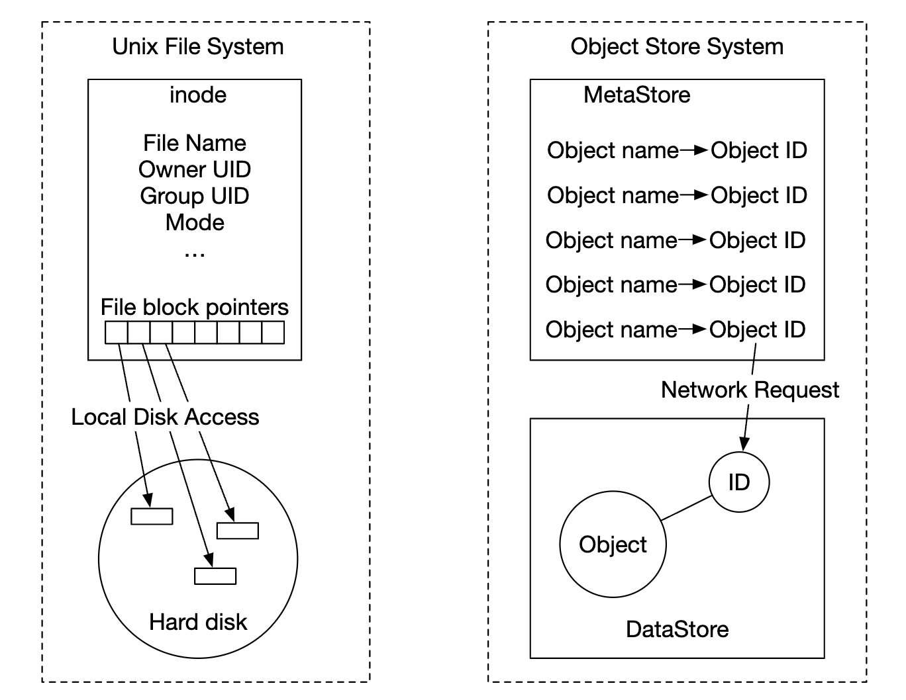

# 第 24 章：S3 类对象存储

## 引言

本章将设计一项类似于 **Amazon S3** 的**对象存储**服务。

存储系统大致分为三类：
- **块存储**
- **文件存储**
- **对象存储**

**块存储**是 1960 年代出现的设备。HDD 和 SSD 就是这类示例。
这些设备通常以物理方式连接到服务器，不过也可以通过高速网络协议以网络连接方式接入。
服务器可以格式化原始块并将其用作文件系统，也可以将其控制权直接交给服务器。

**文件存储**构建在块存储之上。它提供更高层次的抽象，使文件夹和文件更易于管理。

**对象存储**牺牲性能，以换取高持久性、海量规模和低成本。
它面向“冷”数据，主要用于归档和备份。
它没有层次化的目录结构，所有数据都以对象形式存储在扁平结构中。
与其他存储类型相比，它相对较慢。大多数云服务提供商都提供对象存储服务——Amazon S3、Google GCS 等。

<div style="margin-left:3rem">
    
</div>

|                 | 块存储                           | 文件存储                              | 对象存储                    |
|-----------------|----------------------------------|-----------------------------------------|--------------------------------|
| 可变内容        | Y                                | Y                                       | N（具有对象版本控制）       |
| 成本            | 高                               | 中等到高                               | 低                             |
| 性能            | 中等到高，非常高                 | 中等到高                               | 低到中等                       |
| 一致性          | 强一致性                         | 强一致性                               | 强一致性 [5]                  |
| 数据访问        | SAS/iSCSI/FC                     | 标准文件访问、CIFS/SMB 和 NFS           | RESTful API                    |
| 可扩展性        | 中等可扩展性                     | 高可扩展性                             | 海量可扩展性                   |
| 适用于          | 虚拟机（VM）、数据库            | 通用文件系统访问                       | 二进制数据、非结构化数据       |

一些与对象存储相关的术语：
- **存储桶** - 对象的逻辑容器。名称全局唯一。
- **对象** - 存储在存储桶中的一份独立数据。包含对象数据和元数据。
- **版本控制** - 在同一个存储桶中保留对象多个变体的功能。
- **统一资源标识符（URI）** - 每个资源都通过 URI 唯一标识。
- **服务级别协议（SLA）** - 服务提供商与客户端之间的合同。

Amazon S3 Standard-Infrequent Access 存储类别的 SLA：
- 在多个可用区之间提供 99.999999999% 的持久性
- 即使整个可用区被摧毁，数据仍具有韧性
- 设计可实现 99.9% 的可用性

---

## 第 1 步：理解问题并确定设计范围

- C：应包含哪些功能？
- I：创建存储桶、对象上传/下载、版本控制、列出存储桶中的对象
- C：典型数据大小是多少？
- I：我们需要高效存储大对象和小对象
- C：一年存储多少数据？
- I：100 petabytes
- C：我们能否假设数据持久性为 6 nines（99.9999%），且服务可用性为 4 nines（99.99%）？
- I：是的，听起来合理

### **非功能性要求**

- **100 PB 的数据**
- **6 nines 的数据持久性**
- **4 nines 的服务可用性**
- 存储效率。在保持高可靠性和高性能的同时降低存储成本

### **粗略估算**

对象存储很可能会在磁盘容量或每秒 IO（IOPS）方面出现瓶颈。

假设：
- 我们有 20% 的小对象（小于 1mb）、60% 的中等大小对象（1-64mb）和 20% 的大对象（大于 64mb），
- 一块硬盘（SATA，7200rpm）每秒能够执行 100-150 次随机寻道（100-150 IOPS）

根据这些假设，我们可以估算系统能够持久化的对象总数。
- 让我们使用每种对象类型的中位大小来简化计算——小对象为 0.5mb，中等对象为 32mb，大对象为 200mb。
- 在 100PB 的存储空间（10^11 MB）中，40% 的存储使用率会产生 0.68bil 个对象
- 如果假设元数据为 1kb，那么我们需要 0.68tb 的空间来存储元数据信息

---

## 第 2 步：提出高层设计并获得认可

在深入设计之前，让我们先探讨对象存储的一些有趣特性：
- **对象不可变性** - 对象存储中的对象是不可变的（其他存储系统并非如此）。我们可以删除或替换它们，但不能更新。
- **键值存储** - 对象 URI 是它的键，我们可以通过发起 HTTP 调用来获取其内容
- **只写一次，多次读取** - 数据访问模式是写入一次并多次读取。根据一些 Linkedin 研究，95% 的操作是读取
- 支持大对象和小对象

对象存储的设计理念类似于 UNIX——保存文件时，它会在一个称为 inode 的数据结构中创建文件名，而文件数据存储在磁盘上的不同位置。
inode 包含文件块指针列表，这些指针指向磁盘上的不同位置。

访问文件时，我们首先从 inode 获取其元数据，然后再获取文件内容。

对象存储的工作方式类似——元数据存储用于保存文件信息，但内容存储在磁盘上：

<div style="margin-left:3rem">
    
</div>

将元数据与文件内容分离后，我们可以独立扩展不同的存储：

<div style="margin-left:3rem">
    
</div>

### **高层设计**

<div style="margin-left:3rem">
    
</div>

- **负载均衡器** - 在服务副本之间分发 API 请求
- **API 服务** - 无状态服务器，负责协调对元数据存储和对象存储的调用，以及对 IAM 服务的调用。
- **身份和访问管理（IAM）** - 认证（auth）、授权（authz）和访问控制的中心位置。
- **数据存储** - 存储和检索实际数据。操作基于对象 ID（UUID）。
- **元数据存储** - 存储对象元数据

### **上传对象**

<div style="margin-left:3rem">
    
</div>

- 通过 HTTP PUT 请求创建名为 "bucket-to-share" 的存储桶
- API 服务调用 IAM，以确保用户已获授权并具有写入权限
- API 服务调用元数据存储以创建存储桶条目。创建完成后返回成功响应。
- 创建存储桶后，发送 HTTP PUT 以创建名为 "script.txt" 的对象
- API 服务验证用户身份，并确保用户具有写入权限
- 验证通过后，通过 HTTP PUT 将对象负载发送到数据存储。数据存储将其持久化并返回一个 UUID。
- API 服务调用元数据存储，以创建包含 object_id、bucket_id 和 bucket_name 以及其他元数据的新条目。

对象上传请求示例：

```
PUT /bucket-to-share/script.txt HTTP/1.1
Host: foo.s3example.org
Date: Sun, 12 Sept 2021 17:51:00 GMT
Authorization: authorization string
Content-Type: text/plain
Content-Length: 4567
x-amz-meta-author: Alex

[4567 bytes of object data]
```

### **下载对象**

存储桶没有目录层次结构，但我们可以通过连接存储桶名称和对象名称来创建逻辑层次结构，以模拟文件夹结构。

获取对象的 GET 请求示例：

```
GET /bucket-to-share/script.txt HTTP/1.1
Host: foo.s3example.org
Date: Sun, 12 Sept 2021 18:30:01 GMT
Authorization: authorization string
```

<div style="margin-left:3rem">
    
</div>

- 客户端向负载均衡器发送 HTTP GET 请求，即 `GET /bucket-to-share/script.txt`
- API 服务查询 IAM，以验证用户是否具有读取存储桶的正确权限
- 验证通过后，从元数据存储中获取对象的 UUID
- 根据 UUID 从数据存储中获取对象负载并返回给客户端

---

// sprint 1

## 第 3 步：深入设计

### **数据存储**

以下是 API 服务与数据存储交互的方式：

<div style="margin-left:3rem">
    
</div>

数据存储的主要组件：

<div style="margin-left:3rem">
    
</div>

数据路由服务提供 RESTful 或 gRPC API，以访问数据节点集群。
它是无状态服务，通过添加更多服务器来扩展。

它的主要职责是：
- 查询放置服务，以获取用于存储数据的最佳数据节点
- 从数据节点读取数据并将其返回给 API 服务
- 将数据写入数据节点

放置服务确定哪些数据节点应存储一个对象。
它维护一个虚拟集群映射，用于确定集群的物理拓扑。

<div style="margin-left:3rem">
    
</div>

该服务还向所有数据节点发送心跳，以确定是否应将它们从虚拟集群中移除。

由于这是一项关键服务，建议维护一个包含 5 或 7 个副本的集群，并通过 Paxos 或 Raft 共识算法进行同步。
例如，一个 7 节点集群可以容忍 3 个节点发生故障。

数据节点存储实际的对象数据。
通过将数据复制到多个数据节点来确保可靠性和持久性。

每个数据节点都有一个正在运行的守护进程，该进程向放置服务发送心跳。

心跳包括：
- 数据节点管理多少个磁盘驱动器（HDD 或 SSD）？
- 每个驱动器上存储了多少数据？

#### 数据持久化流程

<div style="margin-left:3rem">
    
</div>

- API 服务将对象数据转发到数据存储
- 数据路由服务将数据发送到主数据节点
- 主数据节点在本地保存数据，并将其复制到两个辅助数据节点。复制成功后发送响应。
- 对象的 UUID 返回给 API 服务。

注意事项：
- 给定一个对象 UUID，通过使用一致性哈希可以确定性地选择其复制组
- 在第 4 步中，主数据节点在返回响应之前复制对象数据。这更倾向于强一致性，而不是更高的延迟。

<div style="margin-left:3rem">
    
</div>

#### 数据的组织方式

一种简单的数据管理方法是将每个对象存储在单独的文件中。

这种方法可行，但当文件系统中存在许多小文件时，性能并不高：
- HDD 上的数据块会被浪费，因为每个文件都会使用整个块大小。典型块大小为 4kb。
- 文件很多意味着 inode 很多。操作系统无法很好地处理过多 inode，并且还存在 inode 数量上限。

这些问题可以通过使用预写日志（WAL）将许多小文件合并为更大的文件来解决。当文件达到其容量（通常为几个 GB）时，就会创建一个新文件：

<div style="margin-left:3rem">
    
</div>

这种方法的缺点是，对文件的写入访问需要串行化。访问同一文件的多个核心必须彼此等待。
为了解决这个问题，我们可以将文件限制在特定核心上，以避免锁竞争。

#### 对象查找

为了支持在同一个文件中存储多个对象，我们需要维护一个表，告知数据节点：
- `object_id`
- 存储对象的 `filename`
- 对象开始位置的 `file_offset`
- `object_size`

我们可以将此表部署在 RocksDB 之类的基于文件的 db 中，或传统的关系数据库中。
由于访问模式是低写入+高读取，关系数据库效果更好。

我们应该如何部署它？
我们可以在集群中单独部署并扩展 db，由所有数据节点访问。

缺点：
- 我们需要积极扩展集群以服务所有请求
- 数据节点与 db 集群之间存在额外的网络延迟

另一种方法是利用数据节点只关注与自身相关数据这一事实，
因此我们可以将关系数据库直接部署在数据节点本身中。

SQLite 是一个不错的选择，因为它是轻量级的基于文件的关系数据库。

#### 更新后的数据持久化流程

<div style="margin-left:3rem">
    
</div>

- API Service 发送保存新对象的请求
- 数据节点服务将新对象追加到名为 "/data/c" 的文件末尾
- 将对象的新记录插入对象映射表

#### 持久性

数据持久性是我们设计中的一项重要要求。为了实现 6 nines 的持久性，需要适当检查每一种故障情况。

首先要解决的问题是硬件故障。我们可以通过复制数据节点来最大限度地降低故障概率。
除此之外，我们还应跨不同的故障域进行复制（跨机架、跨数据中心、独立网络等）。
一个关键事件可能会在同一域内造成多次硬件故障：

<div style="margin-left:3rem">
    
</div>

假设典型 HDD 的年故障率为 0.81%，制作三个副本可以实现 6 nines 的持久性。

以这种方式复制数据节点可以实现我们所需的持久性，但我们也可以利用纠删码来降低存储成本。

纠删码使我们能够使用奇偶校验位，从而在发生故障时重建丢失的位：

<div style="margin-left:3rem">
    
</div>

假设这些位是数据节点。如果其中两个节点宕机，可以使用剩余的四个节点将其恢复。

纠删码方案有多种。在我们的例子中，可以使用 8+4 纠删码，并将其拆分到不同的故障域中，以最大限度提高可靠性：

<div style="margin-left:3rem">
    
</div>

纠删码能够让我们实现低得多的存储成本（提升 50%），代价是访问速度下降，因为数据路由服务必须从多个位置收集数据：

<div style="margin-left:3rem">
    
</div>

其他注意事项：
- 复制需要 200% 的存储开销（在有 3 个副本的情况下），而纠删码只需 50%
- 纠删码[可提供 11 nines 的持久性](https://github.com/Backblaze/erasure-coding-durability)，而复制只能提供 6 nines
- 纠删码需要更多计算来计算和存储奇偶校验

总之，复制对于延迟敏感型应用更有用，而纠删码对于存储成本效率和持久性更具吸引力。
纠删码的实现也困难得多。

#### 正确性验证

如果磁盘完全故障，那么很容易检测到故障。但如果磁盘内存的一部分损坏，检测就没那么直接了。

为了检测这种情况，我们可以使用校验和——文件内容的哈希，可用于验证文件的完整性。

在我们的例子中，我们会为每个文件和每个对象存储校验和：

<div style="margin-left:3rem">
    
</div>

在纠删码（8+4）的情况下，我们需要分别获取 8 个数据片段，并验证每个片段的校验和。

// sprint 2

### **元数据数据模型**

表模式：

<div style="margin-left:3rem">
    
</div>

我们需要支持的查询：
- 按名称查找对象 ID
- 根据名称插入/删除对象
- 列出存储桶中共享相同前缀的对象

通常会限制用户可以创建的存储桶数量，因此存储桶表的大小很小，可以放入单个 db 服务器。
但我们仍然需要扩展服务器以提高读取吞吐量。

不过，对象表可能无法放入单个数据库服务器。因此，我们可以通过分片来扩展该表：
- 按 bucket_id 分片会导致热点问题，因为一个存储桶可能有数十亿个对象
- 按 bucket_id 分片可以使负载分布更均匀，但我们的查询会变慢
- 我们选择按 `hash(bucket_name, object_name)` 分片，因为大多数查询都基于对象/存储桶名称。

即使采用这种分片方案，列出存储桶中的对象仍然会很慢。

### **列出存储桶中的对象**

在单个数据库中，根据前缀（看起来像目录）列出对象的工作方式如下：

```
SELECT * FROM object WHERE bucket_id = "123" AND object_name LIKE `abc/%`
```

数据库分片后，实现这一点就很有挑战性。为此，我们可以在每个分片上运行查询，并在内存中聚合结果。
但这会使分页变得困难，因为不同分片包含的结果大小不同，我们需要为每个分片维护单独的 limit/offset。

我们可以利用对象存储通常未针对列出对象进行优化这一事实，因此可以牺牲列出性能。
我们还可以创建一个用于列出对象的反规范化表，按存储桶 ID 分片。
这样可以使我们的列出查询足够快，因为它被隔离到单个数据库实例中。

### **对象版本控制**

版本控制的实现方式是增加另一个 `object_version` 列，其类型为 TIMEUUID，从而可以基于该列对记录进行排序。

每个新版本都会产生一个新的 `object_id`：

<div style="margin-left:3rem">
    
</div>

删除对象会创建一个新版本，并使用特殊的 `object_id` 表示对象已被删除。针对它的查询会返回 404：

<div style="margin-left:3rem">
    
</div>

### **优化大文件上传**

可以使用分段上传来优化大文件上传——将大文件拆分为多个块，并独立上传：

<div style="margin-left:3rem">
    
</div>

- 客户端调用服务以启动分段上传
- 数据存储返回一个唯一标识该上传的上传 ID
- 客户端将大文件拆分为多个块，并使用 upload id 独立上传
- 上传一个块后，数据存储返回一个 etag，它是一个 md5 校验和，用于标识该上传块
- 所有分块上传完成后，客户端发送完整的分段上传请求，其中包括 upload_id、分块编号和所有 etags
- 数据存储从各个分块重新组装对象。此过程可能需要几分钟。之后向客户端返回成功响应。

此时可以移除不再有用的旧分块。我们可以引入垃圾回收器来处理这些分块。

### **垃圾回收**

垃圾回收是回收不再使用的存储空间的过程。数据变成垃圾的方式有几种：
- **延迟对象删除** - 对象被标记为已删除，但实际上并未删除
- **孤儿数据** - 例如上传中途失败，需要删除旧分块
- **损坏数据** - 未通过校验和验证的数据

垃圾回收器还负责回收副本中的未使用空间。
进行复制时，会从主节点和副本中删除数据。使用纠删码（8+4）时，会从全部 12 个节点中删除数据。

为了便于删除，我们将使用一个称为压实的过程：
- 垃圾回收器将未删除的对象从 "data/b" 复制到 "data/d"
- 复制完成后，使用数据库事务更新 `object_mapping` 表
- 为避免产生过多小文件，会对增长超过某个阈值的文件执行压实

<div style="margin-left:3rem">
    
</div>

---

## 第 4 步：总结

我们讨论了以下内容：
- 设计 S3 类对象存储
- 比较对象存储、块存储和文件存储之间的差异
- 讨论存储桶中对象的上传、下载、列出和版本控制
- 深入设计——数据存储和元数据存储、复制和纠删码、分段上传、分片
