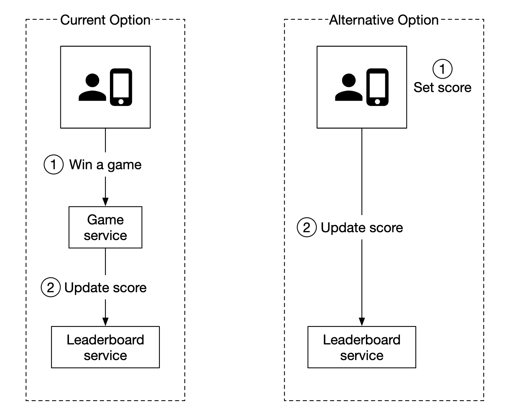
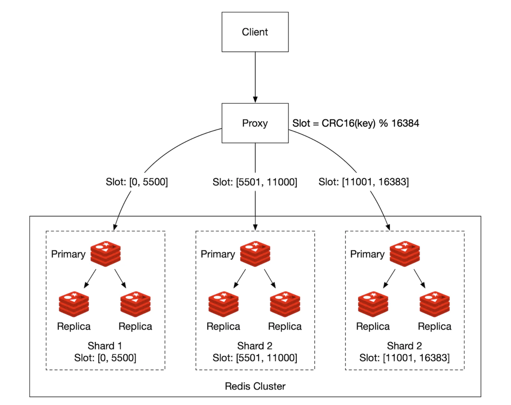
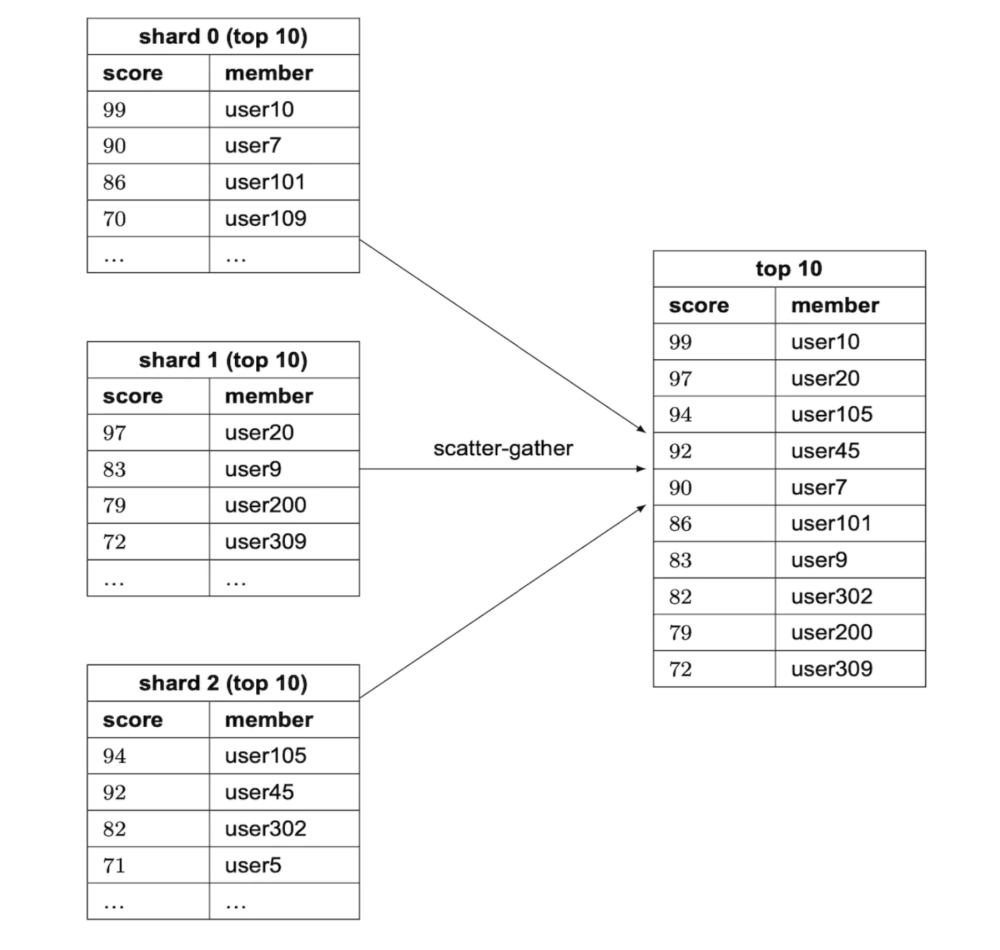
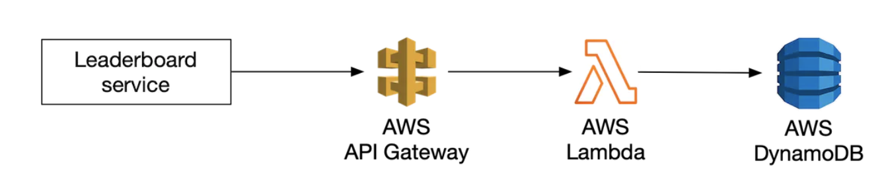

# 第 25 章：实时游戏排行榜

## 引言

我们将为一款在线移动游戏设计一个**排行榜**：

<div style="margin-left:3rem">
    
</div>

---

## 第 1 步：理解问题并确定设计范围

- C：排行榜的分数如何计算？
- I：用户每赢得一场比赛就获得一个积分。
- C：所有玩家都包含在排行榜中吗？
- I：是
- C：是否存在与排行榜关联的时间段？
- I：每月都会开始一场新的锦标赛，同时开始一个新的排行榜。
- C：我们可以假设只关心前 10 名用户吗？
- I：我们希望显示前 10 名用户以及特定用户的排名。如果时间允许，我们可以讨论显示排行榜中特定用户附近的用户。
- C：一场锦标赛中有多少用户？
- I：5mil DAU 和 25mil MAU
- C：一场锦标赛平均进行多少场比赛？
- I：每个玩家平均每天进行 10 场比赛
- C：如果两个玩家得分相同，我们如何确定排名？
- I：在这种情况下，他们的排名相同。如果时间允许，我们可以讨论如何打破平局。
- C：排行榜需要实时更新吗？
- I：是，我们希望展示实时结果，或尽可能接近实时的结果。不能展示批量处理的结果历史。

### **功能性要求**

- 在排行榜上显示前 10 名玩家
- 显示用户的具体排名
- 显示给定用户上方和下方各四个位置的用户（额外要求）

### **非功能性要求**

- 分数实时更新
- 分数更新实时反映在排行榜上
- 通用的可扩展性、可用性、可靠性

### **粗略估算**

按照 50mil DAU 计算，如果游戏在 24h 内玩家分布均匀，我们平均会有 50 users/s。
但是，由于分布通常不均匀，我们可以估计在线用户峰值为 250 users/s。

得分用户的 QPS——平均每天进行 10 场游戏，50 users/s * 10 = 500 QPS。峰值 QPS = 2500。

获取前 10 名排行榜的 QPS——假设用户平均每天打开一次，QPS 为 50。

---

## 第 2 步：提出高层设计并获得认可

### **API 设计**

我们需要的第一个 API 用于更新用户分数：

```
POST /v1/scores
```

此 API 接受两个参数——`user_id` 以及用户赢得游戏所获得的 `points`。

此 API 只能由游戏服务器访问，终端客户端不能访问。

下一个 API 用于获取排行榜前 10 名玩家：

```
GET /v1/scores
```

响应示例：

```
{
  "data": [
    {
      "user_id": "user_id1",
      "user_name": "alice",
      "rank": 1,
      "score": 12543
    },
    {
      "user_id": "user_id2",
      "user_name": "bob",
      "rank": 2,
      "score": 11500
    }
  ],
  ...
  "total": 10
}
```

你也可以获取特定用户的分数：

```
GET /v1/scores/{:user_id}
```

响应示例：

```
{
    "user_info": {
        "user_id": "user5",
        "score": 1000,
        "rank": 6,
    }
}
```

### **高层架构**

<div style="margin-left:3rem">
    
</div>

- 玩家赢得游戏时，客户端向游戏服务发送请求
- 游戏服务验证胜利是否有效，并调用排行榜服务更新玩家分数
- 排行榜服务更新排行榜存储中的用户分数
- 玩家调用排行榜服务获取排行榜数据，例如前 10 名玩家和给定玩家的排名

曾考虑过的另一种设计是由客户端直接在排行榜服务中更新自己的分数：

<div style="margin-left:3rem">
    
</div>

此选项不安全，因为容易受到中间人攻击。玩家可以设置代理并随意更改自己的分数。

另一个注意事项是，对于游戏逻辑由服务器管理的游戏，客户端不需要显式调用服务器来记录胜利。
服务器会根据游戏逻辑自动为他们完成记录。

另一个需要考虑的问题是，是否应该在游戏服务器和排行榜服务之间放置消息队列。如果其他服务对游戏结果感兴趣，这会很有用，但到目前为止这并不是面试中的明确要求，因此没有包含在设计中：

<div style="margin-left:3rem">
    
</div>

### **数据模型**

让我们讨论存储排行榜数据的选项——关系型 DB、Redis、NoSQL。

NoSQL 方案将在深入设计部分讨论。

#### 关系数据库方案

如果规模不重要，并且用户数量不多，关系型 DB 就能很好地满足我们的需求。

我们可以从一个简单的排行榜表开始，每个月使用一个表（个人备注——这没有意义。你可以只添加一个 `month` 列，从而避免每月维护新表的麻烦）：

<div style="margin-left:3rem">
    
</div>

其中还需要包含其他数据，但这些数据与我们要运行的查询无关，因此被省略了。

用户赢得一个积分时会发生什么？

<div style="margin-left:3rem">
    
</div>

如果用户尚不存在于表中，我们需要先插入该用户：

```
INSERT INTO leaderboard (user_id, score) VALUES ('mary1934', 1);
```

后续调用中，我们只需更新其分数：

```
UPDATE leaderboard set score=score + 1 where user_id='mary1934';
```

我们如何找到排行榜中的顶尖玩家？

<div style="margin-left:3rem">
    
</div>

我们可以运行以下查询：

```
SELECT (@rownum := @rownum + 1) AS rank, user_id, score
FROM leaderboard
ORDER BY score DESC;
```

但这并不高效，因为它会扫描表来对数据库表中的所有记录进行排序。

我们可以在 `score` 上添加索引，并使用 `LIMIT` 操作来避免扫描所有内容，从而进行优化：

```
SELECT (@rownum := @rownum + 1) AS rank, user_id, score
FROM leaderboard
ORDER BY score DESC
LIMIT 10;
```

但是，如果用户不在排行榜顶部，而你又想定位其排名，这种方法的扩展性并不好。

#### Redis 方案

我们希望找到一个即使面对数百万玩家也能良好工作的方案，而不必退回到复杂的数据库查询。

Redis 是一种内存数据存储，因为在内存中运行而速度很快，并且具有适合我们需求的数据结构——有序集合。

有序集合是一种类似于编程语言中集合的数据结构，允许你按照给定标准保持数据结构有序。
在内部，它使用哈希映射维护键（user_id）和值（score）之间的映射，并使用跳表将分数映射到按顺序排列的用户：

<div style="margin-left:3rem">
    
</div>

跳表如何工作？
- 它是一个支持快速搜索的链表
- 它由一个有序链表和多级索引组成

<div style="margin-left:3rem">
    
</div>

当数据集足够大时，这种结构使我们能够快速搜索特定值。
在下面的示例中（64 个节点），在基础链表中需要遍历 62 个节点才能找到给定值，而在跳表情况下只需遍历 11 个节点：

<div style="margin-left:3rem">
    
</div>

有序集合始终保持数据有序，因此性能优于关系数据库，代价是添加和查找操作的时间复杂度为 O(logN)。

相比之下，下面是我们在关系型 DB 中查找给定用户排名时需要运行的嵌套查询示例：

```
SELECT *,(SELECT COUNT(*) FROM leaderboard lb2
WHERE lb2.score >= lb1.score) RANK
FROM leaderboard lb1
WHERE lb1.user_id = {:user_id};
```

在 Redis 中操作排行榜需要哪些操作？
- **ZADD** - 如果用户不存在，则将用户插入集合。否则，更新分数。时间复杂度为 O(logN)。
- **ZINCRBY** - 将用户分数增加给定数量。如果用户不存在，则分数从零开始。时间复杂度为 O(logN)。
- **ZRANGE/ZREVRANGE** - 获取按分数排序的用户范围。我们可以指定顺序（ASC/DESC）、偏移量和结果大小。时间复杂度为 O(logN+M)，其中 M 是结果大小。
- **ZRANK/ZREVRANK** - 按 ASC/DESC 顺序获取给定用户的位置（排名）。时间复杂度为 O(logN)。

用户获得一个积分时会发生什么？

```
ZINCRBY leaderboard_feb_2021 1 'mary1934'
```

每个月都会创建一个新的排行榜，而旧排行榜会移至历史存储。

用户获取前 10 名玩家时会发生什么？

```
ZREVRANGE leaderboard_feb_2021 0 9 WITHSCORES
```

结果示例：

```
[(user2,score2),(user1,score1),(user5,score5)...]
```

用户获取自己的排行榜位置呢？

<div style="margin-left:3rem">
    
</div>

在已知用户排行榜位置的情况下，可以通过以下查询轻松实现：

```
ZREVRANGE leaderboard_feb_2021 357 365
```

可以使用 `ZREVRANK <user-id>` 获取用户的位置。

让我们探讨一下存储需求：
- 假设最坏情况是所有 25mil MAU 都参加某个月的游戏
- ID 是 24-character string，分数是 16-bit integer，我们需要 26 bytes * 25mil = ~650MB 的存储空间
- 即使由于跳表开销而将存储成本加倍，这仍然可以轻松容纳在现代 redis 集群中

还需要考虑的一个非功能性要求是支持每秒 2500 次更新。这完全在单个 Redis 服务器的能力范围内。

其他注意事项：
- 我们可以启动一个 Redis 副本，以避免 redis 服务器崩溃时丢失数据
- 我们仍然可以利用 Redis 持久性，以便在崩溃时不丢失数据
- 我们需要在 MySQL 中建立两个支持表，用于获取用户名、显示名称等用户详细信息，以及存储例如用户赢得游戏的时间
- MySQL 中的第二个表可用于在基础设施故障时重建排行榜
- 作为一项小型性能优化，我们可以缓存前 10 名玩家的用户详细信息，因为这些信息会被频繁访问

---

## 第 3 步：深入设计

### **是否使用云服务提供商**

我们可以选择部署和管理自己的服务，也可以使用云服务提供商来代我们管理这些服务。

如果选择自行管理服务，我们将使用 redis 存储排行榜数据，使用 mysql 存储用户资料；如果希望扩展数据库，还可以使用用户资料缓存：

<div style="margin-left:3rem">
    
</div>

或者，我们可以使用云服务来为我们管理许多服务。例如，可以使用 AWS API Gateway 将 API 调用路由到 AWS Lambda 函数：

<div style="margin-left:3rem">
    
</div>

AWS Lambda 使我们能够运行代码，而无需自行管理或配置服务器。它仅在需要时运行，并自动扩展。

用户得分示例：

<div style="margin-left:3rem">
    
</div>

用户获取排行榜示例：

<div style="margin-left:3rem">
    
</div>

Lambda 是无服务器架构的一种实现。我们不需要管理扩展和环境设置。

如果从头开始构建游戏，作者建议采用这种方法。

### **扩展 Redis**

从存储和 QPS 的角度来看，拥有 5mil DAU 时，单个 Redis 实例就足够了。

但是，如果设想用户群增长 10x，达到 500mil DAU，那么存储需要 65gb，QPS 会达到 250k。

这样的规模需要分片。

一种实现方式是对数据进行范围分区：

<div style="margin-left:3rem">
    
</div>

在这个示例中，我们将根据用户分数进行分片。我们将在应用程序代码中维护 user_id 与分片之间的映射。
我们可以通过 MySQL 或另一个缓存来保存该映射本身。

要获取前 10 名玩家，我们将查询分数最高的分片（`[900-1000]`）。

要获取用户排名，我们需要计算用户所在分片内的排名，并加上其他分片中分数更高的所有用户。
后者是一个 O(1) 操作，因为可以通过 info keyspace 命令快速访问每个分片的记录总数。

或者，我们可以通过 Redis Cluster 使用哈希分区。它是一个代理，会根据类似一致性哈希但并不完全相同的分区方式，在 redis 节点之间分发数据：

<div style="margin-left:3rem">
    
</div>

在这种设置下计算前 10 名玩家很有挑战性。我们需要获取每个分片的前 10 名玩家，并在应用程序中合并结果：

<div style="margin-left:3rem">
    
</div>

哈希分区存在一些限制：
- 如果需要获取前 K 个用户，其中 K 较高，那么延迟可能会增加，因为需要从所有分片获取大量数据
- 分区数量增加时，延迟会增加
- 没有直接的方法来确定用户的排名

由于这些原因，作者倾向于针对这个问题使用固定分区。

其他注意事项：
- 一个最佳实践是为写入密集型 redis 节点分配所需内存两倍的内存，以便在需要时容纳快照
- 我们可以使用名为 Redis-benchmark 的工具来跟踪 redis 设置的性能，并据此做出数据驱动的决策

### **替代方案：NoSQL**

另一个值得考虑的方案是使用适当的 NoSQL 数据库，该数据库针对以下方面进行了优化：
- 大量写入
- 在同一分区内按分数有效地对项目排序

DynamoDB、Cassandra 或 MongoDB 都很适合。

在本章中，作者决定使用 DynamoDB。它是一种完全托管的 NoSQL 数据库，提供可靠的性能和出色的可扩展性。
当我们需要查询不属于主键的字段时，它还支持使用全局二级索引。

<div style="margin-left:3rem">
    
</div>

让我们从一个用于存储国际象棋游戏排行榜的表开始：

<div style="margin-left:3rem">
    
</div>

这运行良好，但如果需要按分数查询任何内容，扩展性就不好。因此，我们可以将分数作为排序键：

<div style="margin-left:3rem">
    
</div>

这种设计的另一个问题是我们按月份进行分区。与其他月份相比，最新月份的访问不均匀，这会导致热点分区。

我们可以使用一种称为写分片的技术，为每个键追加一个分区编号，该编号通过 `user_id % num_partitions` 计算：

<div style="margin-left:3rem">
    
</div>

需要考虑的一个重要权衡是应该使用多少个分区：
- 分区越多，写入可扩展性越高
- 但是，读取可扩展性会受到影响，因为我们需要查询更多分区来收集聚合结果

使用这种方法需要采用我们之前看到的“scatter-gather”技术，随着分区增加，其时间复杂度也会增加：

<div style="margin-left:3rem">
    
</div>

为了合理评估分区数量，我们需要进行一些基准测试。

这种 NoSQL 方案仍有一个主要缺点——很难计算用户的具体排名。

如果规模足够大，需要进行分片，那么我们或许可以告诉用户其分数位于哪个“百分位数”。

定时任务可以定期运行来分析分数分布，并据此确定用户的百分位数，例如：

```
10th percentile = score < 100
20th percentile = score < 500
...
90th percentile = score < 6500
```

---

## 第 4 步：总结

如果时间允许，还可以讨论其他事项：
- **更快的检索** - 我们可以通过 Redis 哈希缓存用户对象，映射为 `user_id -> user object`。与查询数据库相比，这可以实现更快的检索。
- **打破平局** - 当两个玩家得分相同时，可以根据最近进行的游戏对他们进行排序来打破平局。
- **系统故障恢复** - 发生大规模 Redis 中断时，我们可以遍历 MySQL WAL 条目来重建排行榜，并通过临时脚本重新创建它
