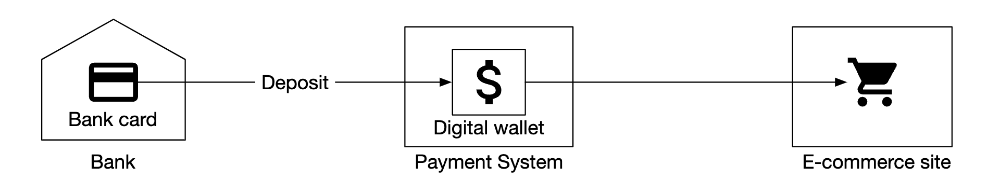
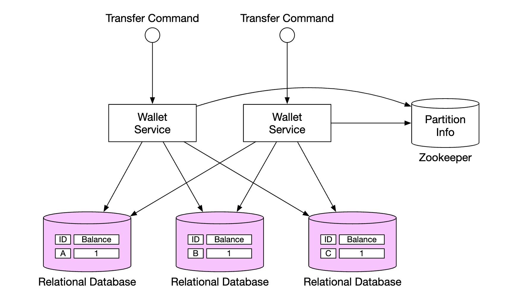
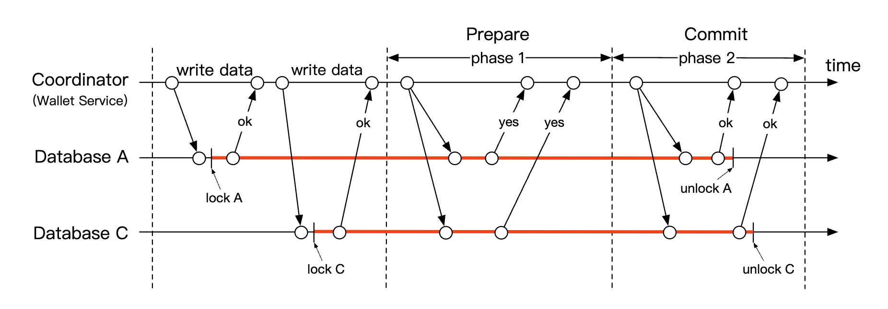
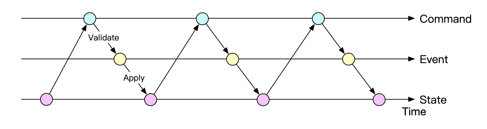
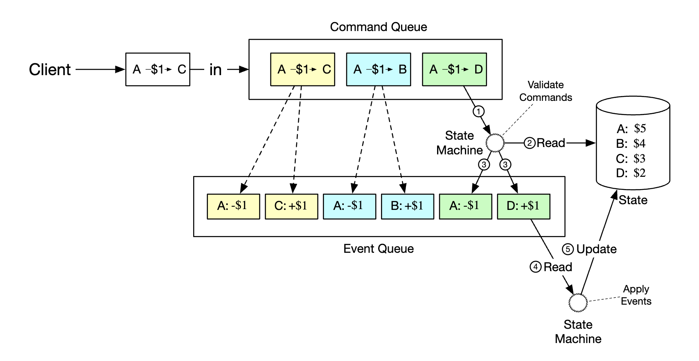
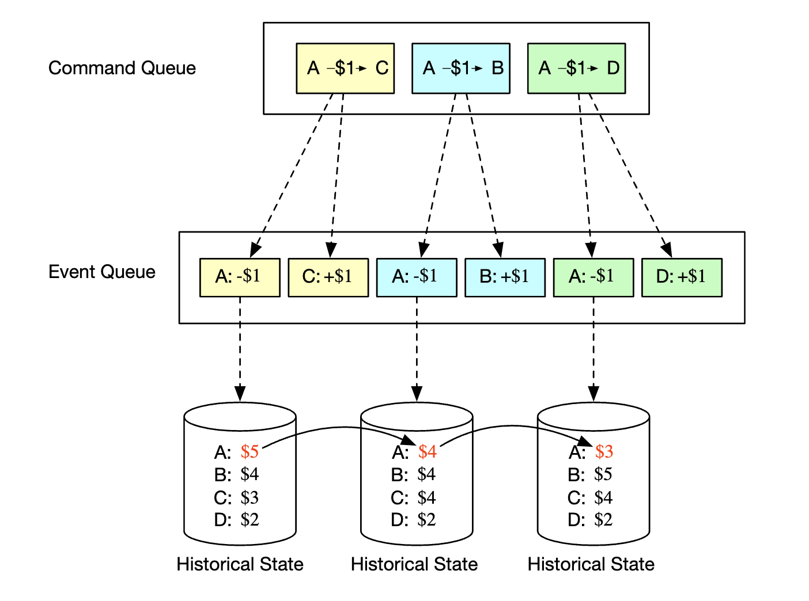
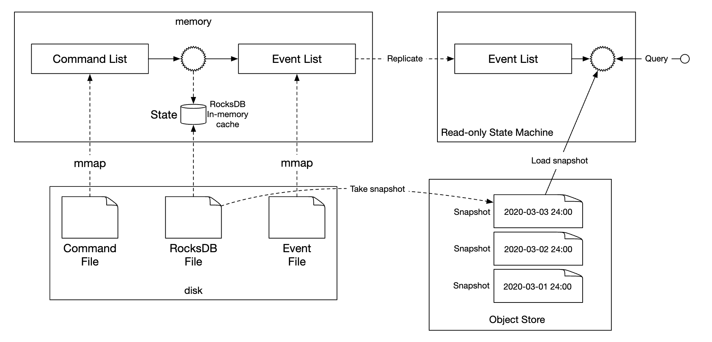

# 第 27 章：数字钱包

## 简介
**支付平台**通常拥有一个**钱包服务**，允许客户在应用内存储资金，之后可以将其提取出来。

你也可以使用它购买商品和服务，或向使用**数字钱包**服务的其他用户转账。这可能比通过普通支付渠道进行支付更快、更便宜。

<div style="margin-left:3rem">
    
</div>

---

## 步骤 1：理解问题并确定设计范围
 * C：我们是否只需关注数字钱包之间的转账？是否还应支持其他操作？
 * I：目前先关注数字钱包之间的转账。
 * C：系统每秒需要支持多少笔交易？
 * I：假设为 1mil TPS
 * C：数字钱包有严格的正确性要求。我们是否可以假设事务保证已足够？
 * I：听起来不错
 * C：我们需要证明正确性吗？
 * I：我们可以通过对账做到这一点，但对账只能检测差异，而不能显示差异的根本原因。相反，我们希望能够从头重放数据，以重建历史。
 * C：我们能否假设可用性要求为 99.99%？
 * I：可以
 * C：是否需要考虑外汇？
 * I：不，这超出了范围

以下是我们需要支持的内容摘要：
 * 支持两个账户之间的余额转账
 * 支持 1mil TPS
 * 可靠性为 99.99%
 * 支持事务
 * 支持可复现性

### **粗略估算**
在云中配置的传统关系型数据库可以支持约 1000 TPS。

为了达到 1mil TPS，我们需要 1000 个数据库节点。但如果每次转账有两条分支，那么实际上需要支持 2mil TPS。

我们的设计目标之一是提高单个节点能够处理的 TPS，从而减少数据库节点数量。

| 每节点 TPS | 节点数       |
|--------------|-------------|
| 100          | 20,000      |
| 1,000        | 2,000       |
| 10,000       | 200         |

---

## 步骤 2：提出高层设计并获得认同

### **API 设计**
本次面试只需要支持一个端点：
```
POST /v1/wallet/balance_transfer - transfers balance from one wallet to another
```

请求参数 - from_account、to_account、amount（字符串，以免丢失精度）、currency、transaction_id（幂等键）。

示例响应：
```
{
    "status": "success"
    "transaction_id": "01589980-2664-11ec-9621-0242ac130002"
}
```

### **内存分片解决方案**
我们的钱包应用为每个用户账户维护账户余额。

表示这一点的一种良好数据结构是 `map<user_id, balance>`，可以使用内存中的 Redis 存储来实现。

由于单个 redis 节点无法承受 1mil TPS，我们需要将 Redis 集群划分到多个节点中。

分区算法示例：
```
String accountID = "A";
Int partitionNumber = 7;
Int myPartition = accountID.hashCode() % partitionNumber;
```

可以使用 Zookeeper 存储分区数量和 redis 节点的地址，因为它是一种高可用的配置存储。

最后，钱包服务是负责执行转账操作的无状态服务。它可以轻松地进行水平扩展：

<div style="margin-left:3rem">
    
</div>

虽然该解决方案解决了可扩展性问题，但它不允许我们原子地执行余额转账。

### **分布式事务**
处理事务的一种方法是在标准的、分片的关系型数据库之上使用两阶段提交协议：

<div style="margin-left:3rem">
    
</div>

以下是两阶段提交（2PC）协议的工作方式：

<div style="margin-left:3rem">
    
</div>

 * 协调器（钱包服务）像平常一样在多个数据库上执行读写操作
 * 应用程序准备提交事务时，协调器要求所有数据库准备事务
 * 如果所有数据库都回复“是”，协调器就要求数据库提交事务。
 * 否则，要求所有数据库中止事务

2PC 方法的缺点：
 * 由于锁竞争，性能不佳
 * 协调器是单点故障

### **使用 Try-Confirm/Cancel（TC/C）的分布式事务**
TC/C 是 2PC 协议的一种变体，使用补偿事务工作：
 * 协调器要求所有数据库为事务预留资源
 * 协调器收集 DBs 的回复——如果回复为是，则要求 DBs 执行 try-confirm；如果回复为否，则要求 DBs 执行 try-cancel。

TC/C 与 2PC 的一个重要区别是，2PC 执行单个事务，而在 TC/C 中，有两个独立的事务。

以下是 TC/C 各阶段的工作方式：

| 阶段 | 操作       | A                   | C                   |
|-------|-----------|---------------------|---------------------|
| 1     | Try       | 余额变更：-$1       | 不执行任何操作          |
| 2     | Confirm   | 不执行任何操作          | 余额变更：+$1       |
|       | Cancel    | 余额变更：+$1       | 不执行任何操作          |

阶段 1 - try：

<div style="margin-left:3rem">
    
</div>

 * 协调器在 A 的 DB 中启动本地事务，将 A 的余额减少 1$
 * C 的 DB 收到一条 NOP 指令，该指令不执行任何操作

阶段 2a - confirm：

<div style="margin-left:3rem">
    
</div>

 * 如果两个 DBs 都回复“是”，则开始 confirm 阶段。
 * A 的 DB 收到 NOP，而 C 的 DB 被指示将 C 的余额增加 1$（本地事务）

阶段 2b - cancel：

<div style="margin-left:3rem">
    
</div>

 * 如果阶段 1 中的任何操作失败，则开始 cancel 阶段。
 * 指示 A 的 DB 将 A 的余额增加 1$，C 的 DB 收到 NOP

以下是 2PC 与 TC/C 的比较：

|      | 第一阶段                                  | 第二阶段：成功                    | 第二阶段：失败                        |
|------|--------------------------------------------------------|------------------------------------|-------------------------------------------|
| 2PC  | 事务尚未完成                              | 提交/取消所有事务                  | 取消所有事务                   |
| TC/C | 所有事务均已完成——已提交或已取消           | 必要时执行新事务                   | 反转已经提交的事务             |

TC/C 也称为补偿式分布式事务。高层操作在业务逻辑中处理。

TC/C 的其他属性：
 * 与数据库无关，只要数据库支持事务即可
 * 分布式事务的细节和复杂性需要在业务逻辑中处理

### **TC/C 故障模式**
如果协调器在执行过程中死亡，就需要恢复其中间状态。
这可以通过维护阶段状态表来实现，并在数据库分片内原子地更新这些表：

<div style="margin-left:3rem">
    
</div>

该表包含什么：
 * 分布式事务的 ID 和内容
 * try 阶段的状态——未发送、已发送、已收到响应
 * 第二阶段的名称——confirm 或 cancel
 * 第二阶段的状态
 * 乱序标志（稍后解释）

使用 TC/C 时需要注意的一点是，分布式事务正在执行期间，账户状态之间会有一个短暂的不一致时刻：

<div style="margin-left:3rem">
    
</div>

只要我们始终从这种状态中恢复，并且用户无法利用中间状态来例如消费余额，这就是没问题的。
通过始终先执行扣减再执行增加，可以保证这一点。

| Try 阶段选择       | 账户 A | 账户 C |
|--------------------|-----------|-----------|
| 选择 1             | -$1       | NOP       |
| 选择 2（无效）     | NOP       | +$1       |
| 选择 3（无效）     | -$1       | +$1       |

请注意，上表中的选择 3 无效，因为如果不依赖 2PC，就无法保证跨不同数据库原子地执行事务。

需要处理的一个边界情况是乱序执行：

<div style="margin-left:3rem">
    
</div>

数据库有可能在收到 try 之前就收到 cancel 操作。可以通过在阶段状态表中添加乱序标志来处理这种边界情况。
收到 try 操作时，我们首先检查乱序标志是否已设置；如果已设置，则返回失败。

### **使用 Saga 的分布式事务**
另一种流行的方法是使用 Saga——一种用于通过微服务架构实现分布式事务的标准。

其工作方式如下：
 * 所有操作按顺序排列。所有操作都在各自的数据库中独立执行。
 * 操作从第一个执行到最后一个
 * 当某个操作失败时，整个过程从末尾开始使用补偿操作回滚，直到回到开头

<div style="margin-left:3rem">
    
</div>

我们如何协调工作流？有两种方法：
 * 编排（Choreography）- Saga 中涉及的所有服务都订阅相关事件，并完成自己在 Saga 中的部分
 * 协调（Orchestration）- 单个协调器指示所有服务按正确顺序完成各自的工作

使用编排的挑战在于，业务逻辑分散在多个服务之间，而这些服务进行异步通信。
协调方法可以很好地处理复杂性，因此通常是数字钱包系统的首选方法。

以下是 TC/C 与 Saga 的比较：

|                                           | TC/C            | Saga                     |
|-------------------------------------------|-----------------|--------------------------|
| 补偿操作                                  | 在 Cancel 阶段  | 在回滚阶段               |
| 集中式协调                                | 是              | 是（编排模式）           |
| 操作执行顺序                              | 任意            | 线性                     |
| 并行执行可能性                            | 是              | 否（线性执行）           |
| 可能看到部分不一致状态                    | 是              | 是                       |
| 应用程序或数据库逻辑                      | 应用程序        | 应用程序                 |

主要区别在于 TC/C 可并行化，因此我们的决定取决于延迟要求——如果需要实现低延迟，就应选择 TC/C 方法。

无论采用哪种方法，我们仍然需要支持审计和重放历史，以从失败状态中恢复。

### **事件溯源**
在现实中，数字钱包应用可能需要接受审计，我们必须回答一些问题：
 * 我们知道任意时刻的账户余额吗？
 * 我们如何知道历史余额和当前余额是正确的？
 * 代码变更后，我们如何证明系统逻辑是正确的？

事件溯源是一种帮助我们回答这些问题的技术。

它由四个概念组成：
 * 命令 - 来自现实世界的预期操作，例如将 1$ 从账户 A 转移到 B。需要有全局顺序，因此它们会被放入 FIFO 队列。
   * 与事件不同，命令可能失败，并且由于 IO 或无效状态等原因具有一定的随机性。
   * 命令可以产生零个或多个事件
   * 事件生成可能包含外部 IO 等随机性。这一点稍后会再次讨论
 * 事件 - 关于系统中发生的事件的历史事实，例如“已将 1$ 从 A 转移到 B”。
   * 与命令不同，事件是系统内已经发生的事实
   * 与命令类似，它们需要排序，因此会被放入 FIFO 队列
 * 状态 - 事件导致的变化。例如，账户与其余额之间的键值存储。
 * 状态机 - 驱动事件溯源过程。它主要验证命令，并应用事件以更新系统状态。
   * 状态机应该是确定性的，因此不应读取外部 IO 或依赖随机性。 

<div style="margin-left:3rem">
    
</div>

以下是事件溯源的动态视图：

<div style="margin-left:3rem">
    
</div>

对于钱包服务，命令就是余额转账请求。我们可以将它们放入 FIFO 队列，例如 Kafka：

<div style="margin-left:3rem">
    
</div>

以下是完整图示：

<div style="margin-left:3rem">
    
</div>

 * 状态机从命令队列读取命令
 * 从数据库读取余额状态
 * 验证命令。如果有效，则为每个账户生成两个事件
 * 读取下一个事件，并通过更新数据库中的余额（状态）来应用它

使用事件溯源的主要优势是可复现性。在此设计中，所有状态更新操作都作为所有余额变更的不可变历史保存。

始终可以通过从头重放事件来重建历史余额。
由于事件列表不可变且状态机具有确定性，因此可以保证成功重放任何中间状态。

<div style="margin-left:3rem">
    
</div>

本节开头提出的所有审计相关问题都可以通过依赖事件溯源来解决：
 * 我们知道任意时刻的账户余额吗？- 可以从头开始重放事件，直到我们感兴趣的时间点
 * 我们如何知道历史余额和当前余额是正确的？- 可以从头重新计算所有事件来验证正确性
 * 代码变更后，我们如何证明系统逻辑是正确的？- 可以让不同版本的代码针对这些事件运行，并验证其结果是否一致

使用 CQRS 架构可以处理客户端关于余额的查询——可以有多个只读状态机，基于不可变事件列表查询历史状态：

<div style="margin-left:3rem">
    
</div>

---

## 步骤 3：深入设计
本节将探索一些性能优化，因为我们仍然需要扩展到 1mil TPS。

### **高性能事件溯源**
我们将探索的第一个优化是将命令和事件保存到本地磁盘存储，而不是 Kafka 等外部存储。

这样可以避免网络延迟，而且由于我们只执行追加操作，该操作通常对 HDD 很快。

下一个优化是在内存中缓存最近的命令和事件，以节省从磁盘重新加载它们的时间。

在底层，我们可以利用一个名为 mmap 的命令实现上述优化，它将数据存储在本地磁盘中，同时也将其缓存到内存中：

<div style="margin-left:3rem">
    
</div>

我们还可以进行的下一个优化是使用 SQLite 将状态存储在本地文件系统中——SQLite 是一种基于文件的本地关系型数据库。RocksDB 也是一个不错的选项。

就我们的用途而言，我们选择 RocksDB，因为它使用针对写操作优化的日志结构合并树（LSM）。
读取性能通过缓存进行优化。

<div style="margin-left:3rem">
    
</div>

为了优化可复现性，我们可以定期将快照保存到磁盘，这样就不必每次都从头复现给定状态。我们可以将快照作为大型二进制文件存储在分布式文件存储中，例如 HDFS：

<div style="margin-left:3rem">
    
</div>

### **可靠的高性能事件溯源**
到目前为止的所有优化都很棒，但它们使我们的服务变成了有状态服务。出于可靠性目的，我们需要引入某种复制机制。

在此之前，我们应该分析系统中哪些数据需要高可靠性：
 * 状态和快照始终可以通过从事件列表重现它们来重新生成。因此，我们只需要保证事件列表的可靠性。
 * 有人可能认为我们总能从命令列表重新生成事件列表，但事实并非如此，因为命令是不确定的。
 * 结论是，我们只需要确保事件列表的高可靠性

为了实现事件的高可靠性，我们需要在多个节点之间复制列表。我们需要保证：
 * 不会丢失数据
 * 日志文件中数据的相对顺序在副本之间保持不变

为此，我们可以采用 Raft 等共识算法。

在 Raft 中，有一个处于活动状态的领导者，以及处于被动状态的跟随者。如果领导者死亡，其中一个跟随者会接替。
只要超过一半的节点处于运行状态，系统就会继续运行。

<div style="margin-left:3rem">
    
</div>

采用这种方法，所有节点都根据事件列表更新状态。Raft 确保领导者和跟随者拥有相同的事件列表。

### **分布式事件溯源**
到目前为止，我们已经设计出一个具有高单节点性能且可靠的系统。

我们需要解决一些限制：
 * 单个 Raft 组的容量有限。到某个时候，我们需要对数据进行分片，并实现分布式事务
 * 在 CQRS 架构中，请求/响应流程很慢。客户端需要定期轮询系统，才能获知钱包何时更新

轮询不是实时的，因此用户可能需要一段时间才能得知余额更新。如果轮询频率过高，还可能使查询服务过载：

<div style="margin-left:3rem">
    
</div>

为了减轻系统负载，我们可以引入一个反向代理，由它代表用户发送命令，并代表用户轮询响应：

<div style="margin-left:3rem">
    
</div>

这减轻了系统负载，因为我们可以使用单个请求获取多个用户的数据，但仍然无法解决实时接收要求。

我们可以进行的最后一项更改是让只读状态机在响应可用后，将响应推送回反向代理。这样可以让用户感觉更新是实时发生的：

<div style="margin-left:3rem">
    
</div>

最后，为了进一步扩展系统，我们可以将系统分片到多个 Raft 组中，并通过协调器使用 TC/C 或 Sagas 在这些组之上实现分布式事务：

<div style="margin-left:3rem">
    
</div>

以下是最终系统中余额转账请求的一个生命周期示例：
 * 用户 A 向 Saga 协调器发送一个分布式事务，其中包含两个操作——`A-1` 和 `C+1`。
 * Saga 协调器在阶段状态表中创建记录，以跟踪事务状态
 * 协调器确定需要向哪些分区发送命令。
 * 分区 1 的 Raft 领导者接收 `A-1` 命令，验证该命令，将其转换为事件，并在 Raft 组的其他节点之间复制该事件
 * 事件结果同步到读取状态机，读取状态机会向协调器推送响应
 * 协调器创建一条记录，表明操作成功，并继续执行下一项操作——`C+1`
 * 下一项操作的执行方式与第一项类似——确定分区，发送命令，执行命令，读取状态机推回响应
 * 协调器创建一条记录，表明操作 2 也成功，最后将结果通知客户端

---

## 步骤 4：总结
以下是我们设计的演进过程：
 * 我们从使用内存 Redis 的解决方案开始。该方法的问题在于它不是持久化存储。
 * 我们转而使用关系型数据库，并在其上使用 2PC、TC/C 或分布式 Saga 执行分布式事务。
 * 接下来，我们引入事件溯源，以使所有操作都可审计
 * 我们一开始使用外部数据库和队列将数据存储在外部存储中，但这并不高效
 * 我们继续将数据存储在本地文件存储中，利用追加操作的性能。我们还使用缓存来优化读取路径
 * 前一种方法虽然性能高，但并不持久。因此，我们引入带复制的 Raft 共识，以避免单点故障
 * 我们还采用 CQRS 和反向代理，代表用户管理事务的生命周期
 * 最后，我们将数据分区到多个 Raft 组中，并使用分布式事务机制——TC/C 或分布式 Saga——对其进行编排
