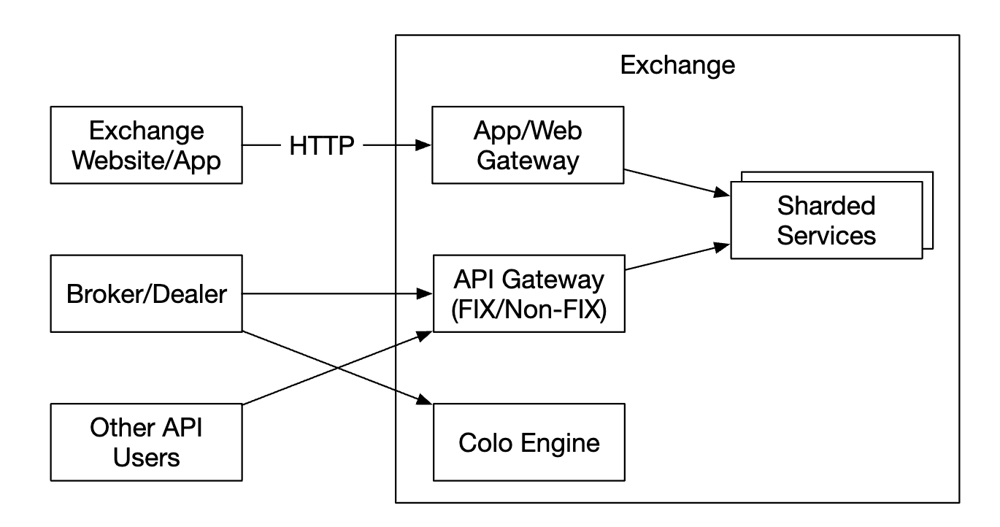

# 第 28 章：证券交易所

## 引言
本章将设计一个**电子证券交易所**。

其基本功能是高效地撮合买方和卖方。

主要证券交易所包括 **NYSE**、**NASDAQ** 等。

<div style="margin-left:3rem">
    
</div>

---

## 第 1 步：理解问题并确定设计范围
 * C：我们要交易哪些证券？股票、期权还是期货？
 * I：为简单起见，只交易股票
 * C：支持哪些订单类型——下单、取消、替换？限价单、市价单、条件单呢？
 * I：我们需要支持下单和取消订单。订单类型只考虑限价单。
 * C：系统是否需要支持盘后交易？
 * I：不需要，只支持正常交易时间
 * C：你能描述一下交易所的基本功能吗？
 * I：客户可以下达或取消限价单，并实时接收撮合成交。他们应该能够实时查看订单簿。
 * C：交易所的规模是多少？
 * I：数万名用户同时交易，约有 ~100 个交易品种。每天有数十亿个订单。我们还需要支持合规所需的风险检查。
 * C：哪些风险检查？
 * I：进行简单的风险检查——例如限制用户每天最多交易 1mil 股 apple 股票
 * C：用户钱包参与情况如何？
 * I：我们需要在下单前确保客户有足够的资金。用于待处理订单的资金需要被暂时冻结，直到订单完成。

### **非功能需求**
面试官提到的规模暗示我们要设计一个中小规模的交易所。
我们还需要确保未来能够灵活支持更多交易品种和用户。

其他非功能需求：
 * 可用性——至少 99.99%。停机可能损害声誉
 * 容错——需要容错能力和快速恢复机制，以限制生产事故的影响
 * 延迟——往返延迟应该处于 ms 级别，并关注第 99 个百分位数。持续偏高的 99p 延迟会给少数用户带来糟糕的体验。
 * 安全——我们应该有账户管理系统。为了符合法律要求，需要支持 KYC 以验证用户身份。我们还应该保护公共资源免受 DDoS 攻击。

### **粗略估算**
 * 100 个交易品种，每天 1bil 个订单
 * 正常交易时间为 09:30 到 16:00（6.5h）
 * QPS = 1bil / 6.5 / 3600 = 43000
 * 峰值 QPS = 5*QPS = 215000
 * 市场开盘时交易量会显著增加

---

## 第 2 步：提出高层设计并获得认同

### **业务知识 101**
我们先讨论一些与交易所有关的基本概念。

经纪商负责调解交易所与终端用户之间的交互——例如 Robinhood、Fidelity 等。

机构客户使用专门的交易软件进行大宗交易。他们需要特殊处理。
例如，在大额交易时拆分订单，以避免影响市场。

订单类型：
 * 限价单——以固定价格买入或卖出。它可能不会立即找到匹配，也可能只被部分撮合。
 * 市价单——不指定价格。立即按照当前市场价格执行。

价格：
 * 买价（Bid）——买方愿意买入股票的最高价格
 * 卖价（Ask）——卖方愿意卖出股票的最低价格

US 市场有三层价格报价——L1、L2、L3。

L1 市场数据包含最佳买价/卖价及数量：

<div style="margin-left:3rem">
    
</div>

L2 包含更多价格档位：

<div style="margin-left:3rem">
    
</div>

L3 显示每个价格档位以及排队数量：

<div style="margin-left:3rem">
    
</div>

K 线图显示市场的开盘价和收盘价，以及给定时间间隔内的最高价和最低价：

<div style="margin-left:3rem">
    
</div>

FIX 是一种交换证券交易信息的协议，大多数供应商都在使用。证券交易示例：
```
8=FIX.4.2 | 9=176 | 35=8 | 49=PHLX | 56=PERS | 52=20071123-05:30:00.000 | 11=ATOMNOCCC9990900 | 20=3 | 150=E | 39=E | 55=MSFT | 167=CS | 54=1 | 38=15 | 40=2 | 44=15 | 58=PHLX EQUITY TESTING | 59=0 | 47=C | 32=0 | 31=0 | 151=15 | 14=0 | 6=0 | 10=128 |
```

### **高层设计**

<div style="margin-left:3rem">
    
</div>

交易流程：
 * 客户通过交易界面下单
 * 经纪商将订单发送到交易所
 * 订单通过客户端网关进入交易所，客户端网关负责验证、限流、认证等。订单被转发给订单管理器。
 * 订单管理器根据风险管理器设置的规则执行风险检查
 * 风险检查通过后，订单管理器验证钱包中是否有足够的资金来执行订单
 * 订单被发送到撮合引擎。找到匹配时，撮合引擎为买方和卖方分别发出两次执行（称为成交）。两个订单都会被排序，以确保结果是确定性的。
 * 执行结果返回给客户。

市场数据流程（M1-M3）：
 * 撮合引擎生成执行结果流，并将其发送给市场数据发布器
 * 市场数据发布器构建 K 线图，并将其发送给数据服务
 * 市场数据存储在专用存储中，用于实时分析。经纪商连接到数据服务，以及时获取市场数据。

报告流程（R1-R2）：
 * 报告器从订单和执行结果中收集所有必要的报告字段，并将其写入 DB
 * 报告字段——client_id、price、quantity、order_type、filled_quantity、remaining_quantity

交易流程位于关键路径上，而其余流程不在关键路径上，因此它们的延迟要求不同。

#### 交易流程
交易流程位于关键路径上，因此应该针对低延迟进行高度优化。

撮合引擎是它的核心，也称为交叉引擎。主要职责：
 * 维护每个交易品种的订单簿——某个交易品种的买入/卖出订单列表。
 * 撮合买入和卖出订单——一次匹配会产生两次执行（成交），买方和卖方各一次。此功能必须快速且准确
 * 将执行结果流作为市场数据分发
 * 匹配必须按照确定性的顺序生成。这是高可用性的基础

接下来是排序器——它是让撮合引擎具有确定性的关键组件，它会为每个入站订单和出站成交加盖序列 ID。

<div style="margin-left:3rem">
    
</div>

我们为入站订单和出站成交加盖序列 ID，原因有几个：
 * 及时性和公平性
 * 快速恢复/重放
 * 恰好一次保证

从概念上讲，我们可以使用 Kafka 作为排序器，因为它实际上是一个入站和出站消息队列。不过，为了实现更低的延迟，我们将自行实现它。

订单管理器管理订单状态。它还与撮合引擎交互——发送订单并接收成交。

订单管理器的职责：
 * 发送订单进行风险检查——例如验证用户的交易量小于 1mil
 * 根据用户钱包检查订单，并验证是否有足够的资金来执行订单
 * 将订单发送到排序器，再发送到撮合引擎。为了减少带宽，只有必要的订单信息会被传递给撮合引擎
 * 从排序器接收执行结果（成交），然后通过客户端网关将其发送给经纪商

实现订单管理器的主要挑战是状态转换管理。事件溯源是一种可行的解决方案（在深入探讨中讨论）。

最后，客户端网关从用户接收订单并将其发送给订单管理器。其职责如下：

<div style="margin-left:3rem">
    
</div>

由于客户端网关位于关键路径上，因此应该保持轻量。

可以为不同客户设置多个客户端网关。例如，colo 引擎是一台交易引擎服务器，由经纪商租用并放置在交易所的数据中心中：

<div style="margin-left:3rem">
    
</div>

#### 市场数据流程
市场数据发布器从撮合引擎接收执行结果，并根据执行结果流构建订单簿/K 线图。

该数据被发送到数据服务，数据服务负责向订阅者展示聚合数据：

<div style="margin-left:3rem">
    
</div>

#### 报告流程
报告器不在关键路径上，但仍然是一个重要组件。

<div style="margin-left:3rem">
    
</div>

它负责交易历史、税务报告、合规报告、结算等。
对于报告流程，延迟不是关键要求。准确性和合规性更重要。

### **API 设计**
客户通过经纪商与证券交易所交互，以便下单、查看执行结果和市场数据、下载历史数据进行分析等。

我们使用 RESTful API 在客户端网关和经纪商之间进行通信。

对于机构客户，使用专有协议来满足其低延迟要求。

创建订单：
```
POST /v1/order
```

参数：
 * symbol——股票代码。String
 * side——买入或卖出。String
 * price——限价单的价格。Long
 * orderType——限价或市价（在我们的设计中只支持限价单）。String
 * quantity——订单数量。Long

响应：
 * id——订单的 ID。Long
 * creationTime——订单的系统创建时间。Long
 * filledQuantity——已成功执行的数量。Long
 * remainingQuantity——仍待执行的数量。Long
 * status——new/canceled/filled。String
 * 其余属性与输入参数相同

获取执行结果：
```
GET /execution?symbol={:symbol}&orderId={:orderId}&startTime={:startTime}&endTime={:endTime}
```

参数：
 * symbol——股票代码。String
 * orderId——订单的 ID。可选。String
 * startTime——以 epoch 表示的查询开始时间 \[11\]。Long
 * endTime——以 epoch 表示的查询结束时间。Long

响应：
 * executions——范围内每次执行结果组成的数组（见下面的属性）。Array
 * id——执行结果的 ID。Long
 * orderId——订单的 ID。Long
 * symbol——股票代码。String
 * side——买入或卖出。String
 * price——执行价格。Long
 * orderType——限价或市价。String
 * quantity——已成交数量。Long

获取订单簿：
```
GET /marketdata/orderBook/L2?symbol={:symbol}&depth={:depth}
```

参数：
 * symbol——股票代码。String
 * depth——每一侧的订单簿深度。Int

响应：
 * bids——包含价格和大小的数组。Array
 * asks——包含价格和大小的数组。Array

获取 K 线：
```
GET /marketdata/candles?symbol={:symbol}&resolution={:resolution}&startTime={:startTime}&endTime={:endTime}
```

参数：
 * symbol——股票代码。String
 * resolution——K 线图时间窗口的长度，单位为秒。Long
 * startTime——以 epoch 表示的窗口开始时间。Long
 * endTime——以 epoch 表示的窗口结束时间。Long

响应：
 * candles——每根 K 线数据组成的数组（属性如下所列）。Array
 * open——每根 K 线的开盘价。Double
 * close——每根 K 线的收盘价。Double
 * high——每根 K 线的最高价。Double
 * low——每根 K 线的最低价。Double

### **数据模型**
我们的交易所中有三种主要的数据类型：
 * 产品、订单、执行结果
 * 订单簿
 * K 线图

#### 产品、订单、执行结果
产品描述交易品种的属性——产品类型、交易代码、UI 显示代码等。

这些数据不会频繁变化，主要用于在 UI 中渲染。

订单代表买入/卖出订单的指令。执行结果是出站的撮合结果。

下面是数据模型：

<div style="margin-left:3rem">
    
</div>

我们在全部三种流程中都会遇到订单和执行结果：
 * 在关键路径中，它们在内存中处理以获得高性能。它们从排序器中存储并恢复。
 * 报告器将订单和执行结果写入数据库，用于报告场景
 * 执行结果被转发到市场数据服务，以重建订单簿和 K 线图

#### 订单簿
订单簿是某个金融工具的买入/卖出订单列表，按价格档位组织。

这种模型的高效数据结构需要满足：
 * 常数时间查找——获取价格档位或价格档位之间的交易量
 * 快速执行添加/执行/取消操作
 * 查询最佳买价/卖价
 * 遍历价格档位

订单簿执行示例：

<div style="margin-left:3rem">
    
</div>

完成这个大订单后，随着买卖价差扩大，价格上涨。

订单簿的伪代码实现示例：
```
class PriceLevel{
    private Price limitPrice;
    private long totalVolume;
    private List<Order> orders;
}

class Book<Side> {
    private Side side;
    private Map<Price, PriceLevel> limitMap;
}

class OrderBook {
    private Book<Buy> buyBook;
    private Book<Sell> sellBook;
    private PriceLevel bestBid;
    private PriceLevel bestOffer;
    private Map<OrderID, Order> orderMap;
}
```

为了实现更高效的方案，我们可以使用双向链表代替标准列表：
 * 放置新订单是 O(1)，因为我们将订单添加到链表尾部。
 * 撮合订单是 O(1)，因为我们从头部删除订单
 * 取消订单意味着从订单簿中删除订单。我们利用 `orderMap` 进行 O(1) 查找和 O(1) 删除（因为 `Order` 持有对链表中前一个元素的引用）。

<div style="margin-left:3rem">
    
</div>

市场数据服务也使用这种数据结构来重建订单簿。

#### K 线图
K 线数据由市场数据服务根据时间间隔内处理订单的结果计算得出：
```
class Candlestick {
    private long openPrice;
    private long closePrice;
    private long highPrice;
    private long lowPrice;
    private long volume;
    private long timestamp;
    private int interval;
}

class CandlestickChart {
    private LinkedList<Candlestick> sticks;
}
```

以下是避免消耗过多内存的一些优化：
 * 使用预分配的环形缓冲区保存 K 线，以减少分配次数
 * 限制内存中的 K 线数量，并将其余内容持久化到磁盘

我们将使用内存中的列式数据库（例如 KDB）进行实时分析。市场收盘后，数据会持久化到历史数据库中。

---

## 第 3 步：深入设计
现代交易所有一个值得注意的特点：与大多数其他软件不同，它们通常将所有内容运行在一台巨型服务器上。

让我们探索具体细节。

### **性能**
对于交易所而言，所有百分位数的整体延迟表现良好都非常重要。

我们如何降低延迟？
 * 减少关键路径上的任务数量
 * 通过减少网络/磁盘使用和/或减少任务执行时间，缩短每项任务所花费的时间

为了实现第一个目标，我们从关键路径中剥离了所有额外职责，甚至移除了日志记录，以实现最佳延迟。

如果遵循原始设计，会存在几个瓶颈——服务之间的网络延迟以及排序器的磁盘使用。

采用这种设计，我们可以实现端到端数十毫秒的延迟。但我们希望达到数十微秒。

因此，我们会把所有内容放在一台服务器上，并让进程通过 mmap 作为事件存储进行通信：

<div style="margin-left:3rem">
    
</div>

另一个优化是使用应用循环（执行关键任务的 while 循环），并将其固定到同一个 CPU 上，以避免上下文切换：

<div style="margin-left:3rem">
    
</div>

使用应用循环的另一个副作用是没有锁竞争——多个线程争夺同一个资源。

现在让我们探索 mmap 的工作方式——它是一个 UNIX 系统调用，会将磁盘上的文件映射到应用程序的内存中。

我们可以使用的一个技巧是在 `/dev/shm` 中创建文件，它代表“共享内存”。因此，我们完全不需要访问磁盘。

### **事件溯源**
事件溯源在[数字钱包章节](../chapter28)中有深入讨论。有关全部细节请参考该章节。

简而言之，我们不存储当前状态，而是存储不可变的状态转换：

<div style="margin-left:3rem">
    
</div>

 * 左侧——传统架构
 * 右侧——事件源架构

这是目前为止我们的设计：

<div style="margin-left:3rem">
    
</div>

 * 外部域使用 FIX 协议与我们的客户端网关交互
 * 订单管理器接收新订单事件，验证该事件并将其添加到内部状态。然后订单被发送到撮合核心
 * 如果订单被撮合，则生成 `OrderFilledEvent` 并通过 mmap 发送
 * 其他组件订阅事件存储，并执行各自的处理

还有一项优化——所有组件都持有订单管理器的副本，该副本被打包为库，以避免管理订单时的额外调用

在这种设计中，排序器发生了变化：它不再是事件存储，而是一个单写入器，在将事件转发到事件存储之前对事件进行排序：

<div style="margin-left:3rem">
    
</div>

### **高可用性**
我们的目标是 99.99% 的可用性——每天只有 8.64s 的停机时间。

为此，我们必须识别交易所架构中的单点故障：
 * 设置关键服务（例如撮合引擎）的备份实例，并使其处于待机状态
 * 积极自动化故障检测和故障转移到备份实例

像客户端网关这样的无状态服务可以通过添加更多服务器轻松进行水平扩展。

对于有状态组件，我们可以处理入站事件，但如果不是领导者，就不能发布出站事件：

<div style="margin-left:3rem">
    
</div>

为了检测主副本是否宕机，我们可以发送心跳来检测它是否不再工作。

这种机制只在单台服务器的边界内有效。 
如果要扩展它，我们可以将整台服务器设置为热/温副本，并在发生故障时进行故障转移。

为了在副本之间复制事件存储，我们可以使用可靠 UDP 进行更快的通信。

### **容错**
如果连温副本也宕机了怎么办？这是一个低概率事件，但我们应该为此做好准备。

大型科技公司通过将核心数据复制到多个城市的数据中心来解决这个问题，以缓解如自然灾害等影响。

需要考虑的问题：
 * 如果主实例宕机，我们如何以及何时故障转移到备份实例？
 * 如何在备份实例中选择领导者？
 * 需要多长的恢复时间（RTO——恢复时间目标）？
 * 哪些功能需要恢复？我们的系统能否在降级条件下运行？

解决方法：
 * 系统可能因为 bug 宕机（同时影响主实例和副本），我们可以使用混沌工程来暴露此类边界情况和灾难性结果
 * 不过，一开始我们可以手动执行故障转移，直到积累足够的系统故障模式知识
 * 可以使用领导者选举（例如 Raft）来确定主实例宕机时哪个副本成为领导者

不同服务器之间的复制工作方式示例：

<div style="margin-left:3rem">
    
</div>

领导者选举术语示例：

<div style="margin-left:3rem">
    
</div>

有关 Raft 工作方式的详情，[请查看这里](https://thesecretlivesofdata.com/raft/)

最后，我们还需要考虑损失容忍度——在情况变得危急之前，我们最多能丢失多少数据？
这将决定我们多久备份一次数据。

对于证券交易所，数据丢失是不可接受的，因此我们必须经常备份数据，并依靠 raft 的复制来降低数据丢失的概率。

### **撮合算法**
通过伪代码稍微了解一下撮合的工作方式：
```
Context handleOrder(OrderBook orderBook, OrderEvent orderEvent) {
    if (orderEvent.getSequenceId() != nextSequence) {
        return Error(OUT_OF_ORDER, nextSequence);
    }

    if (!validateOrder(symbol, price, quantity)) {
        return ERROR(INVALID_ORDER, orderEvent);
    }

    Order order = createOrderFromEvent(orderEvent);
    switch (msgType):
        case NEW:
            return handleNew(orderBook, order);
        case CANCEL:
            return handleCancel(orderBook, order);
        default:
            return ERROR(INVALID_MSG_TYPE, msgType);

}

Context handleNew(OrderBook orderBook, Order order) {
    if (BUY.equals(order.side)) {
        return match(orderBook.sellBook, order);
    } else {
        return match(orderBook.buyBook, order);
    }
}

Context handleCancel(OrderBook orderBook, Order order) {
    if (!orderBook.orderMap.contains(order.orderId)) {
        return ERROR(CANNOT_CANCEL_ALREADY_MATCHED, order);
    }

    removeOrder(order);
    setOrderStatus(order, CANCELED);
    return SUCCESS(CANCEL_SUCCESS, order);
}

Context match(OrderBook book, Order order) {
    Quantity leavesQuantity = order.quantity - order.matchedQuantity;
    Iterator<Order> limitIter = book.limitMap.get(order.price).orders;
    while (limitIter.hasNext() && leavesQuantity > 0) {
        Quantity matched = min(limitIter.next.quantity, order.quantity);
        order.matchedQuantity += matched;
        leavesQuantity = order.quantity - order.matchedQuantity;
        remove(limitIter.next);
        generateMatchedFill();
    }
    return SUCCESS(MATCH_SUCCESS, order);
}
```

这个撮合算法使用 FIFO 算法确定价格档位中要撮合的订单。

### **确定性**
我们使用的排序器技术保证了功能确定性。

事件实际发生的时间并不重要：

<div style="margin-left:3rem">
    
</div>

延迟确定性是我们必须跟踪的内容。我们可以根据对 99 或 99.99 百分位延迟的监控来计算它。

可能导致延迟峰值的因素包括 Java 等语言中的垃圾回收事件。

### **市场数据发布器优化**
市场数据发布器从撮合引擎接收撮合结果，并据此重建订单簿和 K 线图。

由于内存不是无限的，我们只保留部分 K 线。客户可以选择需要多少粒度的信息。更细粒度的信息可能需要更高的价格：

<div style="margin-left:3rem">
    
</div>

环形缓冲区（又称循环缓冲区）是一个固定大小的队列，其头部与尾部相连。空间会被预先分配，以避免分配操作。该数据结构也是无锁的。

优化环形缓冲区的另一种技术是填充，它确保序列号不会与其他任何内容位于同一个缓存行中。

### **市场数据分发公平性和组播**
我们需要确保订阅者在同一时间接收数据，因为如果一个订阅者比另一个更早接收数据，就会获得关键的市场洞察，并可能利用它操纵市场。

为实现这一点，我们可以在向订阅者发布数据时使用基于可靠 UDP 的组播。

数据可以通过三种方式经互联网传输：
 * Unicast（单播）——一个源，一个目的地
 * Broadcast（广播）——一个源，整个子网
 * Multicast（组播）——一个源，位于不同子网上的一组主机

理论上，使用组播时，所有订阅者应该在同一时间收到数据。

不过 UDP 不可靠，数据可能无法到达所有人。但可以通过重传来增强它。

### **共址**
交易所允许经纪商将服务器共址在与交易所相同的数据中心内。

这会大幅降低延迟，可以视为 VIP 服务。

### **网络安全**
由于存在一些面向互联网的服务，DDoS 是交易所面临的挑战。我们的选项如下：
 * 将公共服务和数据与私有服务隔离，使 DDoS 攻击不会影响最重要的客户
 * 使用缓存层存储不经常更新的数据
 * 加固 URLs 以抵御 DDoS，例如优先使用 `https://my.website.com/data/recent` 而不是 `https://my.website.com/data?from=123&to=456`，因为前者更易缓存
 * 需要有效的允许列表/阻止列表机制。
 * 可以使用限流来缓解 DDoS

---

## 第 4 步：总结
其他有趣的笔记：
 * 并非所有交易所都依赖于将一切放在一台大型服务器上，但有些交易所仍然这样做
 * 现代交易所更加依赖云基础设施以及自动做市商（AMM），从而避免维护订单簿
